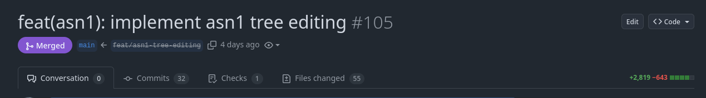
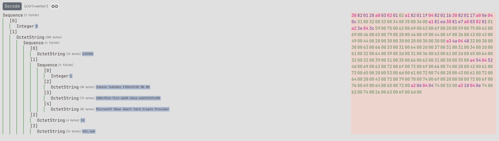
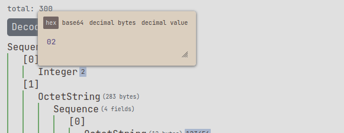
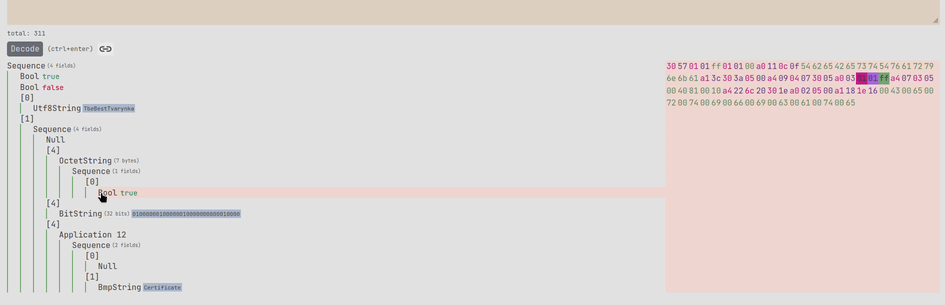
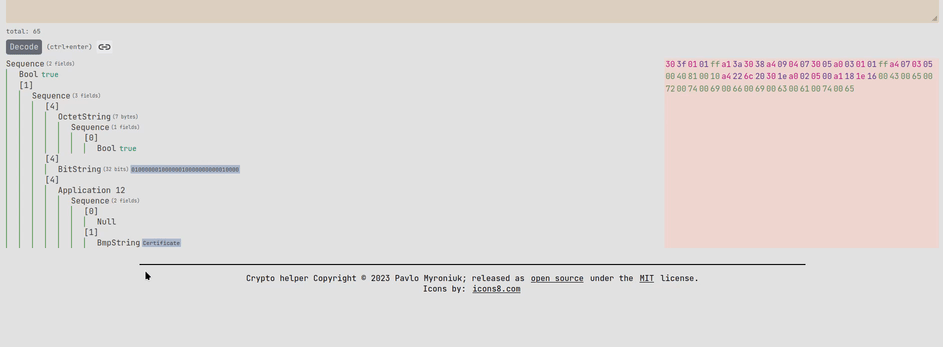
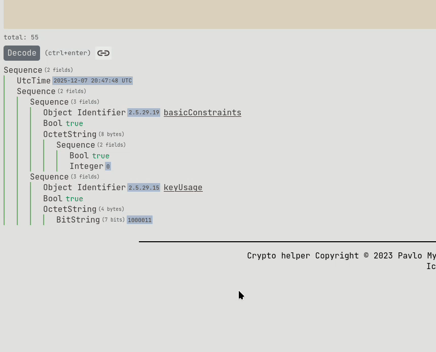
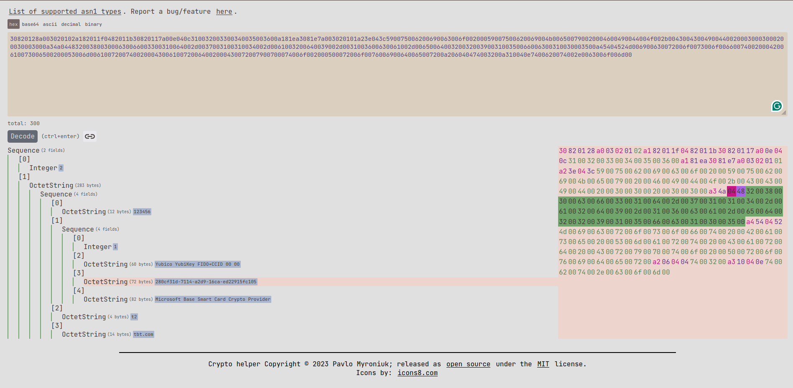
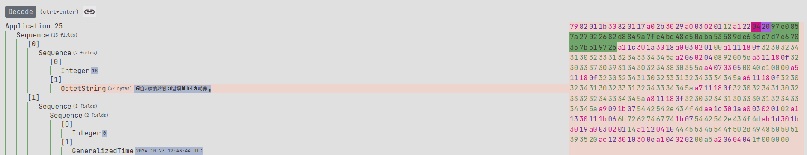
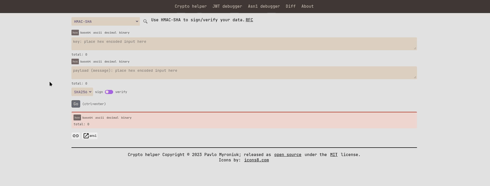
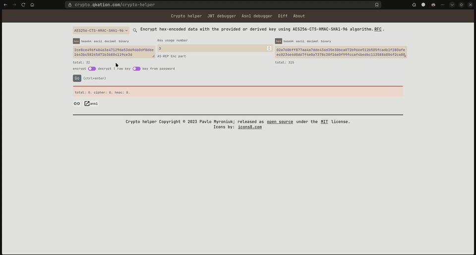

+++
title = "Announcing crypto-helper v.0.16.0"
date = 2025-12-14
draft = false

[taxonomies]
tags = ["rust", "tool", "project", "yew", "crypto-helper"]

[extra]
keywords = "Rust, Yew, ASN1, ASN1 parser, ASN1 editor"
toc = true
# thumbnail = "dataans-thumbnail.png"
+++

Visit this tool at [crypto.qkation.com](https://crypto.qkation.com).

Short release notes can be found here: `TODO`.

# Intro

[The previous release](https://github.com/TheBestTvarynka/crypto-helper/releases/tag/v.0.15.0) was around 1.5 years ago.
I've made many improvements and fixes since then. It's time to publish a new release.

Note:

> _Actually, releases are just checkpoints during the `crypto-helper` development and do not mean anything special._
> _All features and fixes are deployed and available right after merging into the `main` branch._

This post contains a comprehensive list of new changes with additional explanations of how to use the new functionality.

# ASN1 major features

## ASN1 tree editing

[feat(asn1): implement asn1 tree editing (#105)](https://github.com/TheBestTvarynka/crypto-helper/pull/105).

This is the most prominent and most wanted feature of this release.

I always wanted the ability to edit the ASN1 tree. It _just_ feels right. If I can view, then I'm most likely going to edit...
But for the past few years, I have not had enough time or motivation to implement it. It was just an interesting idea (as many other ideas in my head). But it changed this summer, when I needed [to generate different certificates](https://github.com/Devolutions/sspi-rs/pull/483/commits/46d04e5b1cccf9aa7e9da704ddf063df6e049081#diff-5c9de79f33bbce03789d71e8b4c0fbd409a4bdcb4c746cedfe4cbfc428036ebf) to test information extraction.

It was a nightmare. How can I generate the same cert, but with a few differences, such as extension/enhanced key usage, or alternate subject name properties?
I did not care if the cert is trusted or about the cert's private key. I only needed certificate files. The task can be summarized as _how to edit the ASN1 tree_: add, change, or remove ASN1 nodes.

That time I decided to use my [`asn1-parser`](https://github.com/TheBestTvarynka/crypto-helper/tree/main/crates/asn1-parser) crate and _just_ wrote some tests that parse the original certificate, make the necessary changes, and encode it again in base64.
It wasn't a pleasure to write such tests. After that, I decided to implement ASN1 tree editing no matter what.

After:

    - many hours of designing,
    - a few PoCs,
    - `asn1-parser` complete refactoring,
    - 2.8k lines of code,
    - ...

I finally came up with a working, very cool (IMHO) implementation. It works just as I expected. I am even a bit proud of it.

### User guide

So, how to edit the ASN1 tree? The page looks exactly the same as before ASN1 tree editing was implemented.

#### Editing

To **edit** an ASN1 node, hold `ctrl` + click on the node title. For example, let's click on the `Integer` node:

You will see a pop-up menu. Here you can enter any value you want. Multiple formats supported: raw hex/base64 bytes or decimal value (the value will be converted into bytes).

The changes take effect automatically when you type:

These editing rules apply to every node you see on the screen.

#### Deletion

To **delete** an ASN1 node, hold `ctrl` and move the cursor to the start of the node title. You will see a trash icon. Click it and confirm deletion. It will automatically update the entire tree.

#### Creation

To **create** an ASN1 node, hold `ctrl` and move the cursor between the other two notes where you want to insert a new node. You will see the plus icon.
Click on it. You will see a pop-up menu. Type the desired node type. The app will automatically select the suitable editor type for the entered node type.
Type the data you want and submit. Demo:

Sometimes you need to create more than one node at a time. For example, when you want to move one sub-tree from one place to another inside the tree.
The current implementation does not allow it directly. Still, you can achieve the result by copying the sub-tree, deleting it, and then inserting it in the needed place by creating a new sub-tree from raw (copied) data.
Example:

The `raw` data type is added on purpose: to allow multiple node creations at a time. I bet it will be helpful in many cases.

## Wide strings auto-decoding

[feat(crypto-helper): asn1: autodecode wide strings; (#103)](https://github.com/TheBestTvarynka/crypto-helper/pull/103).
I often see that in some cases, strings can be encoded as UTF-16 inside the `OctetString` node. For example, [CredSSP](https://learn.microsoft.com/en-us/openspecs/windows_protocols/ms-cssp/34ee27b3-5791-43bb-9201-076054b58123) smart card credentials are encoded this way:

As you can see in the screenshot above, such buffers are now parsed as UTF-16 and printed as a standard string.

But I forgot that many other buffers can be a valid UTF-16. For example, in the screenshot below, you can see the highlighted encryption key, which was automatically decoded as UTF-16:

I still decided to keep this feature because it looks fun :satisfied:. If I need to look at buffer bytes, I can always look at the hex viewer to the right.

# crypto-helper major features

## HMAC-SHA support

`HMAC-SHA` algorithm support: [crypto-helper/commit/dcc4e41f](https://github.com/TheBestTvarynka/crypto-helper/commit/dcc4e41f73e84e5e6f49d1d24e3abac128368e53). Including the following SHA variations: `SHA256`, `SHA384`, and `SHA512`. Demo:

## Redirect to ASN1

[Add button to redirect output to ans1 page (#95)](https://github.com/TheBestTvarynka/crypto-helper/pull/95). Many thanks [@grok-rs](https://github.com/grok-rs) for his contribution!
The idea is simple: redirect to the ASN1 page and try to decode the result of the cryptographic operation as an ASN1 DER structure.

This feature is very useful for me when I want to decrypt and parse the encrypted part of the Kerberos message. For example:

# Other changes

* More OIDs: [#81](https://github.com/TheBestTvarynka/crypto-helper/pull/81), [#102](https://github.com/TheBestTvarynka/crypto-helper/pull/102).
* Fix incorrect diff calculation: [#94](https://github.com/TheBestTvarynka/crypto-helper/pull/94). Many thanks [@grok-rs](https://github.com/grok-rs) for his contribution!
* Allow empty `BitString` decoding: [#93](https://github.com/TheBestTvarynka/crypto-helper/pull/93). Many thanks [@grok-rs](https://github.com/grok-rs) for his contribution!
* CI: add build WASM step: [crypto-helper/commit/814d1675](https://github.com/TheBestTvarynka/crypto-helper/commit/814d16755e95d4f4e69b736c7917d578beb6d881).
* Update dependencies and refactoring: [#83](https://github.com/TheBestTvarynka/crypto-helper/pull/83), [#87](https://github.com/TheBestTvarynka/crypto-helper/pull/87), [Rust 2024 edition (#101)](https://github.com/TheBestTvarynka/crypto-helper/pull/101), [#106](https://github.com/TheBestTvarynka/crypto-helper/pull/106).
* `README.md` and typos fixes: [#79](https://github.com/TheBestTvarynka/crypto-helper/pull/79), [#80](https://github.com/TheBestTvarynka/crypto-helper/pull/80), [crypto-helper/commit/15785bfe](https://github.com/TheBestTvarynka/crypto-helper/commit/15785bfecb6d23c7aea0c19f7953af07fa2e08c4), [crypto-helper/commit/dd47d963](https://github.com/TheBestTvarynka/crypto-helper/commit/dd47d963e8f56c3d65e80f4da059db094e474dfb).

# References

1. GitHub release.
2. 
