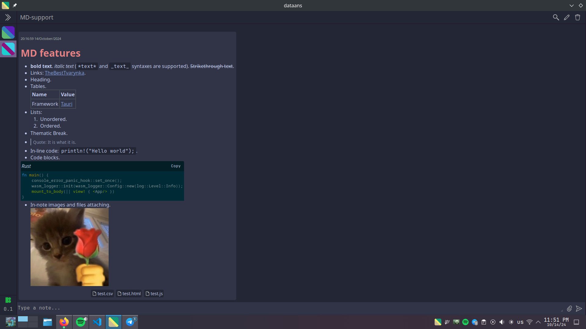

+++
title = "Announcing Dataans v.0.1.0"
date = 2024-10-19
draft = false

[taxonomies]
tags = ["rust", "tool", "project", "tauri", "leptos", "dataans"]

[extra]
keywords = "Rust, Tauri, Leptos, Note-taking, Markdown"
toc = true
thumbnail = "dataans-thumbnail.png"
+++

# Intro

Around half a year ago, I started my new side project: [`Dataans`](https://github.com/TheBestTvarynka/Dataans). It already has plenty of good features and I think I'm ready to present it to you.

I'd say that it's not ready and missing a lot of functionality, but I remembered the following quote ([Lessons learned in 35 years of making software](https://dev.jimgrey.net/2024/07/03/lessons-learned-in-35-years-of-making-software/)):

> When you deliver work you’re really proud of, you’ve almost certainly done too much and taken too long.

I've been thinking about it for a while and decided to finally publish a first release. Otherwise, it might never happen. I always have something in mind to implement/fix/improve. It is an infinite process.

# Dataans

The Dataans is a desktop app that allows you to take notes in the form of markdown snippets grouped into spaces. Yes, it's another note-taking app, but it has unique features that I miss in all other note-taking apps.

## Motivation

I already have [a post](https://tbt.qkation.com/projects/dataans/) about the motivation and features I lack in other existing note-taking apps. Please, read the [Motivation](https://tbt.qkation.com/projects/dataans/#motivation) section of the article to understand why I decided to write my own app.

## Features

* Quake (drop-down) mode. The keybinding can be configured.
* Cross-platform.
* All notes are markdown snippets grouped into spaces. The following MD features are supported:
  * Italic, bold, strike-through text.
  * Quotes.
  * Links.
  * Headers.
  * Tables.
  * In-line code and code blocks.
  * Pasting images from clipboard.
* Files can be attached to the note.
* Common keybindings for text editing (like `ctrl+k` for creating links).
* The app can be configured using the config file. Color scheme also can be configured.
* Simple note search.
* Many different keybindings to control the application.

Read more detailed in the project Wiki: [Dataans: Wiki](https://github.com/TheBestTvarynka/Dataans/wiki).

## How to try it

Follow this instructions: [github/TheBestTvarynka/Dataans/dataans/README.md](https://github.com/TheBestTvarynka/Dataans/blob/main/dataans/README.md) :stuck_out_tongue_winking_eye: :zany_face:

# References & final note

1. [Dataans: Source code](https://github.com/TheBestTvarynka/Dataans/).
2. [Dataans: Contributing guide](https://github.com/TheBestTvarynka/Dataans/blob/main/doc/CONTRIBUTING.md).
3. [Dataans: Technical decisions explained](https://github.com/TheBestTvarynka/Dataans/blob/main/doc/tech_stack.md).
4. [Dataans: Wiki](https://github.com/TheBestTvarynka/Dataans/wiki).
5. [Lessons learned in 35 years of making software](https://dev.jimgrey.net/2024/07/03/lessons-learned-in-35-years-of-making-software/).

I want to add one thing: **write programs for yourself in your favorite languages**. I'm feeling happy every time I use my app for my needs. Even if your future app will do only one task, then still create it. _No better software than software that does useful work._