+++
title = "Announcing Grafily v.0.3.0"
date = 2026-05-31
draft = false
template = "post.html"
description = "Obsidian plugin for rendering pretty family graphs (family trees)"

[taxonomies]
tags = ["javascript", "typescript", "project", "react", "algorithms", "data-structures"]

[extra]
keywords = "TypeScript, Graphs, Algorithms"
toc = true
mermaid = true
thumbnail = "grafily-thumbnail.png"
+++

Short release notes: [github/TheBestTvarynka/grafily/v.0.3.0](https://github.com/TheBestTvarynka/grafily/releases/tag/v.0.3.0).

# Intro

Around a month ago, I released Grafily v.0.3.0. I was really happy to reach this milestone.
Grafily is the most algorithmically challenging project so far, and I had a lot of enjoyment working on it.
The fact that I personally use this tool for my own family research makes me happy.

Let me recall what Grafily is and what its purpose is.
Grafily is an Obsidian plugin for rendering family relationship graphs and trees.
It scans a person's pages inside the vault and builds the tree/graph based on it.

> For the sake of convenience: When I say _graph_ assume that I mean both _graph_ and _tree_ cases.
Graphs include trees.

The resulting graph is interactive.
It means that the user can change the graph structure, expand relationships (add nodes), collapse them (hide), swap spouses in a marriage, and even rearrange siblings.

This article explains what has been implemented, how it works, includes a showcase, and describes plans for the future.
You can use the page index to jump to any section you are interested in.

# Philosophy

## Do one thing and do it well

The Grafily has one concrete goal: to render pretty family relationship graphs.
It will never become an all-in-one genealogy research tool.
It will never become a universal graph renderer. Or anything like that.
The Grafily follows the [Unix philosophy](https://en.wikipedia.org/wiki/Unix_philosophy#Do_One_Thing_and_Do_It_Well):

> Do one thing and do it well.

The Grafily is good in building graph layouts.
It does not even render them because the [`reactflow`](https://reactflow.dev/) library handles that.


flowchart LR
    first["bunch of .md files"] -->|Grafily| second["Pretty graph ✨"]


## The Worse Is Better

Did you hear about [the _worse-is-better_ philosophy](https://www.dreamsongs.com/RiseOfWorseIsBetter.html)? If not, I encourage you to read [The Rise of Worse is Better](https://www.dreamsongs.com/RiseOfWorseIsBetter.html) article.

TL;DR. This is a citation from the mentioned article above:

> The worse-is-better philosophy:
>   - Simplicity -- the design must be simple, both in implementation and interface. It is more important for the implementation to be simple than the interface.
>   - Correctness -- the design must be correct in all observable aspects. It is slightly better to be simple than correct.
>   - Consistency -- the design must not be overly inconsistent. Consistency can be sacrificed for simplicity in some cases, but it is better to drop those parts of the design that deal with less common circumstances than to introduce either implementational complexity or inconsistency.
>   - Completeness -- the design must cover as many important situations as is practical. All reasonably expected cases should be covered. Completeness can be sacrificed in favor of any other quality. Consistency can be sacrificed to achieve completeness if simplicity is retained.

:thinking: What does it mean for the app?
It means that some features can be discarded in favor of app simplicity.
The benefits of some features may not justify the complexity of their implementation.
I would rather keep the app simple than unreasonably complex.

# Features

<sup><sub>All persons in demo screenshots below are generated using AI. If you find any coincidences with real people, please contact me, and I will fix them.</sub></sup>

- **Start-up menu.** The start-up menu shows when the user opens the plugin.
  It allows the user to either load a saved graph or set parameters and generate a new one.
  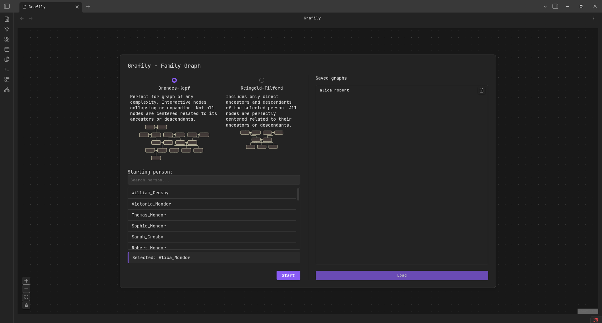
- **Persistence.** The user can save generated graphs and reopen them in the next session.
  It allows the user to keep multiple relationship graphs on hand without having to rebuild the entire graph each time.
  The saved graphs are listed on the right side of the start-up menu.
- **Data directory configuring.** The user can configure the directory that the plugin will scan for people's data.
  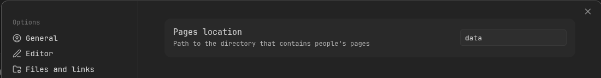
- **Graphs layout building and rendering:**
  * Tree-baed layout called [Reingold-Tilford](#reingold-tilford).
    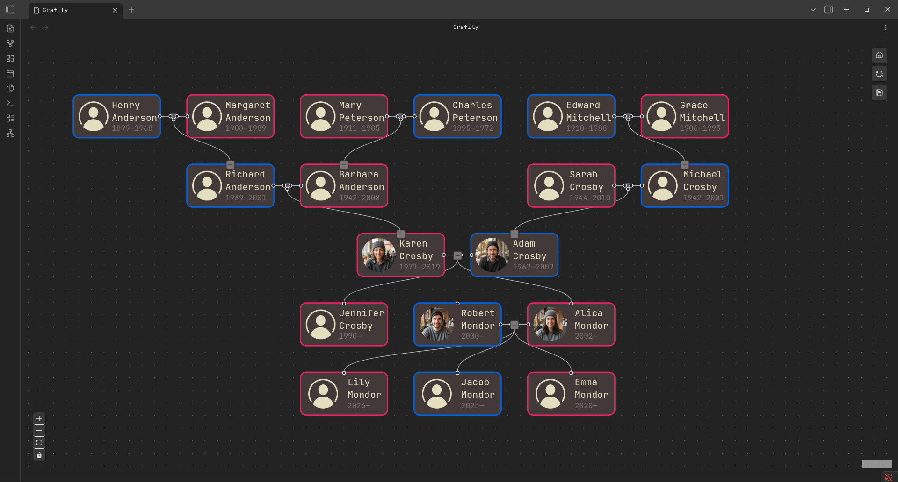
  * Graph-based layout called [Brandes-Köpf](#brandes-kopf).
    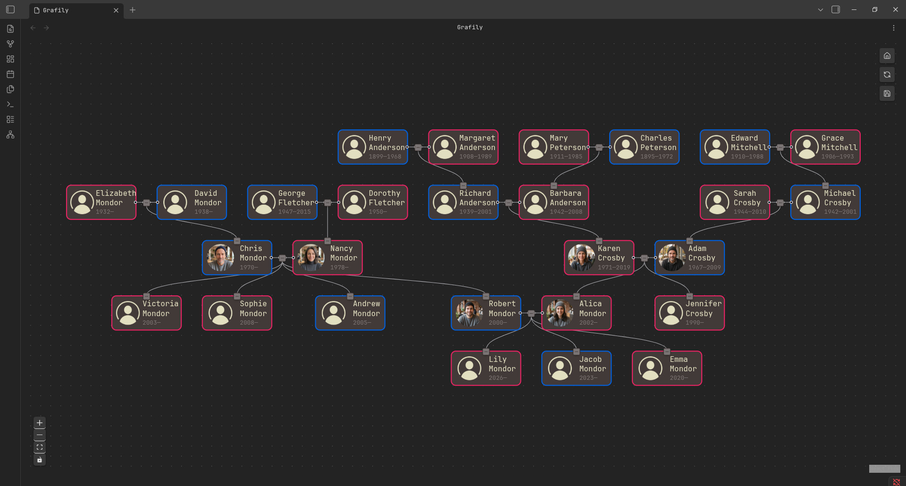
- **Interactivity.** The user can collapse/expand nodes and rearrange nodes (swap siblings, swap spouse nodes in a marriage, etc.).
  UI buttons for the interactivity are located at the top right corner of the graph view and called the _side panel_:

  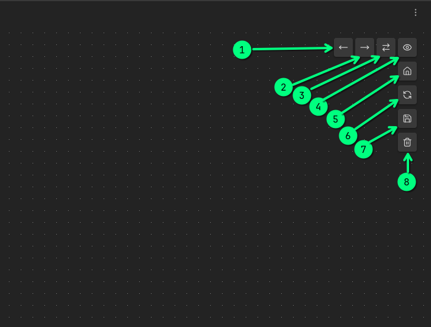
    1. Move the node left among its siblings.
    2. Move the node right among its siblings.
    3. Swap the selected person's place with their spouse.
    4. Show the current node: the viewpoint will move so the selected node will be in the center of the screen.
    5. Return to the start-up menu.
    6. Reload persons' data. This button will not update relationships. But it will update a person's data, such as names, images, and dates.
    7. Save the current graph.
    8. Delete the current graph.

# How it works

When the user opens the plugin, it automatically starts vault scanning for family members' pages.
It expects the vault to have one page per person.
It's not necessary to scan all `.md` files inside the vault.
The user can configure the target directory, and the app will scan only files within that directory.


To be successfully accepted, the `.md` page must have predefined metadata at the beginning of the page:

```md
# <surname> <name>

**Spouse**: [[<spouse page>]]
**Parents**: [[<1st parent page>]], [[<2nd parent page>]]
**Birth**: <year>-<month>-<day>
**Death**: <year>-<month>-<day>
**Image**: [[<profile picture file>]]

---

Person's page content.
```

Example:

```md
# Myroniuk Pavlo

**Spouse**: [[Kateryna]]
**Parents**: [[Yaroslav]], [[Halyna]]
**Birth**: 2001-07-10
**Image**: [[TheBestTvarynka.png]]

---

I was born in the Volyn region, the western part of Ukraine.
```

Based on the specified relationships in each person's metadata, the app is able to build the full relationship graph.
You can type any information you want after the `---`. The `# <surname> <name>` line is required. All other key-value pairs are optional.
Moreover, you do not need to specify the spouse link for both; only one link is sufficient.
For example, if you specified in the metadata that Bob's spouse is Emma, then it is not required to specify Bob in Emma's metadata.

The most interesting part is how the app builds the graph. It is explained in the next section :relaxed:.

## Architechture

The app works in 4 main stages:

<table style="border:none;border-collapse:collapse;table-layout:fixed;">
<colgroup>
    <col style="width: 40%;">
    <col style="width: 60%;">
  </colgroup>
<tbody>
  <tr>
    <td style="border:none;border-collapse:collapse;">

flowchart TD
    A[".md files"] -->|1. Parse and extract metadata| B["Index"]
    B -->|2. Build internal representation| C["Graph structure"]
    C -->|3. Calculate nodes positions| D["Nodes coordinates and edges"]
    D -->|4. Render using `reactflow`| E["Pretty graph ✨"]

    </td>
    <td style="border:none;border-collapse:collapse;">

1. `.md` files parsing. I already described that above, so we will not focus on it here.
2. Obviously, it's not possible to place family members on the 2-dimensional plane.
  The entire family history can be a huge, complicated graph.
  Also, the perfect node layout does not exist because, depending on the case, the user wants to see different people in different positions.
  So, each layout algorithm has its own internal representation of relationships.
  This representation usually contains only nodes that will be rendered on the view and their relationships (node edges).
  Optionally, the internal representation can contain additional data to help it build the resulting graph.
3. Each layout algorithm implements its own solution for calculating node positions (`x` and `y` coordinates).
  The third step is to calculate these coordinates.
4. And the last step is to create `Node[]` and `Edge[]` objects and pass them to the `rectflow` view.
    </td>
  </tr>
</tbody>
</table>

At this point, the _internal representation_ can be a bit of a magical thing.
Let me explain it better with an example.
Let's take the Reingold-Tilford. It is the simplest layout I have.
It can render only direct ancestors and descendants of the selected person/marriage:

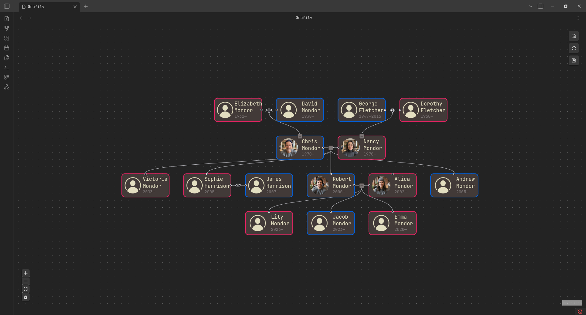

Intuitively, you can assume that it's essentially a tree internally. 
And you will be right. In the code it looks like this ([src](https://github.com/TheBestTvarynka/grafily/blob/96b65e62e0ace284a3727ca7400cd795bd1cd02b/src/layout/tree/treeBuilder.ts#L105-L114)):

```ts
/**
 * Tree builder, which allows creating and modifying family trees.
 * This tree builder can be used for parents (ancestors) and children (descendants)
 * trees generations. The implemented behavior is abstract enough.
 */
export class TreeBuilder {
    private family: Index;
    private children: Map<string, TreeNode[]> = new Map();
    private root: TreeNode | null = null;
    private getChildNodes: (nodeId: TreeNode, family: Index) => TreeNode[];

    /* ... */
}
```

It contains a family `Index` (all family relationships), a map with connections from parent to children nodes, and the root node/
There is nothing complicated.

In the screenshot above, you can see the parents' tree (ancestors' tree) and the children's tree (descendants' tree) of _Nance Mordor_.
Internally, it's just two trees ([src](https://github.com/TheBestTvarynka/grafily/blob/96b65e62e0ace284a3727ca7400cd795bd1cd02b/src/layout/tree/index.ts#L30-L34)):

```ts
export class ReingoldTilford {
    private family: Index;
    private parentsTreeBuilder: TreeBuilder;
    private childrenTreeBuilder: TreeBuilder;
    private root: string | null = null;

    /* ... */

}
```

The implementation is abstracted over the `getChildNodes` function, which returns either node parents or node children.

## Persistence

The attentive reader will notice one problem with `TreeBuilder`: it cannot be easily saved to a file because it uses complex types, such as `Map`, internally.

And you will be right. To correctly serialize the structure to JSON, the object must be a _plain_ object and not contain circular references.

To resolve this issue, every layout implementation implements two methods for serializing and deserializing ([src 1](https://github.com/TheBestTvarynka/grafily/blob/96b65e62e0ace284a3727ca7400cd795bd1cd02b/src/layout/tree/treeBuilder.ts#L100-L103) and [src 2](https://github.com/TheBestTvarynka/grafily/blob/96b65e62e0ace284a3727ca7400cd795bd1cd02b/src/layout/tree/index.ts#L334-L350)):

```ts
// Can be safely serialized using `JSON.stringify`.
export interface FamilyTree {
    children: Record<string, TreeNode[]>;
    root: TreeNode;
}

/**
 * Returns the layout state ready for serialization. It is safe to stringify it to the JSON
 * and parse back again.
 * For the `ReingoldTilford`, the `data` field has `{ parentsTreeBuilder: FamilyTree, childrenTreeBuilder: FamilyTree }` type.
 *
 * @returns {SerializableLayout} - An object ready to be serialized.
 */
toSerializableObject(): SerializableLayout {
    return {
        name: REINGOLD_TILFORD,
        data: {
            parentsTreeBuilder: this.parentsTreeBuilder.familyTree(), // Returns a `FamilyTree` object.
            childrenTreeBuilder: this.childrenTreeBuilder.familyTree(),
        },
    };
}
```

Such an approach allows the user to restore the layout state from the disk and continue working from the same place.

## Interactivity

Now let's talk about interactivity.
We do not want to do extra work on every user click because otherwise, the interface will be laggy.

<table style="border:none;border-collapse:collapse;table-layout:fixed;">
<colgroup>
    <col style="width: 35%;">
    <col style="width: 65%;">
  </colgroup>
<tbody>
  <tr>
    <td style="border:none;border-collapse:collapse;">

flowchart TD
    A["User action"] -->|1. Update internal relationships| B["Updated internal representation"]
    B -->|2. Recalculate nodes positions| C["Nodes coordinates and edges"]
    C -->|3. Rerender using `reactflow`| D["Pretty graph ✨"]

    </td>
    <td style="border:none;border-collapse:collapse;">

1. When the user decides to edit the graph, the corresponding action is propagated to the layout object, which, in turn, edits the internal representation accordingly.
  For example, if the user expands the person's parents, new people will be added and linked to the internal representation.
2. When the internal representation is altered, then it recalculates the nodes' coordinates.
  This stage will create new `Node[]` and `Edge[]` objects.
  I have two reasons for that:

    1. It's too hard to trace and edit existing `Node[]` and `Edge[]` objects.
    2. We need a new array object anyway to trigger the React component rerender.
  
  From the React component perspective, all interactivity boils down to:

  ```ts
  const newGraph = layout.action(parameters);
  setGraph(newGraph);

  // For example:
  const newGraph = layout.collapseChildren(nodeId);
  setGraph(newGraph);
  ```
3. And the last third step is to pass `Node[]` and `Edge[]` objects to the `rectflow` view.
    </td>
  </tr>
</tbody>
</table>

Any graph modifications do not require a full graph rebuild.
After any user action, only a small part (usually) of the graph is affected.

The selected approach allows for decoupling rendering and React components from the layout algorithms implementation.
I can easily modify the React parts without worrying about breaking the algorithmic part and vice versa.

## Layout algorithms

Below is the high-level overview.
I cannot put everything in one post.
I plan to write separate blog posts on all the algorithms used in Grafily.
The descriptions below aim to explain the pros and cons of each layout type, but not how each works.

### Reingold-Tilford

I already mentioned this layout type many times above.
It has such an interesting name because I developed it based on the Reingold-Tilford algorithm for calculating tree nodes' coordinates (the tree-drawing problem).
I have a separate blog post about it: [Drawing Genealogy Graphs. Part 1: Tree Drawing Using Reingold-Tilford Algorithm](https://tbt.qkation.com/posts/draw-tree-using-reingold-tilford-algorithm/).

**Pros:**

- It is a simple layout perfect for seeing one person/marriage direct ancestors or descendants.
- It is pretty looking because (almost) all nodes are centered over their children.

**Cons:**

- The simplicity is also a limitation. No way to render parallel families or join two different family trees.

**Supported interactivity:**

- The user can collapse or expand parents of any parent node starting from the selected person/marriage and up the bloodline (ancestors tree).
  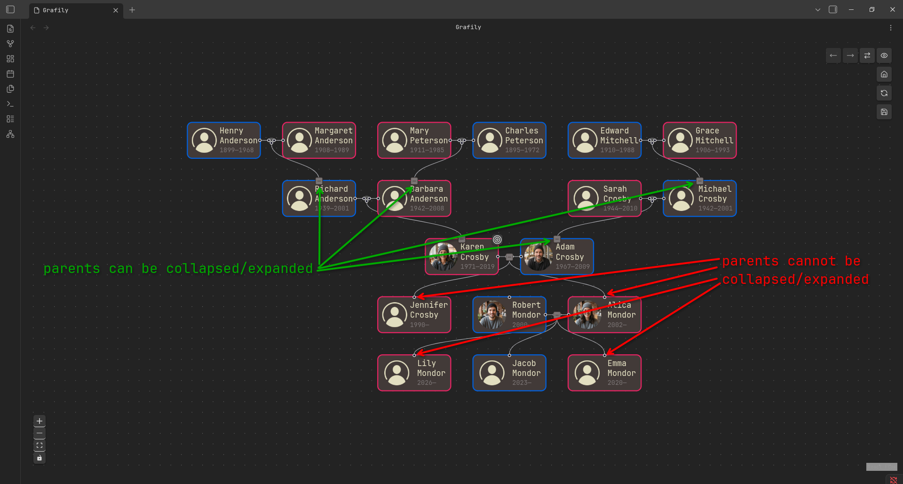
- The user can collapse or expand children of any child node starting from the selected person/marriage and down the bloodline (descendants tree).
  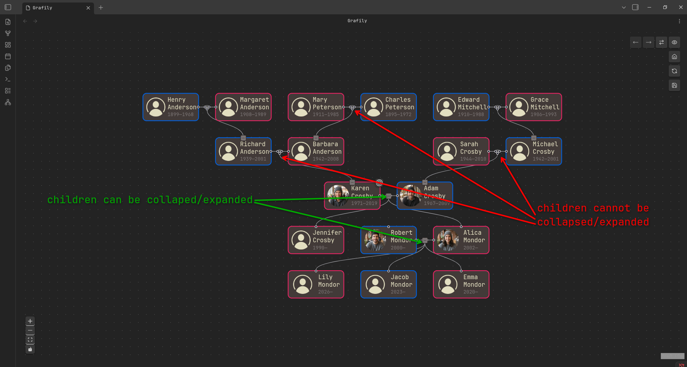
- The user can swap any married spouse with the other.
  | Before swap | After swap |
  |-|-|
  | 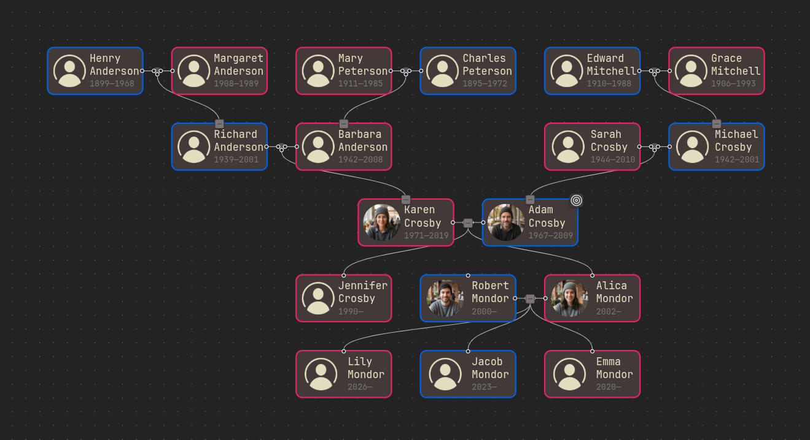 | 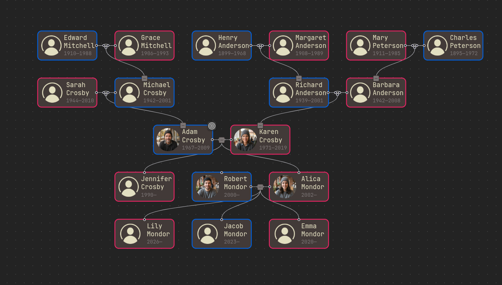 |
- The user can rearrange siblings. It is called _to move the current node left/right_.
  | Before move left | After move left |
  |-|-|
  | 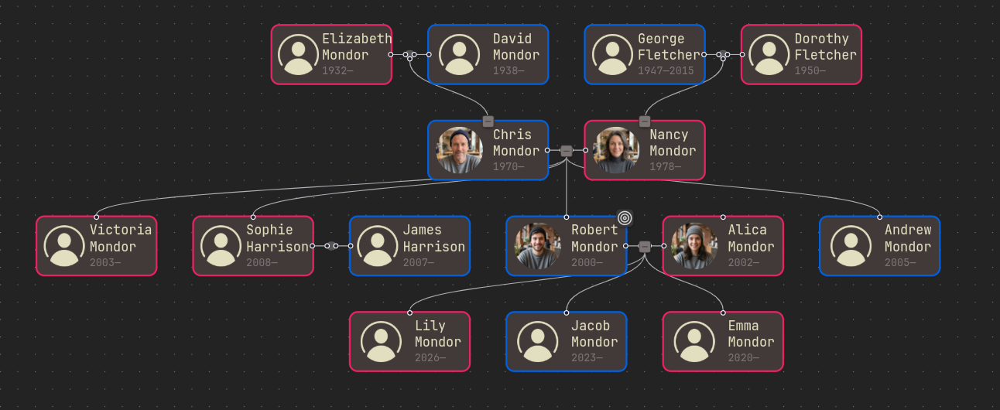 | 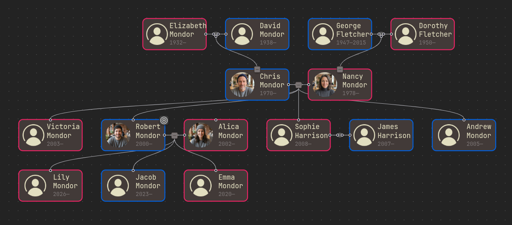 |

### Brandes-Köpf

The most powerful (at the moment of writing) layout type.
Internally, it is a bidirectional layered graph.
Almost the most generic graph you can think of ([src](https://github.com/TheBestTvarynka/grafily/blob/96b65e62e0ace284a3727ca7400cd795bd1cd02b/src/layout/fullGraph/graphBuilder.ts#L91-L102)):

```ts
/**
 * A special class for all graph manipulations. It is used to build the initial graph and modify it when the user makes any changes.
 * This implementation does not calculate any node positions. Its only purpose is to modify the graph structure and layering.
 */
export class GraphBuilder {
    private nodes = new Map<string, GraphNode>();
    // string - node id.
    // string[] - list of parent node ids.
    private parents = new Map<string, string[]>();
    // string - node id.
    // string[] - list of child node ids.
    private children = new Map<string, string[]>();
    // number - layer index.
    // string[] - list of node ids in the layer.
    private layers: Map<number, string[]> = new Map<number, string[]>();
    private family: Index;

    /* */
}
```

Its name is taken from the nodes' coordinate assignment algorithm used: [Fast and Simple Horizontal Coordinate Assignment](https://scispace.com/pdf/fast-and-simple-horizontal-coordinate-assignment-2aawem94ts.pdf).
To be honest, I did not develop the coordinates assignment algorithm from scratch.
The implementation is highly inspired by the `dagre` project: [github/dagrejs/dagre/2595d05a0f/lib/position/bk.js](https://github.com/dagrejs/dagre/blob/2595d05a0fbb7721f35bfcaab5fbf40f5b3858ca/lib/position/bk.js).
Basically, that's the same algorithm, but rewritten in TypeScript and adapted to the current use case.
You can read about it more here:

- The [Dagre](https://github.com/dagrejs/dagre) project on GitHub.
- [github/dagrejs/dagre/wiki#recommended-reading](https://github.com/dagrejs/dagre/wiki#recommended-reading).

I do not have a separate article about it yet, but I plan to write one someday and hope that day comes :innocent:.

**Pros:**

- It is able to render parallel families: families of the sibling spouse, for example.
  
- The user can edit any part of the graph.

**Cons:**

- Not all nodes are perfectly centered. Even more, almost all nodes are not perfectly centered.
  The resulting graph is not super aesthetic or perfectly rendered.
  It can annoy you a bit.
- Currently, not all possible graph modifications are implemented, but they are at least possible and planned to be implemented :wink:.

**Supported interactivity:**

- The user can collapse/expand any parents of any person.
- The user can collapse/expand children of any marriage.
- The user can swap spouses of any marriage.
- Just like in the tree case, the user can rearrange siblings (_to move the current node left or right_).

As you can see, this layout is extremely flexible and powerful.

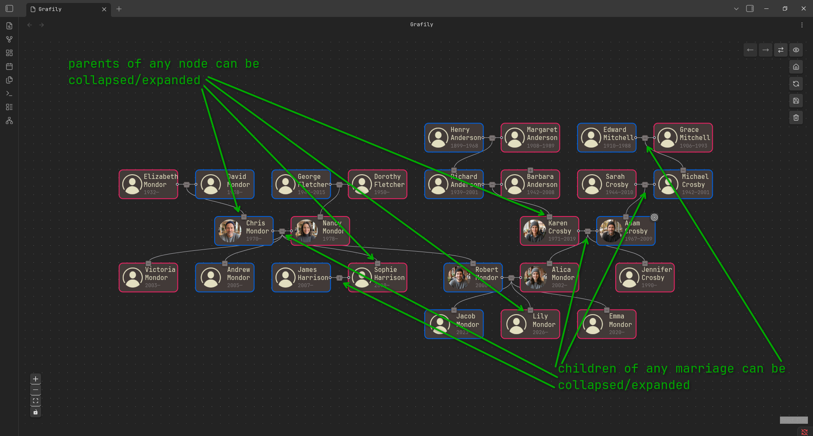

In reality, the use of the Brandes-Köpf layout is not that simple.
The user must follow the rules to be able to modify the graph. There are some of them.

The moving of the current node, left and right actions, have limitations:

- The selected node and the neighbor node in the move direction must not have child nodes (child nodes must be collapsed).
- The selected node and the neighbor node in the move direction must have only one parent connection: the common parent node.
  Spouses' parents (if any) must be collapsed.

Because it is allowed for child nodes to have parallel families, it is not easy to determine how to swap the subgraphs of two siblings while avoiding edge crossings.
Of course, I am sure I could create a smart-ass graph-walking algorithm that would remember the borders of both subgraphs and then swap them, but I thought about that for a moment and decided it is not worth the trouble.
I decided to add limitations above in favor of implementation simplicity (see [Philosophy#the-worse-is-better](#the-worse-is-better) section).
The same story with the spouses' swap action limitations:

- Maximum one spouse of the target marriage is allowed to have parents expanded.

# What's next?

I have two big directions of development:

1. First, I need to implement more possible modifications in the Brandes-Köpf layout.
  My idea is simple: if you can think of any family graph on a 2D plane without edges crossing, then this graph should be possible to recreate in Grafily.
2. Currently, only a small subset of families is supported: only one marriage per person, only one mom and one dad per person.
  What about adoption, step-dad/mom, and their previous families, remarriage?
  I do not know what is the best way to support all possible families types and peoples relationships.
  I have only a blurred image in my head, but I am sure I will figure something out :wink:.

# Conclusions

I said it before, and I say it again: writing software for yourself and **using** it is an amazing feeling.
I like the result, I like how it grows, I like the fact that I am using it.

Rendering people's relationships is a difficult task, and there is no way to do it correctly or perfectly.
Every feature has its tradeoffs and limitations.

I learned a lot about graph algorithms and coordinate assignment algorithms.
I significantly improved my skills.
The first steps during implementation were super slow and uncertain.
Besides its huge usefulness in my genealogy research, the Grafily is also a great exercise of my programming skills.

# References

1. GitHub release [github/TheBestTvarynka/grafily/v.0.3.0](https://github.com/TheBestTvarynka/grafily/releases/tag/v.0.3.0).
2. [Drawing Genealogy Graphs. Part 1: Tree Drawing Using Reingold-Tilford Algorithm](https://tbt.qkation.com/posts/draw-tree-using-reingold-tilford-algorithm/).
3. [github/dagrejs/dagre/wiki#recommended-reading](https://github.com/dagrejs/dagre/wiki#recommended-reading).
