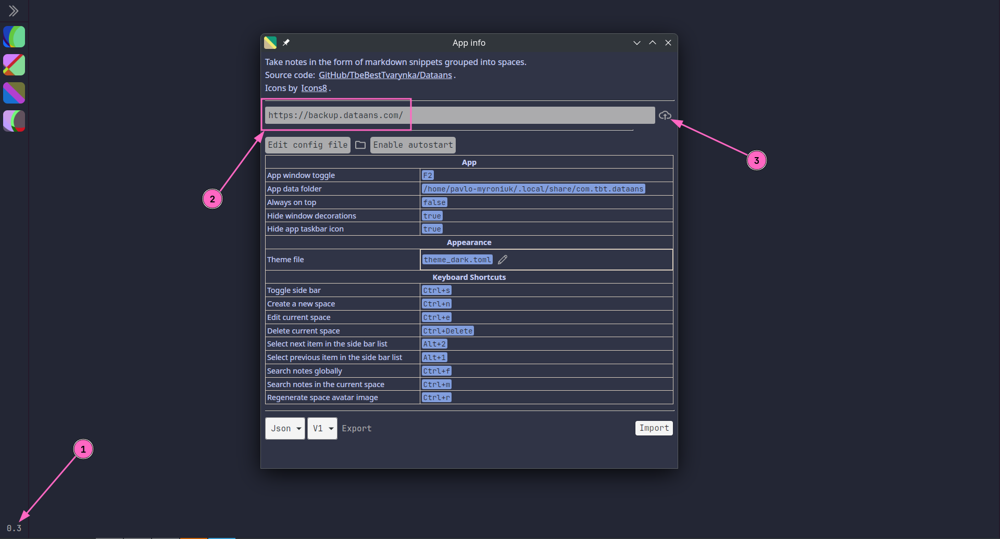
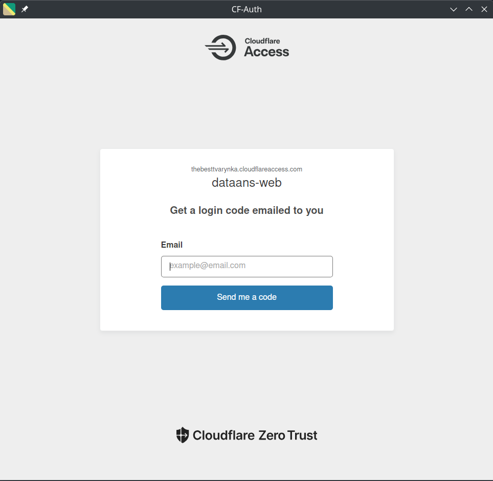
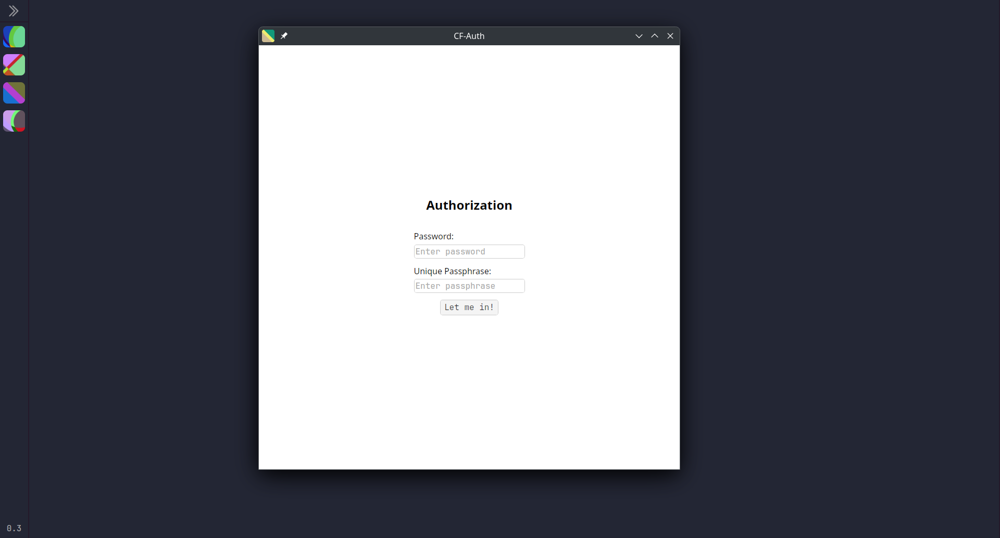
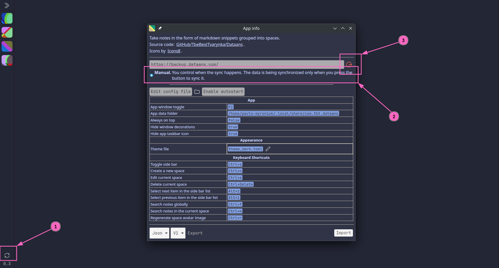

+++
title = "Announcing Dataans v.0.3.0"
date = 2025-08-03
draft = false

[taxonomies]
tags = ["rust", "tool", "project", "tauri", "leptos", "dataans"]

[extra]
keywords = "Rust, Tauri, Leptos, Note-taking, Markdown, Sync, Local-first"
toc = true
mermaid = true
thumbnail = "dataans-v030-thumbnail.png"
+++

[GitHub/TheBestTvarynka/Dataans/releases/v.0.3.0](https://github.com/TheBestTvarynka/Dataans/releases/tag/v.0.3.0).

# Intro

The Dataans app has adopted a local-first approach since the very beginning of its existence.
After some time, I started to use the app on many devices and inside my Windows/Linux VMs.
I caught myself thinking that it would be good to be able to transfer data from one device to another.
Fast forward two months, and suddenly I realized that it is a critical feature for me.
After some considerations and small research, I understood that I wanted the multi-device synchronization feature.

Decentralized Internet, P2P networks, etc, are good. But the current implementation of the data synchronization feature relies on the central sync (backup) server. The data synchronization using the P2P communication may be implemented in the future. It depends on my needs.

This post turned out to be quite large. Alternatively, you can read the shorter version: [github/TheBestTvarynka/Dataans/6c898a01/doc/sync_server.md](https://github.com/TheBestTvarynka/Dataans/blob/6c898a01afc0942cb94b5dbc822349d8afa924ee/doc/sync_server.md).

# Demo

Before explaining how it works and how I implemented it, I want to show you the demo.

> _Better to see something once than hear about it a thousand times._

[Asian Proverb](https://skeptics.stackexchange.com/q/28487).

So, first, the user needs to log in. Open the `App-info` window by clicking on the app version number in the bottom left corner of the main window. Then, type the sync server address and click log in:



Now the user needs to authorize:



And yes, as you can see, I decided to delegate all authentication-related tasks to Cloudflare. I did not want to implement it manually, and, honestly, it was one of the best decisions I made.
Thanks to [Cloudflare Zero Trust Access](https://www.cloudflare.com/zero-trust/products/access/), I only need to enter email and the code from email.

After the successful sign in, the user needs to enter the password and secret passphrase.



At this point, two cases are possible:

1. If it is the first sign-in among all users' devices (sync server's database is empty), then the user needs to fill in ONLY the password input.
   The passphrase will be automatically generated by the app. But if the user wants to use a custom passphrase, then they can type it.
2. If it is a new sign-in on another device and the sync server's database is not empty (there was a sync from other devices), then the user must type both password AND passphrase.
   The user can read the passphrase on any signed-in device in the `profile.json`.

> _Why does the app require the user to have a password if all auth has been delegated to Cloudflare?_

It is explained in detail in the [Auth](#auth) section. But, in short, the data encryption key is derived from the user's password and passphrase.

This is what the user sees after successful sign-in:



From the screenshot above:

1. Button that triggers data synchronization.
2. Synchronization mode. Currently, only manual mode is implemented.
   It means that whenever the user wants to sync the data, they need to press the button :upside_down_face:.
3. Sign out button.

Now, the user is able to sync app data. The synchronization process happens in the background.
So, the user can freely use the app without any limitations during synchronization. Once the sync is complete, a small pop-up message will appear.


# How it works

Now let's talk about interesting things: how it works :blush:. Below are detailed technical explanations.
You can jump right to the interesting part. There is no need to read it in order.

## Infrastructure

This section is boring, because I don't like to describe infrastructure in detail. So, if you are not interested in such things, then skip it :wink:.


graph TD
    subgraph Internet
        Client[Dataans App]
    end

    subgraph Cloudflare
        Client -->|HTTPS Request| CloudflareZeroTrust[Cloudflare Zero Trust Access]
        CloudflareZeroTrust -->|cf-access-jwt-assertion Injected| FlyApp[Sync Server]

        subgraph Fly.io
            FlyApp -->|User files| ObjectStorage[(Tigris Object Storage)]
        end

        FlyApp -->|Verifies JWT| CF_PubKey[Cloudflare Public Key Endpoint]
    end

    subgraph Neon.com
        FlyApp -->|User data| Postgres[(PostgreSQL Database)]
    end


The overall infrastructure is straightforward.

I use [Cloudflare](https://www.cloudflare.com/) for endpoint protection, auth, DDoS protection, and domain hosting.

I use [Fly.io](https://fly.io/) as a main cloud provider. I like the microVM approach that they use. It is my first app deployed on fly.io.
The deployment process was simple and fast. It reminded me of the old, almost forgotten feeling _"it just works"_.

I use [Neon.com](https://neon.com/) PostgreSQL provider to store user data. I did not like fly.io's Postgres integration because it does not shut down automatically when it is not in use.
So, I decided to try Neon. They have a very limited free tier, but it is ok for me (at least for now).
I am very satisfied with the database start time. I think it is a great choice for small personal projects.

I use [Tigris](https://www.tigrisdata.com/) object storage to store user files. Mainly because it is integrated into the fly.io, so I decided to use it. Its free tier is more than enough for me.

## Auth

Initially, I implemented the authentication manually.
It was a simple password-based authentication with a primitive session-based authorization implementation.

However, I then decided [to throw it out](https://github.com/TheBestTvarynka/Dataans/pull/97/commits).
I pondered on it and decided that I do not want to maintain a ton of code dedicated to auth.
I wanted to delegate it to some external service. I explored the most popular solutions and chose [Cloudflare Zero Trust Access](https://www.cloudflare.com/zero-trust/products/access/).

It works very simply (as I wanted). Cloudflare works as a proxy and intercepts requests to my web service.
If the request does not have an authentication token inside, then Cloudflare does the auth.
I configured the allowed emails list, and Cloudflare sends a code to the entered email during sign-in.
Cloudflare injects a token into the request after successful sign-in and sends the request to my web server.


sequenceDiagram
    participant Client as Client
    participant Cloudflare as Cloudflare
    participant Server as Web-Service

    Client->>Cloudflare: HTTP Request
    Cloudflare->>Client: Redirect to Zero Trust login page
    Client->>Cloudflare: Sign in
    Cloudflare->>Client: Redirect back with session cookie (CF_Authorization cookie)

    Client->>Cloudflare: HTTP Request (with CF_Authorization cookie)
    Cloudflare->>Server: Proxies request with cf-access-jwt-assertion header
    Server-->>Cloudflare: Response
    Cloudflare-->>Client: Web server response


The only thing I need to do on my web server's side is to validate Cloudflare's JWT token.
The validation algorithm is pretty straightforward:

1. Extract the `cf-access-jwt-assertion` header.
2. Get Cloudflare's signing keys.
3. Validate JWT using any common library.

You can read the full code here: [github/TheBestTvarynka/Dataans/6c898a01/crates/web-server/src/routes/mod.rs](https://github.com/TheBestTvarynka/Dataans/blob/6c898a01afc0942cb94b5dbc822349d8afa924ee/crates/web-server/src/routes/mod.rs). There is an important moment:

> By default, **Access rotates the signing key every 6 weeks**. This means you will need to programmatically or manually update your keys as they rotate. ([src](https://developers.cloudflare.com/cloudflare-one/identity/authorization-cookie/validating-json/#access-signing-keys))

Therefore, if you decide to hardcode signing keys, ensure that you rotate them regularly.
I decided to follow another path: the web server requests the signing keys every time it needs to verify the JWT token.
Yes, it is not the best option, but it is enough for me ([Worse Is Better](https://www.dreamsongs.com/RiseOfWorseIsBetter.html)).

Great. Simple, secure, easy to set up :rocket:. I asked ChatGPT for the step-by-step guide, which worked from the first try.
I tried to access the protected route from the browser, and it worked perfectly.

However, there is a small, tiny problem: I am not writing a website, I am writing a desktop app using Tauri.
I cannot rely on cookies themselves because I want to make requests from the app backend using the [`request`](https://docs.rs/reqwest/latest/reqwest/) HTTP client.

Therefore, I need to extract the `CF_Authorization` token somehow and save it somewhere in the app backend.
Additionally, the app needs to ask the user password and passphrase. I was thinking for some time about the easiest way to implement.
I came up with the idea of sending the cookie token, password, and passphrase in one Tauri command to the app backend.

When the user passes the Cloudflare, the web server responds with the [`authorize.html`](https://github.com/TheBestTvarynka/Dataans/blob/6c898a01afc0942cb94b5dbc822349d8afa924ee/crates/web-server/authorize.html) page.
It is a simple form with an embedded script. When the user submits the form, the script extracts the `CF_Authorization` token, reads the typed password and passphrase, and sends all this data to the app backend:

```js
async function extractAndSendToken() {
  const cookie = document.cookie
    .split('; ')
    .find(row => row.startsWith('CF_Authorization='));
  
  if (!cookie) {
    console.error("CF_Authorization cookie not found.");
    return;
  }

  const token = cookie.split('=')[1];

  const password = document.getElementById("password").value;
  const salt = document.getElementById("salt").value;

  let args = { token, url: window.location.origin };
  if (password && password.length > 0) {
    args.password = password;
  }
  if (salt && salt.length > 0) {
    args.salt = salt;
  }

  try {
    await window.__TAURI__.core.invoke("plugin:dataans|sign_in", args);
    console.log("Token sent successfully:", token);
  } catch (e) {
    console.error("Failed to send token:", e);
  }
}
```

Fortunately, Tauri injects the `window.__TAURI__` object into every spawned webview. Thus, even when the webview is created from [an external URL](https://docs.rs/tauri/2.7.0/tauri/enum.WebviewUrl.html#variant.External) (not [the direct app frontend](https://docs.rs/tauri/2.7.0/tauri/enum.WebviewUrl.html#variant.App)), it can still send Tauri commands.

That's all. The rest is easy to implement. When the app backend receives the data, it generates an encryption key (from the password and passphrase), tests the auth token, and saves it... There is a corresponding piece of [code](https://github.com/TheBestTvarynka/Dataans/blob/6c898a01afc0942cb94b5dbc822349d8afa924ee/dataans/src-tauri/src/dataans/command/auth.rs#L35), if you want to see it.

## Data encryption

The local state is unencrypted and saved in a SQLite database. But the app encrypts the data before sending it to the sync server.
Dataans follows one rule regarding user data: **_we trust the user's computer and the user is responsible for keeping the local state safe, but we do not trust any remote servers and always encrypt data before sending it_**.

We need to derive a key to encrypt the data. The app uses the [`PBKDF2`](https://en.wikipedia.org/wiki/PBKDF2) function and needs the user's password and passphrase to derive the key.

```rust
// Pseudocode
let password = sha256(password);
let salt = sha256(passphrase);

let key = pbkdf2_hmac(password, salt, 1_200_000 /* iterations */);
```

The derived key is stored in plaintext in the `profile.json` file. There is no need to hide this key, because all data is local and unencrypted.

As I wrote above, all data is encrypted before sending to the sync server.
The app uses the [AES256](https://en.wikipedia.org/wiki/Advanced_Encryption_Standard)-[GCM](https://en.wikipedia.org/wiki/Galois/Counter_Mode) algorithm and appends an [HMAC](https://en.wikipedia.org/wiki/HMAC)-[SHA256](https://en.wikipedia.org/wiki/SHA-2) checksum.

```rust
// Pseudocode
let nonce = random();

let cipher_text = aes_gcm.encrypt(key, nonce, plaintext);
let checksum = hmac_sha256(key, nonce + plaintext);

let result = nonce + plaintext + checksum;
```

`AES256-GCM` provides strong encryption, and `HMAC-SHA256` provides data integrity. The same for decryption, but in reverse:

```rust
// Pseudocode
let (nonce, cipher) = result.split_at(NONCE_LEN);
let (cipher_text, checksum) = cipher.split_at(cipher.len() - HMAC_LEN);

let plaintext = aes_gcm.decrypt(key, nonce, cipher_text);
let calculated_checksum = hmac_sha256(key, nonce + plaintext);

if checksum != calculated_checksum {
   return Err("data is altered");
}

Ok(plaintext)
```

That is all for the encryption part. The overall encryption process is simple, secure, and, most importantly, boring.
I like the fact that it took a bit more than 100 lines of code to implement all the needed cryptography functions in Rust: [github/TheBestTvarynka/Dataans/6c898a01/dataans/src-tauri/src/dataans/crypto.rs](https://github.com/TheBestTvarynka/Dataans/blob/6c898a01afc0942cb94b5dbc822349d8afa924ee/dataans/src-tauri/src/dataans/crypto.rs).

## Synchronization

(If you do not want to read the whole section, then you can read the code: [github/TheBestTvarynka/Dataans/6c898a01/dataans/src-tauri/src/dataans/sync/mod.rs](https://github.com/TheBestTvarynka/Dataans/blob/6c898a01afc0942cb94b5dbc822349d8afa924ee/dataans/src-tauri/src/dataans/sync/mod.rs).
It is well-documented.

I spent around half of the year trying different approaches in synchronization. It was hard to choose a suitable sync algorithm.
I had never implemented such features and had been overthinking it for months. First, I read [the rsync algorithm](https://rsync.samba.org/tech_report/tech_report.html) documentation and tried to apply it.
Then, I tried to store the hash of every object in the database and compare these hashes to determine the state diff.
At some point, I went even further and tried to apply [Merkle trees](https://en.wikipedia.org/wiki/Merkle_tree) :zany_face:.

Everything looked overcomplicated. But I did not give up and decided to make things even more complicated: [CRDT](https://en.wikipedia.org/wiki/Conflict-free_replicated_data_type)s. I was disappointed again because it wasn't what I needed.

At some point, I paid attention to the [Operation-Based CRDTs](https://en.wikipedia.org/wiki/Conflict-free_replicated_data_type#Operation-based_CRDTs).
Synchronizing the operations log instead of the full app state looks simple.
I elaborated this idea further and finally decided to use it for the synchronization.

Every time a user does any action that alters the local state, the app logs this action. It is called _a user operation_, or _an operation_.
When the user starts the sync, **_the app and the sync server synchronize the operation lists_**. Now the task is a bit simpler: there are two lists and the app needs to synchronize their content.

The naive solution is to take local (app state) and remote (sync server state) operation lists and compare them operation by operation.
But it can be slow, operations number can be large, and I still want to overengineer things. Thus, I introduced blocks and block hashes.

A _block_ is a collection of `N` sequential operations sorted by timestamp.

```rust
// `operations` are sorted by timestamp.
let block_1 = operations[0..N];
let block_2 = operations[N..N * 2];
// ...
let block_n = operations[N * (n - 1)..N * n];
```

I am sure you got the idea. All operations are divided into chunks by `N`, which I call blocks. Nothing more, nothing less.

A _block hash_ is a hash of sequential hashes of block operations.

```rust
let block_hash = hash(hash(block[0]), hash(block[1]), ..., hash(block[N - 1]));
```

This is the core of my small, simple optimization. During the first synchronization step, the app requests the server's block hashes.
And calculates the same block hashes on local operations. Blocks with the same hashes contain the same operations.
Thus, the app can safely discard such blocks.

Conflicts? The last write wins. Every object in the local database has an `updated_at` timestamp.
When the app detects conflict during synchronization, it compares two timestamps and last (latest) write wins.

Let's summarize the synchronization algorithm. I prepared a scheme for you to make it easier to understand:


sequenceDiagram
    participant App as Dataans
    participant Server as Sync Server

    Note over App,Server: Step 1: Request server's blocks and calculate local ones
    App->>Server: GET /data/blocks
    Server-->>App: [hash_1, hash_2, ...]

    Note over App: Step 2: Compare block hashes
    App->>App: Find distinct blocks by comparing hashes

    Note over App,Server: Step 3: Request server's operations from distinct blocks
    App->>Server: GET /data/operation?operations_to_skip=<>
    Server-->>App: [operation_1, operation_2, ...]

    Note over App: Step 4: Determine operations differences
    App->>App: Form operations_to_upload and operations_to_apply sets

    Note over App,Server: Step 5: Sync operations
    App->>Server: POST /data/operation (operations_to_upload)
    App->>App: Apply operations_to_apply to local state


**Step 1.** The app requests the server's block hashes and calculates local block hashes concurrently.
The app will have two lists of hashes as the result.

**Step 2.** The app compares block hashes from two lists one by one.
It stops on the first pair of unequal hashes (or until one of the lists ends) and discards all hashes before this pair. The app will have two lists of block hashes that have different hashes.
It does not need to compare hashes after the first unequal pair.
All operations are sorted by timestamp before calculating block hashes. So, all the next consecutive blocks will also have different hashes.

**Step 3.** At this point, the app knows how many blocks are equal on the local and remote sides.
So, the app requests all operations _after_ equal blocks and queries local operations (also _after_ equal blocks).

**Step 4.** The app compares local and remote operation lists (both of which are sorted by timestamp).
The best thing is that the app does not need to do a Cartesian product over these two lists.
The app compared operations one by one until the pair of operations with different ids (or until one of the lists ends).

We can be sure that all operations after that point also have different ids.
Because it is impossible otherwise. If the app is aware of some operation, then it is also aware of all operations before.
The app cannot synchronize only later operations and skip earlier ones. The same is true for the server's side.

```rust
// Step 4: Find the difference between local and remote operations.
let mut operations_to_upload = Vec::new();
let mut operations_to_apply = Vec::new();

loop {
    match (local_operations.next(), remote_operations.next()) {
        (Some(local_operation), Some(remote_operation)) => {
            if local_operation.id != remote_operation.id {
                operations_to_upload.push(local_operation);
                operations_to_apply.push(remote_operation);

                for local_operation in local_operations {
                    operations_to_upload.push(local_operation);
                }

                for remote_operation in remote_operations {
                    operations_to_apply.push(remote_operation);
                }

                break;
            }
        }
        (Some(local_operation), None) => {
            operations_to_upload.push(local_operation);
        }
        (None, Some(remote_operation)) => {
            operations_to_apply.push(remote_operation);
        }
        (None, None) => break,
    }
}
```

The app will have `operations_to_upload` and `operations_to_apply` lists as the result.

**Step 5.** The last step is simple. The app uploads the `operations_to_upload` operations to the sync server and applies `operations_to_apply` operations on the local database.

If everything succeeds, we can be sure that local and remote states are the same :relaxed:.

## Files sync

Aren't you forgetting something important? :upside_down_face:

Let me remind you. The Dataans supports attaching files to notes. Only file metadata is saved in the local SQLite database.
The file contents are saved locally in the file system as files. It means that we also need to synchronize files alongside the SQLite DB state.

A registered file is the file that is recorded in the local SQLite database. Every file has an `is_uploaded` property.
The app iterates over all registered files in the local database. Based on this property and the file existence in FS, the app does one of the following:

1. `is_uploaded` is `true` and the file exists in FS - then the app does nothing. Everything is good.
2. `is_uploaded` is `true` and the file does not exist in FS - then the app downloads the file from the sync server.
3. `is_uploaded` is `false` and file exists in FS - then the app uploads the file and sets `is_uploaded` to `true`.
   The file is encrypted before uploading.
4. `is_uploaded` is `false` and the file does exist in FS - then the app logs a problem. Ideally, such a situation should not even exist.
   If it happens, then it means that someone/something has modified the app data directory (or a bug, but come on, it is definitely something else :upside_down_face:).

Files synchronization task runs concurrently with the main synchronization task. The synchronization process ends when both tasks finish.

The app can discover new files during database sync. For example, when you add a new file on the first device, synchronize the data, and then try to sync the data on the second device.

When this happens, the main synchronization task notifies the files synchronization task that there is a new file to download.
These two tasks communicate over the [channel](https://docs.rs/tauri/2.7.0/tauri/async_runtime/fn.channel.html).

```rust
// https://github.com/TheBestTvarynka/Dataans/blob/6c898a01afc0942cb94b5dbc822349d8afa924ee/dataans/src-tauri/src/dataans/sync/mod.rs#L133-L138
let (sender, receiver) = channel::<FileId>(CHANNEL_BUFFER_SIZE);

let main_sync_fut = synchronizer.synchronize(emitter, sender);
let file_sync_fut = synchronizer.synchronize_files(emitter, receiver);

let (main_result, file_result) = futures::join!(main_sync_fut, file_sync_fut);
```

# What is next?

I am happy I managed to implement it. I was a bit frustrated about it because the path to the final solution was very rough.
Such an intuitive and simple feature turned out to be quite complex and hard to implement.

Currently, I have implemented most of the major app backend features I needed. I am continuing to develop the Dataans.
But I will focus more on the app frontend features. I think the next major releases will contain a lot of UI and UX improvements.
I have a long list of amazing features :sparkles:.

If you are interested in contributing to or using the Dataans, feel free to ask any questions :relaxed:.

# References

1. [GitHub/TheBestTvarynka/Dataans/releases/v.0.3.0](https://github.com/TheBestTvarynka/Dataans/releases/tag/v.0.3.0).
2. [GitHub/TheBestTvarynka/Dataans](https://github.com/TheBestTvarynka/Dataans).
3. [Cloudflare Zero Trust Access](https://www.cloudflare.com/zero-trust/products/access/).
4. [Neon](https://github.com/neondatabase/neon).
5. [Fly.io](https://fly.io/).
6. [Tigris](https://www.tigrisdata.com/).
7. [Operation-based_CRDTs](https://en.wikipedia.org/wiki/Conflict-free_replicated_data_type#Operation-based_CRDTs).
8. [github/TheBestTvarynka/Dataans/6c898a01/doc/sync_server.md](https://github.com/TheBestTvarynka/Dataans/blob/6c898a01afc0942cb94b5dbc822349d8afa924ee/doc/sync_server.md).
