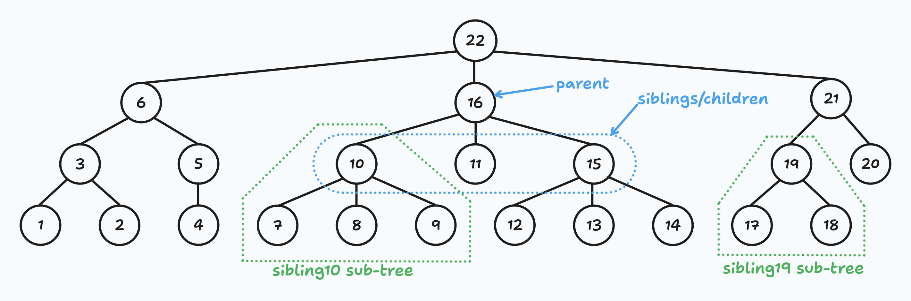
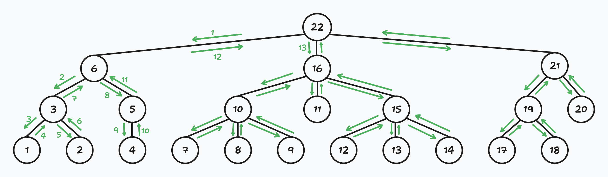
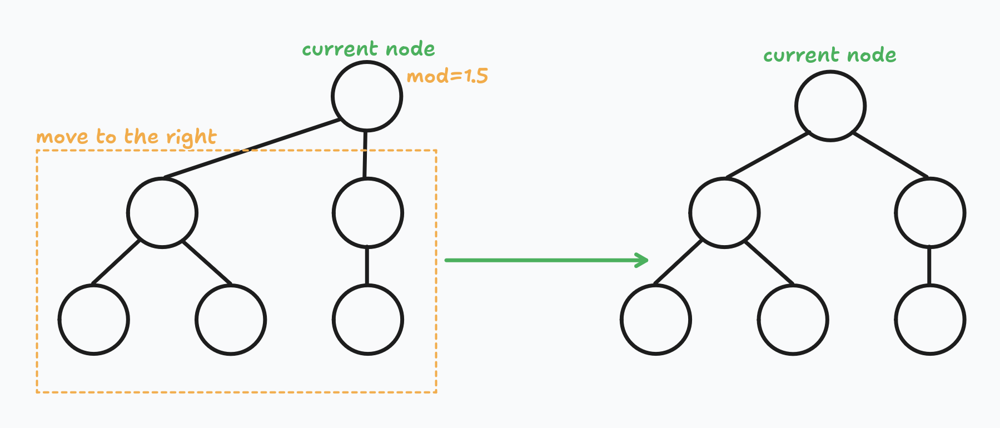
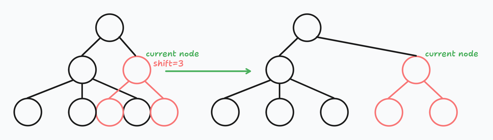
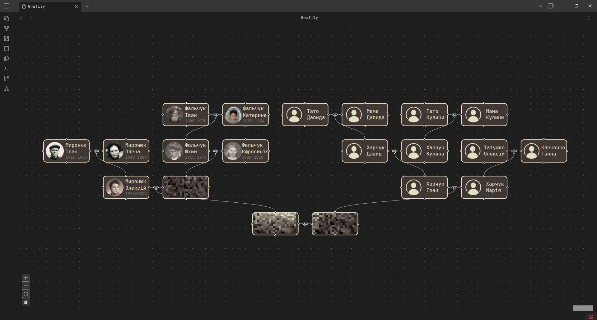

+++
title = "Drawing Genealogy Graphs. Part 1: Tree Drawing Using Reingold-Tilford Algorithm"
date = 2026-02-05
draft = false

[taxonomies]
tags = ["algorithms", "tree-data-structure", "data-structures", "typescript", "drawing-genealogy-graphs-series"]

[extra]
keywords = "Algorithm, Reingold-Tilford Algorithm, Trees, Node positioning, Data structures, Algorithms"
toc = true
math = true
math_auto_render = true
+++

# Motivation

Last year I started my own genealogy research. Honestly, I planned to start it many years ago.
One day in 2025, I realized that if I did not start, then it may never happen and I would lost a huge part of my family history.

I spent a lot of time visiting and asking my old relatives many questions, scanning old photos and documents.
At some point, I questioned myself about how it's better to store all this data.
Some day I will write a detailed post about considered approaches, proc and cons of each of them and why I chose what I chose.
But today, in this post, I am going right to the solution.

I chose [Obsidian](https://obsidian.md/) as a main app for storing all genealogy data including photos, conversations recordings, texts, peoples information, scanned documents, etc.
I wanted to have a full control over my data. I did not want to trust any websites.
Obsidian is very flexible, convenient, and extendable. For me, it's a perfect choice.
Additionally, I periodically back up genealogy data to external SSD and [Google Cloud Storage](https://cloud.google.com/products/storage) bucket.
I do not know about you, but I feel myself pretty comfortable and reliably with this approach.

Let me answer one question before we go further. Yes, I know about [myheritage](https://www.myheritage.com/).
I still fill up all family and ancestors basic info like names, born, marriage, and death dates, etc.
I consider myheritage a great tool for a research.
But again, I do not trust it and do not want to trust it to have all my family personal photos, stories, some documents, and other sensitive information.

So, where did I stop. Oh, yes, Obsidian. Obviously, I would want to visualize the family graph.
The Obsidian has a built-in [Graph View](https://help.obsidian.md/plugins/graph).
It looks funny, but does not look even close to what I want.
I browsed community plugins and did not find anything helpful at all.
So, I decided to write my own Obsidian plugin that will render family members as a pretty graph.
Plugin details are out of the scope of this article. I will definitely write a separate post about it in the future.

**This article is focused only on the nodes positioning algorithm.**

**All tree diagrams were made using [<mark>tldraw</mark>](https://github.com/tldraw/tldraw).**

# Intro

I knew that calculating positions for nodes during graph or tree drawing is not a trivial task and it would definitely be hard.
But I still decided to try to solve this task by myself. I spent a few days on it without achieving any results.
Then I googled for existing algorithms (yes, I should have done it before spending a few days on nothing).

I did not find the exact algorithm, but I found a similar (and much simpler) one: the Reingold-Tilford Algorithm for rendering pretty trees.
This algorithm is not suitable for me, because it is for tree nodes positioning. But all family relationships are a (complex) graph.
This fact introduces a lot of complexity to the task, but I decided to implement the simpler version first and then improve it to meet my requirements.

But why write one more post when other explanations exist?
The problem with existing explanations is that they explain every step of the algorithm as it is, but do not explain **_WHY it works_** and **_WHAT THE PURPOSE_** of each step of the algorithm is.
Many posts feel like the code, but converted to English words :pensive:.

**UDP.** During writing this post I found another post with great explanation and even animations: [Drawing Trees Functionally: Reingold and Tilford, 1981](https://williamyaoh.com/posts/2023-04-22-drawing-trees-functionally.html).

# The Reingold-Tilford Algorithm

Let's go straight to the point. Our task is to calculate `x` and `y` coordinates of each node in our tree.
Every node in the tree can have any number of children.
Different implementations set similar (maybe a bit different) _Aesthetic Rules_ for tree rendering. Usually, they look like this:

1. Nodes at the same level of the tree should be on the same horizontal line.
2. A parent should be centered over its children.
3. A tree and its mirror image should produce drawings that are reflections of one another;
   moreover, a subtree should be drawn the same way regardless of where it occurs in the tree.

**Note 1.** Someone also require the distance between children of the node should be the same, but it's not the case for me.
I do not care about this distance :upside_down_face:.

**Note 2.** There is a special rule for binary trees:
> A left child should be positioned to the left of its parent node and a right child to the right (only applicable to binary trees)

The family tree of direct ancestors is, in fact, a binary tree, the explanation below assumes that any node can have any number of children.

It's easy to satisfy the first condition: the `y` coordinate is a recursion depth (node level in the tree) multiplied by (node height + gap between nodes).

```ts
const y = level * (NODE_HEIGHT + NODES_GAP);
```

The real problems is the `x` coordinate assignment.
Because any node in the tree can have any number of children, we cannot know in advance the exact tree layout and nodes positions.
In other words, we cannot assign `x` coordinates with just one tree traversal.
Fortunately, we can do it in two traversals :wink:. I call them first walk and second walk.

During the first walk, we calculate intermediate (preliminary) `preX`, `mod`, and `shift` values.
During the second walk we use these values to calculate final `x` coordinate.

Because it is just two tree traversals, the overall algorithm complexity is `O(n)` where `n` is the number of nodes in the tree.

Suppose we have the following tree:



Let me clarify a few things.

- <mark>Siblings</mark> are all nodes that share the same parent node.
  I do not often see someone use this term, so I decided to clarify it.
- <mark>Sub-tree</mark> of the node is all descendants including the node itself.
  For example, subtree for node 10 is a tree of nodes 10, 7, 8, 9. 
- The Reingold-Tilford Algorithm uses a [depth-first tree traversal](https://en.wikipedia.org/wiki/Depth-first_search).
  On the picture above, you can see in what order coordinates will be assigned.
  It is important to have determined siblings order.
  Each time we traverse the tree, we should visit nodes in the same order.
  On the picture below I draw arrows which show the nodes visiting order:



## First walk

As I wrote above, during the first walk we determine `preX`, `mod`, and `shift` values for each node in the tree.
Let me explain what these parameters mean.

- `preX` or <mark>preliminary x</mark>.
  The initial node `x` coordinate we gave it based on its position among siblings.
  This `preX` value does not take into account siblings sub-trees or children subtrees.
- `mod` or <mark>modifier</mark>.
  Denotes how much we need to shift node descendants (**but not the node itself**) to the right to make descendants centered with respect to the node.



- `shift` or <mark>shift</mark> :rofl:.
  Denotes how much we need to shift the node **and** its descendants to the right to avoid overlapping with the previous sibling subtree.



Worth mentioning that the original paper does not have the `shift` parameter, only `preX` and `mod`.
The `shift` parameter was introduced in this post _for better clarity_: [Reingold Tilford Algorithm Explained With Walkthrough. Sep 12, 2023](https://towardsdatascience.com/reingold-tilford-algorithm-explained-with-walkthrough-be5810e8ed93/).
I also follow this approach because I got used to this parameter and it's easier to understand that way.

### Preliminary x

As I wrote above, `preX` is the initial node `x` coordinate we gave it based on its position among siblings.
The distance between nodes must be at least NODE_WIDTH + NODES_GAP. Let's call it a _sibling distance_.
For the example simplicity, I assume that the _sibling distance_ is equal to 1:



For every node we set the `preX` to one of the following values:

- If the node is the leftmost node among siblings, then its `preX` is equal to midpoint of its children:
  ```ts
  const leftmostX = leftmostNode.preX + leftmostNode.shift;
  const rightmostX = rightmostNode.preX + rightmostNode.shift;
  const midpoint = (leftmostX + rightmostX) / 2;
  ```
  If the node does not have children but is the leftmost sibling, then it's `prex` is equal to `0`.
- If the node is **not** the leftmost node among siblings, then its `preX` is equal to previous sibling `preX` plus sibling distance.
  ```ts
  const preX = prevSibling.preX + SIBLING_DISTANCE;
  ```

> **_Wait!!! What? `.shift`? Here? Why?_**

Camp down! :innocent:

Yes, `shift`. Do you remember the `shift` definition?

> _Denotes how much we need to shift the **node and its descendants** to the right to avoid overlapping with the previous sibling subtree._

The `shift` value also affects the node `x` value.
We need to take it into an account when calculating `preX`.
But we do not use the children's `mod` value because it does not affect the children `x` value (only children's descendants).

Yes, you do not know how the `shift` is calculated, but I assure you, I will explain it below.
As I said above, the Reingold-Tilford algorithm is the deep-first recursive algorithm.
It means that when we calculate node `preX`, `mod`, and `shift` values, these values **are already calculated for all children nodes**.

### Modifier

At this step, our goal is to center children with respect to their parent node.
Currently, only children of leftmost siblings are centered with respect to their parent node.
We need to do the same for all other nodes.

For every node we calculate the `mod` value: the distance between children midpoint and `preX`.
Or, in other words, how much we need to shift descendants to the right, so they are centered with respect to their parent node.
General formula looks like this:

```ts
const leftmostX = leftmostNode.preX + leftmostNode.shift;
const rightmostX = rightmostNode.preX + rightmostNode.shift;
const midpoint = (leftmostX + rightmostX) / 2;
const mod = node.preX - midpoint;
```

Good. Now all children are centered with respect to their parent node.
Obviously, that's not enough.
All previous manipulations do not prevent overlaps. We do not want subtrees to overlap.
We are going to fix it using the `shift` parameter.

### Shift

## Second walk

Congratulations! You have got though the hardest part. The second walk is much easier and intuitively understandable.

At this point, we have `preX`, `mod`, and `shift` parameters for every node in the tree.
Using the depth-first left-to-right walk, we determine the final `x` and `y` coordinates for every node.

For every node, the final `x` coordinate is the sum of all parent nodes `mod` and `shift` values plus its own `preX` and `shift` values.
In other words, we need to sum `mod` and `shift` values of every parent node on our way to the node.

```ts
const shift = /* the sum of parent nodes mod and shift parameters */;
const x = node.preX + node.shift + shift;
```

The best part is we do not even need to create separate arrays/lists to track parent nodes. We can calculate this sum recursively:

```ts
// Pseudocode.
function secondWalk(node, shift, level) {
    for (const child in node.getChildNodes()) {
        secondWalk(child, shift + node.mod + node.shift, level + 1);
    }

    const x = node.preX + node.shift + shift;
    const y = level * (NODE_HEIGHT + NODES_GAP);

    // At this point, (x, y) are final node coordinates.
    // Do whatever you need to do with them.
}

secondWalk(root, 0, 0);
```

# Demo: Grafily

I hope the reader does not forget that my primary goal is family graph rendering.
Obviously, we cannot render all family members but **only direct ancestors**: parents, parents of parents, etc.

I adjusted the Reingold-Tilford Algorithm to family tree rendering and implemented it in [github/TheBestTvarynka/grafily/b9d281d3/src/layout.ts](https://github.com/TheBestTvarynka/grafily/blob/b9d281d35fe5def9a3b0b260c82375d44f4755b1/src/layout.ts).
The whole implementation tool me ~500 LoC.
This implementation is far from perfection and code can be cleaned a lot.
But I do not need any perfectionism here and I know that I will rewrite it soon.
And this is the example of this algorithm in action:



<sup><sub>I was too lazy to create a separate vault with non-existent persons, so I just took a small subset of my real ancestors and blurred alive ones :upside_down_face:</sup></sub>

As you can see from the screenshot above, the algorithm successfully positioned marriages; there are no overlaps and all marriages are aligned.
At this point, I can call it a success :star_struck: :sunglasses:.

The main limitations of this approach: **only direct ancestors are allowed**. I also call it a school-level family tree.
It's impossible to render siblings, their spouses, and their spouses' families (I call them parallel families).

> _I adjusted the Reingold-Tilford Algorithm to family tree rendering..._

I did not change the algorithm itself, but added small tricks to the nodes representation.

1. Every tree note is actually 3 nodes combined together: parent1 node + marriage node + parent2 node.
   It was done to simplify the algorithm implementation and better edges rendering.

   ```ts
   // https://github.com/TheBestTvarynka/grafily/blob/b9d281d35fe5def9a3b0b260c82375d44f4755b1/src/layout.ts#L13-L19
   // +------------+                             +------------+
   // |  parent1   |--------------o--------------|  parent2   |
   // +------------+                             +------------+
   //
   // | NODE_WIDTH | MARRIAGE_GAP | MARRIAGE_GAP | NODE_WIDTH |
   // |                    MARRIAGE_WIDTH                     |
   const MARRIAGE_WIDTH = (NODE_WIDTH + MARRIAGE_GAP) * 2;
   ```
2. I draw tree with the root on the bottom and leafs on the top of the page.
   In family trees, it is convention to draw older generations on top.
   On the other hand, that's even better because now the tree looks actually like a real tree:

   

# Conclusions

I hope my explanation is pretty clear for you, my dear reader. I did my best to make it easier to understand :blush:.

Additionally, I would like to mention that implementing such algorithm is a great exercise to boost your programming skills.
I have not had such algorithmic tasks in years. And when I started writing the Reingold-Tilford Algorithm for my plugin, I felt a small numbness.
Most of the time I looked like this:


The progress was super slow and I spent a lot of time thinking about representations of different parts of the algorithm in the code.
But in the end, I managed to get it done and even a bit proud of myself.

# References

1. [A Node-Positioning Algorithm for General Trees. John Q. Walker II. September, 1989](https://www.cs.unc.edu/techreports/89-034.pdf).
   This paper is awful. It was useless for me. I understand a bit more than nothing from it. I mentioned it just for curiosity.
2. [Tidier Drawings of Trees Edward M. Reingold and John S. Tilford.  March 1981](https://reingold.co/tidier-drawings.pdf).
   Another related paper just for curiosity and general intellectual development :rofl:.
3. [Reingold Tilford Algorithm Explained With Walkthrough. Sep 12, 2023](https://towardsdatascience.com/reingold-tilford-algorithm-explained-with-walkthrough-be5810e8ed93/).
   Excellent blog post :star_struck: — good explanations, nice images, and illustrations. I recommend reading it.
4. [Drawing Trees Functionally: Reingold and Tilford, 1981. April 22, 2023](https://williamyaoh.com/posts/2023-04-22-drawing-trees-functionally.html).
   Another post with great explanation and even animations :star_struck:.
4. [Algorithm for Drawing Trees. April 20, 2014](https://rachel53461.wordpress.com/2014/04/20/algorithm-for-drawing-trees/).
   Another blog post I found, but it was confusing for me and raised more questions than it answered.
5. My Reingold-Tilford Algorithm implementation: [github/TheBestTvarynka/grafily/b9d281d3/src/layout.ts](https://github.com/TheBestTvarynka/grafily/blob/b9d281d35fe5def9a3b0b260c82375d44f4755b1/src/layout.ts).
6. [Obsidian](https://obsidian.md/) official website.
7. [myheritage](https://www.myheritage.com/) official website.
