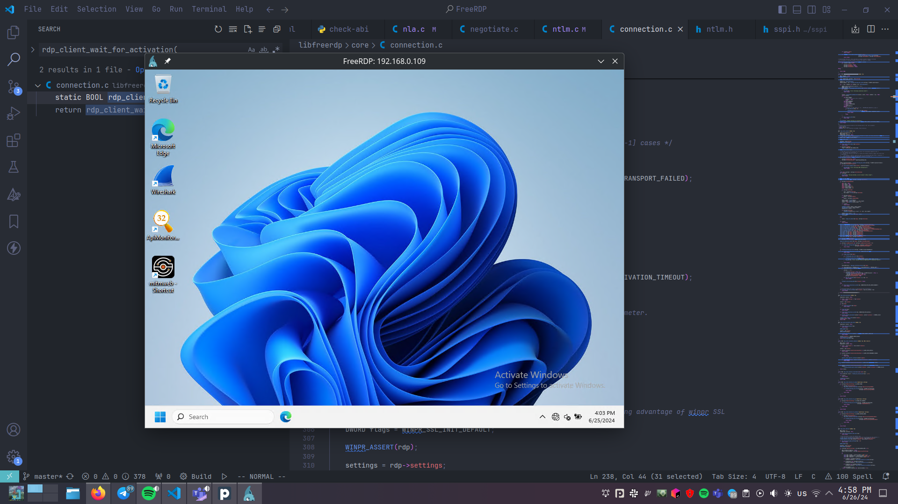

+++
title = "FreeRDP smart card support. Lore 1"
date = 2024-08-30
draft = false

[taxonomies]
tags = ["rust", "freerdp", "scard", "linux", "debugging"]

[extra]
keywords = "Rust, FreeRDP, Smart Card, Debugging"
toc = true
mermaid = true
+++

# Intro

This big article is a detailed lore about how I added a smart card auth support (*scard support*) to the [`FreeRDP`](https://github.com/FreeRDP/FreeRDP).

> _The FreeRDP already supports the scard auth, isn't it?_

Well, yes, but this case is a bit special. I need to tell you a little backstory to clear everything out.

Some time ago the emulated smart card has been implemented in the `sspi-rs`: [Devolutions/sspi-rs/pull/210](https://github.com/Devolutions/sspi-rs/pull/210). It allows us to use an emulated smart card for the RDP authorization without additional drivers, TMP smart cards, etc.

The next big step is to support the system-provided smart cards. It'll allow us to use one `sspi.dll/.so` library for full authorization with scards support. We will be able to switch between emulated and real scards.

# Building FreeRDP

```bash
# Please, do not copy and paste these commands blindly!
# Hmmmm...
# DO NOT COPY THESE COMMANDS AT ALL!
git clone https://github.com/FreeRDP/FreeRDP.git
cd FreeRDP/
sudo pacman -S cmake
sudo pacman -S ninja
sudo pacman -S sdl2_ttf
mkdir freerdp-build
mkdir freerdp-build/debug
cmake -GNinja -B freerdp-build -S ./ -DCMAKE_BUILD_TYPE=Debug -DCMAKE_SKIP_INSTALL_ALL_DEPENDENCY=ON -DWITH_SERVER=OFF -DWITH_SAMPLE=OFF -DWITH_PLATFORM_SERVER=OFF -DUSE_UNWIND=OFF -DWITH_SWSCALE=OFF -DWITH_FFMPEG=OFF -DWITH_WEBVIEW=OFF -DCMAKE_INSTALL_PREFIX=/home/pavlo-myroniuk/apriorit/FreeRDP/freerdp-build/debug
cmake --build freerdp-build
cmake --install freerdp-build
```

The full compilation guide is located here: [FreeRDP/wiki/Compilation](https://github.com/FreeRDP/FreeRDP/wiki/Compilation).

Now let's ensure that everything works well and FreeRDP can connect to the remote server:

```bash
./freerdp-build/debug/bin/xfreerdp -v 192.168.0.109:3389 -u test -p "test" -log-level TRACE -cert ignore
```



Good. From the picture above we can say that `NTLM` auth protocol works well and `FreeRDP` can establish the RDP connection.

# What does "scard support" mean?

In such a case, the "scard supoprt" mean two things:

* Ability to log on into the remote server using smart card (**required**).
* Redirect local smart card to the remote machine (*optional: can be implemented later*).

Currently, I'll consentrate my attention at the first point. I'll talk about auth and scards for the rest of this article.

# Scard auth overview

## NLA

Now we need to understand how scard authorization works. Without this knowladge we can't move further.
The RDP auth is very compilated thing. So, I'll focus my attention only on scard related things.

So, the first thing you need to know is [NLA](https://en.wikipedia.org/wiki/Remote_Desktop_Services#Network_Level_Authentication):

> *Network Level Authentication (NLA) is a feature of RDP Server or Remote Desktop Connection (RDP Client) that requires the connecting user to authenticate themselves before a session is established with the server.*

Sounds pretty compilated. The idea is to authenticate the user before the user session establishment. It reduces the risk of denial-of-service attacks. We say let's perform mutual (hopefully) server and client authentication and reject the connection if something goes wrong.

And yes, Microsoft has a bunch of protocols for NLA. We don't need to know all of them, but I provide you some explanations of needed ones. Look at the picture below. It shows the NLA auth structure and the most common protocols:


flowchart LR
    subgraph CREDSSP["CredSSP"]
        subgraph SPNEGO["SPNEGO"]
            subgraph ApplicationProtocol["Application Protocol (NTLM, Kerberos, etc)"]
            end
        end
    end


[CredSSP overview](https://learn.microsoft.com/en-us/openspecs/windows_protocols/ms-cssp/e36b36f6-edf4-4df1-9905-9e53b7d7c7b7):

> The Credential Security Support Provider (CredSSP) Protocol enables an application to securely delegate a user's credentials from a client to a target server. For example, the Microsoft Terminal Server uses the CredSSP Protocol to securely delegate the user's password or smart card PIN from the client to the server to remotely log on the user and establish a terminal services session.

However, the CredSSP protocol is only responsible for credentials delegation. It doesn't authenticate clients or servers. An actual auth is performed by the inner application protocol like NTLM, or Kerberos (preferable).

But Microsoft would not be Microsoft if they did not add complications. The CredSSP uses [the SPNEGO framework](https://learn.microsoft.com/en-us/openspecs/windows_protocols/ms-spng/b16309d8-4a93-4fa6-9ee2-7d84b2451c84): ([quote src](https://learn.microsoft.com/en-us/openspecs/windows_protocols/ms-cssp/e36b36f6-edf4-4df1-9905-9e53b7d7c7b7))

> SPNEGO provides a framework for two parties that are engaged in authentication to select from a set of possible authentication mechanisms.
>
> ...The CredSSP Protocol uses SPNEGO to mutually authenticate the CredSSP client and CredSSP server. It then uses the encryption key that is established under SPNEGO to securely bind to the TLS session.

Let's summarize this. The SPNEGO selects (negotiates) an appropriate authentication protocol and performs an authentication using this protocol. As the result, we'll have an established security context with some secure encryption key. In turn, the CredSSP will use this key to encrypt the credentials and pass them to the target CredSSP server.

Good. Now you have a brief overview of the NLA. Now it's time to move forward.

## Kerberos

To log on using smart card we need the SPNEGO to select the Kerberos as a application protocol for authentication. The Kerberos is the only one authentication protocol that can be used for the scard auth. In order to support password-less log on, the Kerberos uses the PKINIT extension: [Public Key Cryptography for Initial Authentication in Kerberos (PKINIT)](https://datatracker.ietf.org/doc/html/rfc4556).

If you don't know how the Kerberos works, then check [links](#doc-references-code) ar the end of this article.

## Smart card usage

During the connection establishing, we need smart card for the following things:

* Cerificate and public key extraction.
* Data signing.

To perform successful authenticarion, the Kerberos needs to know the user certificate and be able to sign the data with corresponding private key. Of cource, the private key is not exportable. So, the Kerberos will use some API/module to pass the padded digest and get the signature back.

The most low-level API for accessing smart cards is WinSCard API. It is originally implemented in Windows ([winscard.h](https://learn.microsoft.com/en-us/windows/win32/api/winscard/)) but also has an open source implementation ([pcsc-lite](https://pcsclite.apdu.fr/api/group__API.html)).

## `pcsc-lite`

Before we start the fun, I want to clarify one thing: we should use the [pcsc-lite](https://pcsclite.apdu.fr/) library for the smart card access on Linux and macOS. There are a few reasons for that:

* The `pcsc-lite` works well on Linux.
* The `pcsc-lite` API is very similar to the Windows WinSCard API (but with some differensies described [here](https://pcsclite.apdu.fr/api/group__API.html)).
* The WinSCard API is already integrated and implemented in the [sspi-rs](https://github.com/Devolutions/sspi-rs/tree/master/ffi/src/winscard) library.

Ideally, it would be perfect to use the one `sspi-rs` library as both `sspi.dll/.so` and `winscard.dll/.so`.

# FreeRDP components

The theory is good, but how all these protocols and APIs are represented in the code and how they communicate between each other? The purpose of this section is to give you answers to these questions.

## SSPI

The [SSPI](https://learn.microsoft.com/en-us/windows/win32/secauthn/sspi) is a general interface for authentication in Windows. Many security packages implement it and provide us different authentication methods viz the samwe API. CredSSP, NTLM, Kerneros, Negoteate, SChannel, and more. ALl of them implement SSPI API. More about SSPI you can read in my another blog post: [SSPI introduction](https://tbt.qkation.com/posts/sspi-introduction/).

The SSPI API has become very popular and many programs support it. The same for the FreeRDP: [`SecurityFunctionTableW`](https://github.com/FreeRDP/FreeRDP/blob/c9aa349c52bb3749ac1d37fe16c9f548ee6c53e4/winpr/include/winpr/sspi.h#L1156-L1188). The FreeRDP performs the NLA auth by calling the SSPI API. The FreeRDP is very flexible:

* It has its own SSPI implementors: [`FreeRDP/winpr/libwinpr/sspi`](https://github.com/FreeRDP/FreeRDP/tree/c9aa349c52bb3749ac1d37fe16c9f548ee6c53e4/winpr/libwinpr/sspi).
* It also can call the Windows SSPI API instead of some implementor (in order to use all SSPI features Windows has).
* We can even pass our own SSPI implementor (security package) via the `sspi-module` flag.

The FreeRDP has its own CredSSP implementation ([`nla.c`](https://github.com/FreeRDP/FreeRDP/blob/c9aa349c52bb3749ac1d37fe16c9f548ee6c53e4/libfreerdp/core/nla.c) and [`credssp_auth.c`](https://github.com/FreeRDP/FreeRDP/blob/c9aa349c52bb3749ac1d37fe16c9f548ee6c53e4/libfreerdp/core/credssp_auth.c)) but uses the SSPI for authentication.

After some research I can say that the FreeRDP always uses its own CredSSP implementation but the underlying SSPI package can be injected.

```c
// https://github.com/FreeRDP/FreeRDP/blob/c9aa349c52bb3749ac1d37fe16c9f548ee6c53e4/libfreerdp/core/transport.c#L667-L677
if (nla_authenticate(transport->nla) < 0)
{
    // ...
    return FALSE;
}
// https://github.com/FreeRDP/FreeRDP/blob/c9aa349c52bb3749ac1d37fe16c9f548ee6c53e4/libfreerdp/core/nla.c#L889-L897
int nla_authenticate(rdpNla* nla)
{
    // ...
    return nla_client_authenticate(nla);
}
// https://github.com/FreeRDP/FreeRDP/blob/c9aa349c52bb3749ac1d37fe16c9f548ee6c53e4/libfreerdp/core/nla.c#L617-L655
static int nla_client_authenticate(rdpNla* nla)
{
    // ...
	if (nla_client_begin(nla) < 1)
		goto fail;

	while (nla_get_state(nla) < NLA_STATE_AUTH_INFO)
	{
        // ...
		const int status = transport_read_pdu(nla->transport, s);
        // ...
		const int status2 = nla_recv_pdu(nla, s);
	}
    // ...
}
```

So, we can not inject our own CredSSP implementation, but we can inject our own SSPI interface implemenation with the any application protocol implemented. Interesting...

## Scard: first look

Okay, the scariest part is coming. Actually, I know almost nothing about smart card modules, any scard-related API, or external scard comules in FreeRDP. Currently, I know the following: the `FreeRDP` can link with the Windows WinSCard and use it for the authentication (`/smartcard-logon` and `/sec:nla` flags).

```bash
# All credentials belong to the test VM and can not be used for real ones. So, don't worry.
wfreerdp.exe /v:DESKTOP-8F33RFH.tbt.com /p:214653214653 /u:t2@tbt.com /log-level:TRACE /smartcard-logon /sec:nla > logs.txt
```

But I don't how it behavies on other operating systems like Linux/macOS and now I need to gather any related/useful information about smart cards support/implementation in FreeRDP.

Actually, I'm very naive and have some hope that the FreeRDP can load the winscard module at runtime and I can just inject my own `winscard.dll` that will call pcsc-lite. If so, the the FreeRDP should have different WinSCard methods calls across the code. Lets try to search for it.

I started from the `SCardEstablishContext` function. I found some mentions:

* Smart card emulation in the `smartcard_emulate.c/.h`.
* In different types definitions (`.h` files).
* `SCardEstablishContext` function wrappers in the `smartcard_call.c`.
* In the `ncrypt_pkcs.c` module: `get_piv_container_name` function. This module uses the WinSCard API for the smart card container name extraction.
* Another `SCardEstablishContext` wrapper: `Inspect_SCardEstablishContext` in `smartcard_inspect.c` module.
* `smartcard_pcsc.c` module.

...Hmmm. The scard emulation and wrapper is not relewant for us. The `get_piv_container_name` looks interesting. I explored the `ncrypt_pkcs.c` module a little bit more. It uses the WinSCard API only for the scard container name extraction and links with the `winpr/smartcard.h`. But I don't see any code for data signing. It means that data is signed using another API. I did some researchs about the `SCardTransmit` function usage and got the same result.

I just remembered about the `/winscard-module` arg in FreeRDP. But it only allows the user to pass the custom WinSCard module. As I understood, this module will be used for the smart card rediction over the established RDP connection. More information about it: [[MS-RDPESC]: Remote Desktop Protocol: Smart Card Virtual Channel Extension](https://learn.microsoft.com/en-us/openspecs/windows_protocols/ms-rdpesc/0428ca28-b4dc-46a3-97c3-01887fa44a90).

Additionally, the FreeRDP also has a `/smartcard-logon` arg. It enables _"Smartcard logon with Kerberos authentication"_.

> *But what about smart card credentials passing, data signing, certificate extraction?*

IDK :sweat_smile: and we'll focus on it from now.

## Scard credentials

What it smart card credentials? It's a set of:

* **_PIN code_**. I think you what it is.
* **_Reader Name_**: The name of the smart card reader.
* **_CSP Name_**: The name of the [Cryptographic Service Provider](https://en.wikipedia.org/wiki/Cryptographic_Service_Provider) (CSP). For example, _Microsoft Base Smart Card Crypto Provider_.
* **_Scard certificate_**. Actually, the scard can contain many certificates for different purposes. But we can say that the scard for RDP auth must contain at least one certificate issues by the domain ([AD CS](https://learn.microsoft.com/en-us/windows-server/identity/ad-cs/active-directory-certificate-services-overview)).
* **_Card Name_**.
* **_Smart Card Container Name_**.
* **_User Name_**. Usually, can be extracted from the user ceriticate.

Of cource, we don't want to specify all of them in cli (and we shouldn't). So, the FreeRDP has its own scard credentials mechanism implemented: [`nla_adjust_settings_from_smartcard`](https://github.com/FreeRDP/FreeRDP/blob/c9aa349c52bb3749ac1d37fe16c9f548ee6c53e4/libfreerdp/core/nla.c#L218). How does it work? In short, it iterates through all available container names and tries to find a matched one: [`smartcard_hw_enumerateCerts`](https://github.com/FreeRDP/FreeRDP/blob/c9aa349c52bb3749ac1d37fe16c9f548ee6c53e4/libfreerdp/core/smartcardlogon.c#L557):

```c
// pseudo-code
static BOOL smartcard_hw_enumerateCerts(...)
{
	const char* Pkcs11Module = freerdp_settings_get_string(settings, FreeRDP_Pkcs11Module);

	if (Pkcs11Module)
	{
		/* load a unique CSP by pkcs11 module path */
		LPCSTR paths[] = { Pkcs11Module, NULL };

		status = winpr_NCryptOpenStorageProviderEx(&provider, csp, 0, paths);
		status = list_provider_keys(settings, provider, csp, scope, userFilter, domainFilter,
		                            &cert_list, &count);
	}
	else
	{
		status = NCryptEnumStorageProviders(&nproviders, &names, NCRYPT_SILENT_FLAG);

		for (DWORD i = 0; i < nproviders; i++)
		{
			char providerNameStr[256] = { 0 };
			const NCryptProviderName* name = &names[i];

			if (ConvertWCharToUtf8(name->pszName, providerNameStr, ARRAYSIZE(providerNameStr)) < 0) { }

			WLog_DBG(TAG, "exploring CSP '%s'", providerNameStr);
			if (csp && _wcscmp(name->pszName, csp) != 0)
			{
				WLog_DBG(TAG, "CSP '%s' filtered out", providerNameStr);
				continue;
			}

			status = NCryptOpenStorageProvider(&provider, name->pszName, 0);
			if (status != ERROR_SUCCESS)
				continue;

			if (!list_provider_keys(settings, provider, name->pszName, scope, userFilter,
			                        domainFilter, &cert_list, &count))
				WLog_INFO(TAG, "error when retrieving keys in CSP '%s'", providerNameStr);

			NCryptFreeObject((NCRYPT_HANDLE)provider);
		}

		NCryptFreeBuffer(names);
	}

	*scCerts = cert_list;
	*retCount = count;
	ret = TRUE;

	return ret;
}
```

Now can can made a few conclusions:

* We can inject ouw own [pkcs11](https://en.wikipedia.org/wiki/PKCS_11) module using the `/pkcs11-module:<path>` arg. But as I understand we can only use it only with the `/kerberos` arg:
```txt
/kerberos: [kdc-url:<url>,lifetime:<time>,start-time:<time>,
            renewable-lifetime:<time>,cache:<path>,armor:<path>,
            pkinit-anchors:<path>,pkcs11-module:<name>]
                                  Kerberos options
```
* It uses the _NCrypt_ API for scard credentials ajusting. Actually, the original [NCrypt API](https://learn.microsoft.com/en-us/windows/win32/api/ncrypt/) is only awailale on Windows. So, the FreeRDP has its own wrapper over pkcs11 module and explorts NCrypt-like API: [`ncrypt_pkcs11.c`](https://github.com/FreeRDP/FreeRDP/blob/c9aa349c52bb3749ac1d37fe16c9f548ee6c53e4/winpr/libwinpr/ncrypt/ncrypt_pkcs11.c).
* The `ncrypt_pkcs11.c` module contains only functions for data gathering: extracting PIN contaier name, obtaining different properties values, keys or containers enumeration. But this module doesn't contain any functions for data signing :confused:.

...Hmmm, okayyyyyy. Now we now what components collect smart card credentials. But we don't know what compoent(s) can perform authorization (Kerberos messages + data signing using smart card). Lets investigate it further.

## Kerberos

The one thing I'm sure about is that the Kerberos authentication is only available via SSPI API and all Kerberos-related code is located in the [`winpr/libwinpr/sspi/Kerberos`](https://github.com/FreeRDP/FreeRDP/tree/c9aa349c52bb3749ac1d37fe16c9f548ee6c53e4/winpr/libwinpr/sspi/Kerberos) folder. In order to support Kerberos auth, the FreeRDP uses one of two available Kerberos implementations: [MIT](https://github.com/krb5/krb5) and [Heimdal](https://github.com/heimdal/heimdal). Does FreeRDP support the Kerberos scard auth? To answer this question we need to check if at least one of these Kerberos imlpementations implements the [PK-INIT](https://datatracker.ietf.org/doc/html/rfc4556) Kerberos extension. **_My expectations (my bet)_**: they implement it but depends on some crypto module like _pkcs11_ in order to support flexible mechanism for all crypto-related operations.

[`heimdal/doc/setup.texi`](https://github.com/heimdal/heimdal/blob/ba8c3dbc6261ab397ce5bb4fc0ca6b0ea23eb46a/doc/setup.texi#L1577-L1584):

> @item PKCS11:
>
> PKCS11: is used to handle smartcards via PKCS#11 drivers, such as soft-token, opensc, or muscle. The argument specifies a shared object that implements the PKCS#11 API. The default is to use all slots on the device/token.

The MIT KRB5 implementation is also supports the PKCS11 injecting. [`krb5/doc/conf.py`](https://github.com/krb5/krb5/blob/354f176ba6d6cc544e1c15712a13f9c006ca605d/doc/conf.py#L235-L259):

```py
if 'mansubs' in tags:
    # ...
    pkcs11_modname = '``@PKCS11MOD@``' # <-------
elif 'pathsubs' in tags:
    # Read configured paths from a file produced by the build system.
    exec(open("paths.py").read())
else:
    # ...
    pkcs11_modname = ':ref:`PKCS11_MODNAME <paths>`' # <-------
```

[`krb5/doc/build/options2configure.rst`](https://github.com/krb5/krb5/blob/354f176ba6d6cc544e1c15712a13f9c006ca605d/doc/build/options2configure.rst?plain=1#L140-L141):

> **PKCS11_MODNAME=**\ *library*
>
> Override the built-in default PKCS11 library name.

Let's summarize it. The FreeRDP Kerberos implementation uses external Kerberos protocol implementation and just wraps it in the SSPI API. The MIT KRB5 or Heimdal Kebreros implementations can be used. Both of them use PKCS11 module to support PK-INIT (and scard-related operations). Soooo, in order to support RDP scard auth we need to provide a suitable PKCS11 module. :face_exhaling:

## PKCS11 module

[PKCS#11](https://en.wikipedia.org/wiki/PKCS_11):

> In cryptography, PKCS #11 is one of the Public-Key Cryptography Standards, and also refers to the programming interface to create and manipulate cryptographic tokens (a token where the secret is a cryptographic key).

In other words, it's a library with a defined (standardized) API that can perform some crypto operations related to public/private keys, asymmetric encryption, and so on.

In our case, we need some PKCS#11 module that supports smart cards and uses WinSCard/PCSC-lite API for communicating with scard. Many smart card vendors has pkcs#11 module for their scards. For example, [`libykcs11`](https://developers.yubico.com/yubico-piv-tool/YKCS11/).

> *Soooo, if I take any smart card with a corresponding pkcs#11 library, then scard auth in FreeRDP should work. Rught*

... :thinking: Yeah, it looks like this.

# Doc, references, code

* [Security Support Provider Interface (SSPI)](https://learn.microsoft.com/en-us/windows/win32/rpc/security-support-provider-interface-sspi-).
* [SSPI](https://learn.microsoft.com/en-us/windows/win32/secauthn/sspi).
* [Kerberos Authentication Explained](https://www.varonis.com/blog/kerberos-authentication-explained).
* [What is Kerberos](https://blog.netwrix.com/what-is-kerberos/).
* [RFC: The Kerberos Network Authentication Service (V5)](https://datatracker.ietf.org/doc/html/rfc4120).
* [Public Key Cryptography for Initial Authentication in Kerberos (PKINIT)](https://datatracker.ietf.org/doc/html/rfc4556).
* [FreeRDP](https://github.com/FreeRDP/FreeRDP/blob/c9aa349c52bb3749ac1d37fe16c9f548ee6c53e4) source code.
* [PKCS#11](https://en.wikipedia.org/wiki/PKCS_11).
