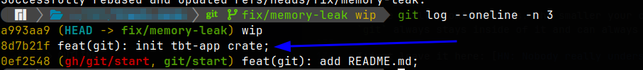
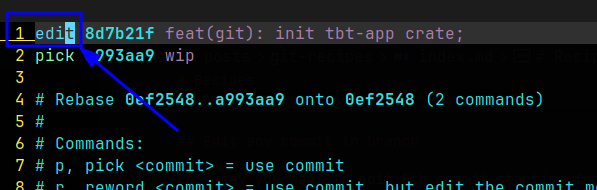
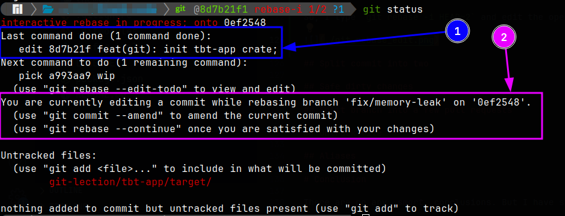
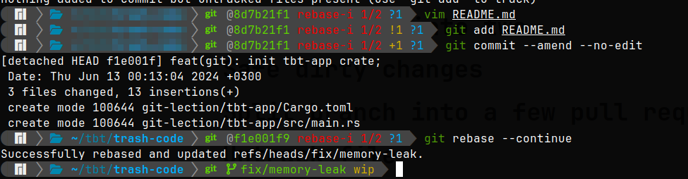

+++
title = "Git recipes"
date = 2024-06-22
draft = false
template = "post.html"

[taxonomies]
tags = ["recipes", "git"]

[extra]
keywords = "Git, VCS"
toc = true
thumbnail = "git-thumbnail.png"
+++

Recently I lectured in my company about [`git`](https://www.git-scm.com/) and resolving specific situations with it. It inspired me to write this article. I know that there is tons of info about `git` and related stuff. I wanted to make this one as a comprehensive set of instructions about resolving concrete git situations.

_**Note.**_ This page can be changed and improved in the future (I'll try to save the backward compatibility)!

# How to read this page

You can read it in any order. If you are interested only in some particular scenario, then read only the corresponding section. All sections are independent from each other and you can start reading anywhere.

The required `git` knowledge level to read this article is pretty low. If you know what are _commit_, _branch_, and _index_ (_stage_), then everything is good.

## Goals

* Explain how to resolve common `git` tasks I face at work every time.
* Improve your `git` knowledge.
* Dispel the fear of working with `git` in uncommon cases (if you have one).

## Non-goals

* **Explain how `git` works inside.** There is a great section in [the book](https://www.git-scm.com/book/en/v2) about git internals: [Git Internals](https://www.git-scm.com/book/en/v2/Git-Internals-Plumbing-and-Porcelain).
* **Propagate to work with `git` only from the terminal.** If the GUI is enough for you to perform all needed tasks, then it's great! The less we interact with `git`, the lower the probability of having problems with it :upside_down_face:.
* **Write zero to pro guide.** It's just impossible :smile:.
* **Replace the [Oh Shit, Git!?!](https://ohshitgit.com/) page**. The _Oh-Shit-Git_ purpose is to quickly resolve common problems. But my purpose is to offer guides for common tasks.

# Recipes

I want to leave a few clarifications before I write recipes.

* `HEAD`. How does Git know what branch you’re currently on? It keeps a special pointer called `HEAD`. [3.1 Git Branching - Branches in a Nutshell](https://git-scm.com/book/en/v2/Git-Branching-Branches-in-a-Nutshell). [What is HEAD in Git?](https://stackoverflow.com/a/2304106/9123725)
* `~<number>` and `^<number>` is the same in many cases, but not always. Read this SO answer for more details: [https://stackoverflow.com/a/2222920/9123725](https://stackoverflow.com/a/2222920/9123725).

## Last commit to index

So, you want to *"undo"* the last commit but save changes. The `git` has a [`git reset`](https://git-scm.com/docs/git-reset) command for that:

```bash
git reset --soft HEAD~1
```

As a result, you'll not have the last commit and all changes will be in the stage. And yes, you can enter any number of commits instead of `1`. If you want changes to be untracked, then use the save command but with the `--mixed` parameter:

```bash
git reset --mixed HEAD~1
```

## Discard last commit

I know that it's a bad idea, but if you really want, then this is how you can **discard** the last commit:

```bash
git reset --hard HEAD~1
```

**Note.** If you regret your decision, then you can restore lost commit with its hash:

```bash
git cherry-pick <commit-hash>
```

If you don't know its hash, then try to find it with `git reflog`.

## Edit last commit

Actually, you only need the `git commit --amend` to do it. `git commit` has a lot of flags and possible use cases, but I list here only common ones so you can copy and use them.

If you have any changes in the stage, then they will be added to commit after running `git commit --amend`. For example:

```bash
vim README.md
git commit --amend --no-edit
```

Now the last commit contains changes we made in `README.md` file. The `--no-edit` arg means do not edit the commit message. If you want to edit the commit message, then use the `-m` arg and just nothing (`git` will ask you for the message). It's also possible to alter the commit author, date, and so on:

```bash
# Reset commit author saving commit date. This command is helpful when you've changed the `.gitconfig` file.
git commit --amend
git commit --amend -m "new commit message"
git commit --amend --reset-author --no-edit --date="$(git log -n 1 --format=%aD)"
git commit --amend --author=<author>
```

Run `git commit --help` for more flags.

## Edit any commit in branch

Lets say you want to edit 5th commit starting from the current one (5th parent). You can use the `git rebase` with its interactive mode to do it:

```bash
git rebase -i HEAD~5
```

The `git` will open a text file with a list of 5 commits (parent commits). Now you need to write `edit` instead of `pick` for commit you want to edit. Safe this file and clone the editor. The rebasing will stop in the specified commit.

Now all you need is to edit selected commit and continue rebasing:

* Check this recipe to know how to edit the commit: [Edit last commit](#edit-last-commit).
* Continue rebasing:

```bash
git rebase --continue
```

### Example

I want to edit the the parent commit:



So, I type `git rebase -i HEAD~2` and edit the opened text file:



When I save the file and close the editor, I see (`git status`) that rebasing has stopped in the needed commit (`1` on the screenshot) and git even shows me helpful commands (`2` on the screenshot):



I edit files as I want, commit changes, and continue rebasing:



That's all! Nothing complicated :smile:.

## Split commit into two

Oh, it is an easy one. Usually, I do it in two steps:

1. "Undo" the last commit but save changes. [Last commit to index](#last-commit-to-index).
2. Create two different commits with `git add` and `git commit`.

```bash
# "Undo" last commit and save its changes. Changes will not be indexed after this command.
git reset --mixed HEAD~1
# First commit:
git add <files for first commit>
git commit -m <first commit message>
# Second commit
git add <files for second commit>
git commit -m <second commit message>
```

You can split one commit into multiple ones with this approach. If you need to split another commit in your branch (one of the parent commits), use the `git rebase -i` and `git reset` commands. More info: [Edit any commit in branch](#edit-any-commit-in-branch).

## Split branch into a few pull requests

:expressionless: :worried: :face_with_spiral_eyes:


([post source](https://x.com/xanf_ua/status/1688486956202643456))

The algorithm is simple:

1. Decide how to split. How many branched you'll have and what commits you'll move to what branches.
2. If you need to split some commits in order to move them to separate branches, then read the [Split commit into two](#split-commit-into-two) recipe, and go to the step 1. Otherwise, go to step 2.
3. Create needed branches in the base commit of the current branch.
4. Use `git checkout` and `git cherry-pick` commands to apply commits to corresponding branches.

## Untrack file

If you want `git` to ignore some file, then just add it to the `.gitignore` file. For example:

```bash
echo "credentials.json" >> .gitignore
```

But if this file was tracked by the `git` before, then this is not enough. You also need to run:

```bash
git rm --cached
```

More info you can read in this SO answer: [How to stop tracking and ignore changes to a file in Git?](https://stackoverflow.com/a/936290/9123725)

## Just my notes

Commands below are my notes for quick access:

```bash
# last commit with date
git log --pretty=format:"%h%x09%an%x09%ad%x09%s" | head -n 1

# one commit changes
git show ff10697de4f

# move last 10 commits from HEAD to another_branch.
# note. this command will not move the another_branch itself. just adds commits on top of it
git rebase -i HEAD~10 --onto another_branch

# author and commiter
git cat-file commit HEAD

# print any file in any commit. more info: https://juplo.de/cat-any-file-in-any-commit-with-git/
git show <hash>:<filepath>
```

# Conclusion

There are no any _smart_ conclusions. But I have stupid ones :grin::

* Make small atomic commits. The smaller your commits are, the better. It's easier to work with such commits. Moreover, everything committed in `git` always stays inside of it and can always be restored.

There are a lot of other `git` commands. I just listed the most common situations for me.
I just leave it here: [HN: Nobody really understands git](https://news.ycombinator.com/item?id=16807206).

# Doc, references, code

* The [Pro GIT](https://www.git-scm.com/book/en/v2) book.
* [Oh Shit, Git!?!](https://ohshitgit.com/).
