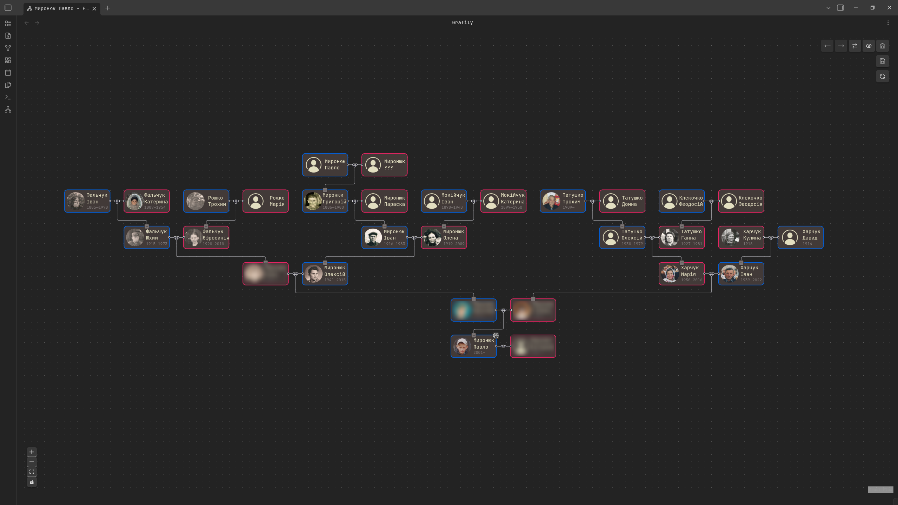
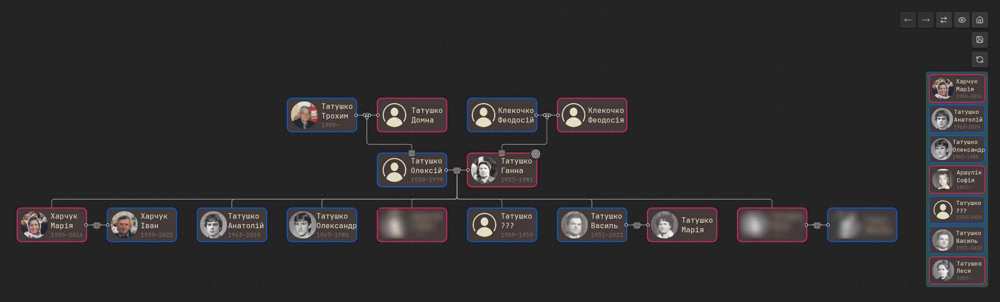
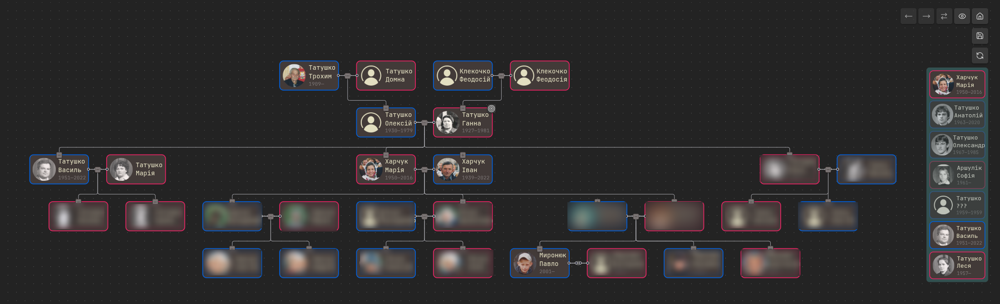
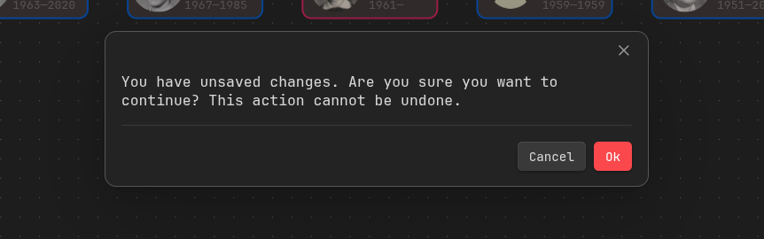
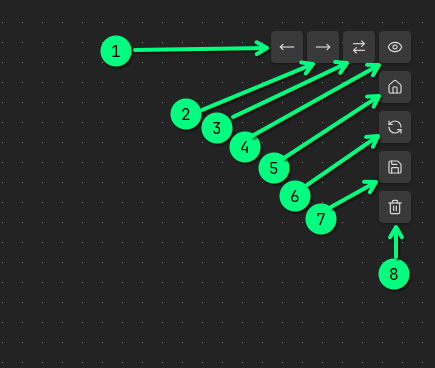
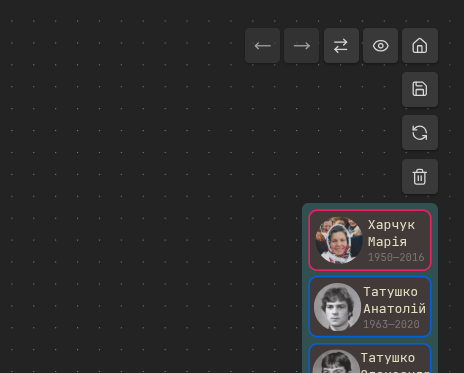

+++
title = "Grafily improvements 0.3.0...0.3.6"
date = 2026-07-19
draft = false
template = "post.html"
description = "Obsidian plugin for rendering pretty family graphs (family trees)"

[taxonomies]
tags = ["javascript", "typescript", "project", "react", "algorithms", "data-structures"]

[extra]
keywords = "TypeScript, Graphs, Algorithms"
toc = true
# mermaid = true
# thumbnail = "grafily-thumbnail.png"
+++

# Intro

Here we go again :wink:. Since [May 09](https://github.com/TheBestTvarynka/grafily/commit/96b65e6) I have implemented some new features, fixed many bugs, and polished the plugin a lot.
Now I use Grafily for my genealogy research on a regular basis.
I already copied all people and their relationships into Obsidian, and I can successfully view family graphs of any kind and complexity.

The plugin works and looks like I wanted at the start of this journey :star_struck:.
I am happy to create useful software, and even happier to use it myself :relaxed:. Just look at this family tree of mine:

(I blurred alive persons, except myself)

This blog post describes all the interesting features and fixes since [0.3.0](https://github.com/TheBestTvarynka/grafily/releases/tag/0.3.0) (with examples, of course).

TL;DR. Short releases descriptions:

- [0.3.1](https://github.com/TheBestTvarynka/grafily/releases/tag/0.3.1): small fixes in `README.md` and `manifest.json`.
- [0.3.2](https://github.com/TheBestTvarynka/grafily/releases/tag/0.3.2): fixed plugin description inside `manifest.json`.
- [0.3.3](https://github.com/TheBestTvarynka/grafily/releases/tag/0.3.3): fixed version number inside `manifest.json` and `package.json`.
- [0.3.4](https://github.com/TheBestTvarynka/grafily/releases/tag/0.3.4): downgraded to React 18, improved start-up menu, added release artifact attestations.
- [0.3.5](https://github.com/TheBestTvarynka/grafily/releases/tag/0.3.5): selective display of marriage children and unsaved graph data detection.
- [0.3.6](https://github.com/TheBestTvarynka/grafily/releases/tag/0.3.6): layout algorithm fixes, better edges styling, navigation buttons, dynamic tab title, consistent parsing, target person autoselect, and other small fixes.

For someone, who does not follow me and is not aware of what Grafily is, let me add a quote from [my previous post about Grafily](https://tbt.qkation.com/posts/announcing-grafily-0-3/):

> _Grafily is an Obsidian plugin for rendering family relationship graphs and trees._
> _It scans a person's pages inside the vault and builds the tree/graph based on it._
>
> _The resulting graph is interactive._
> _It means that the user can change the graph structure, expand relationships (add nodes), collapse them (hide), swap spouses in a marriage, and even rearrange siblings._

Conceptually, the [Features](https://tbt.qkation.com/posts/announcing-grafily-0-3/#features) and [How it works](https://tbt.qkation.com/posts/announcing-grafily-0-3/#how-it-works) sections are still up to date and true.
I did not change the core concepts.
But you can notice small differences in UI/UX and button placements.

# Community Plugins

First of all, I submitted the Grafily plugin to the Obsidian Community Plugins.
Here is the official plugin page: [community.obsidian.md/plugins/grafily](https://community.obsidian.md/plugins/grafily).
Now you do not need to build it from the source code or download and install release assets from GitHub.
Now you are able to simply install it from the Obsidian app.

As I expected, the submission process was kinda annoying because their automatic checker constantly failed my releases.
Here are some of errors:

- Invalid plugin description inside `manifest.json`.
- Versions mismatch in `manifest.json` and `package.json`.
- Dynamic `<script>` element injection which is a security risk.
- Some `eslint` rules were disabled and it is not allowed.
- ...and some other errors.

I do not blame the Obsidian team or anything.
All errors I faced were fair and needed to be fixed.
The only unexpected thing was `Found 3 dynamic <script> element creations.`.
I have never used such things.

My suspicions were correct: it was a dependency problem.
In any uncertainty, blame React and move on :grin:.
It's a joke, of course, but in my case, it really solved the problem.
I did some research: the React 19 Resource Hoisting feature causes dynamic `<script>` injection (creation).
I asked about it in [the Obsidian discord server](https://discord.com/channels/686053708261228577/1516863818771468369/1516863818771468369) and they confirmed it:

> _This is a known issue, the easiest solution for now is to downgrade to React 18._

PRs I made in order to submit the plugin to the community:

- [chore: `readme.md` and `manifest.json`](https://github.com/TheBestTvarynka/grafily/pull/25).
- [fix: description in `manifest.json`: add `.`](https://github.com/TheBestTvarynka/grafily/pull/26).
- [chore: bump plugin version to `0.3.3`](https://github.com/TheBestTvarynka/grafily/pull/27).
- [chore: downgrade to React 18](https://github.com/TheBestTvarynka/grafily/pull/28).
- [feat(ci): artifact-attestations](https://github.com/TheBestTvarynka/grafily/pull/30).
- [refactor: enabled disabled `eslint` rules](https://github.com/TheBestTvarynka/grafily/pull/35).
  I disabled some `eslint` rules to simplify plugin development, but the Obsidian team forced me to enable them.
  And I am grateful for that, because it forced me to type-check more things and develop better function/type contracts (which improved my TypeScript skills :nerd_face:).

# Selective display of children

This is another huge step in the direction of better interactivity.
This feature is **available only for the Brandes-Köpf** layout type.

Let's imagine the situation when the marriage has many children.
Actually, we do not even need to imagine.
My ancestor families usually have >= 3 children.
Let's take great-grandparents' children on my mother's side:

They had 7 children.
It is expected that you may not want to see all children on the graph.
You may want to hide some of them to save screen space and focus an attention on other more important persons.

This is why I implemented selective display of children.
When you select the person (with `ctrl+click` on the person's node), you see this person children on the right side of the screen.
You can hide or show only specific children subgraphs by clicking on that children on the side panel.

For example, let's hide all children, whose spouse and children is unknown, and expand subgraphs of all other children:

In such a way, you can modify the family graph as you want and achieve the desired layout without any problems.

PRs:

- [feat: show/hide siblings node](https://github.com/TheBestTvarynka/grafily/pull/34).
- [fix(layout): full graph: children node inserting](https://github.com/TheBestTvarynka/grafily/pull/40).
- [feat: now the user can open the person from side panel](https://github.com/TheBestTvarynka/grafily/pull/48).

# Navigation buttons

I was tired of opening a plugin, typing the person name, and pressing all that buttons.
Often I want to just build a relationships graph of the current person.
I created a simple but very conveniet way of building graphs.

Now the Grafily plugin supports the `grafily-navigation` code block.
It will be rendered as two buttons for quick and easy graph building:

The left button opens the family tree of the current person (`Reingold-Tilford` layout). The right button opens the graph explorer with the starting person as the current person (`Brandes-Köpf` layout). Example:

PRs:

- [feat: implement buttons for opening the plugin for specific person](https://github.com/TheBestTvarynka/grafily/pull/49).

# UI/UX improvements

## Unsaved changes detection

- [feat: implement unsaved data detection and add confirmation modal](https://github.com/TheBestTvarynka/grafily/pull/36).

I was annoyed and even a bit angry.
Why did not I implement it earlier?! :clown_face:
Who possibly could think that if the data loss is possible it will 99.9% happen?

Honestly, I knew it will happen.
Back then I decided to implement it later on purpose.
But I did not expect that it will happen so often and so annoying!

Now, when you have an unsaved changes, the app will ask you for the confirmation when you try to return to the start-up menu without saving:

## Edges styling

- [feat: improve edges styling](https://github.com/TheBestTvarynka/grafily/pull/47).

| Before | After |
|-|-|
|  |  |

I bet you can see the difference.
The fun part is that I did not implement a new edge type.
It was available all the time.
I _just_ figured out a way of how to set node handle correctly, so the edge is in the middle of the vertical space between nodes.

## Dynamic tab title

- [feat(ui): dynamic tab title](https://github.com/TheBestTvarynka/grafily/pull/51).

It is not helpful at all when you have many opened tabs named `Grafily`.
Now the Grafily plugin tab changes depending on what graph you build.

- When the user opens the start-up menu, the tab title is the same - `Grafily`.
- When the user opens a saved graph or saves the unsaved graph, the tab name is a graph name.
- When the user builds a new graph, the tab name is `<person's name> - <layout friendly name>`.
  For example, `Myroniuk Pavlo - Family tree` or `Myroniuk Pavlo - Family explorer`.

## Reorder side panel buttons

- [ feat: reorder buttons on SidePanel](https://github.com/TheBestTvarynka/grafily/pull/45).

It's easier to see in comparison:

| Before | After |
|-|-|
|  |  |

I still do not think that the current button order is perfect but it 100% better then before.
Further experience will show the right path.

## Autoselect the starting person

- [feat: autoselect and automatically center the starting node](https://github.com/TheBestTvarynka/grafily/pull/46).

That's a small iprovement but still worth mentioning because it's so useful.
Before building the graph, the user must select a starting person.
Now when the graph is built, the starting person is automatically selected and graph is centered so this person is at the center of the screen.

# Bugfixes

- [fix: start up menu: show the menu even when the index is empty](https://github.com/TheBestTvarynka/grafily/pull/29).

Previously, when the user does not have any persons in the vault, the plugin failed to show the start-up menu.
It is not incorrect, but rather confusing.

- [fix(ui): do not render marriage node button if marriage has no children](https://github.com/TheBestTvarynka/grafily/pull/39).

Previously, when the marriage did not have children, the children collapsing button still rendered.
Now the bug is fixed.

- [fix(parsing): consistent spouses order inside marriage](https://github.com/TheBestTvarynka/grafily/pull/41).

Every time you open the plugin, it scans the specified directory for persons and extract metadata from Obsidian notes.
The plugin builds an index by collecting that metadata.
I did not realize this before, but the resulting index must the same after every directory scan.
And all person and marriage IDs also must came up the same.
Otherwise, the saved graph nodes IDs will point to the non-existing persons/marriages in the index.

I ensure the same IDs after every directory scan by sorting marriage spouses by name :smiley:.

- [fix(layout): full graph: parent nodes order](https://github.com/TheBestTvarynka/grafily/pull/42).

It was leftover from the initial layout implementation.
When you swap spouses and expand their parent, then spouses parents may be in wrong order.
One function relied on the spouses order from the index instead of taking it from the layout object.

- [fix(ui): now background pattern present on each grafily tab](https://github.com/TheBestTvarynka/grafily/pull/50).

Previously, when you have two plugin tabs opened, only fir first one had background dots.
It was fixed by assigning a unique ID to the each `ReactFlow` component.

# References

* [Grafily - Obsidian Community](https://community.obsidian.md/plugins/grafily).
* [Grafily - GitHub](https://github.com/TheBestTvarynka/grafily).
* [`git diff 0.3.0...0.3.6`](https://github.com/TheBestTvarynka/grafily/compare/0.3.0...0.3.6).
