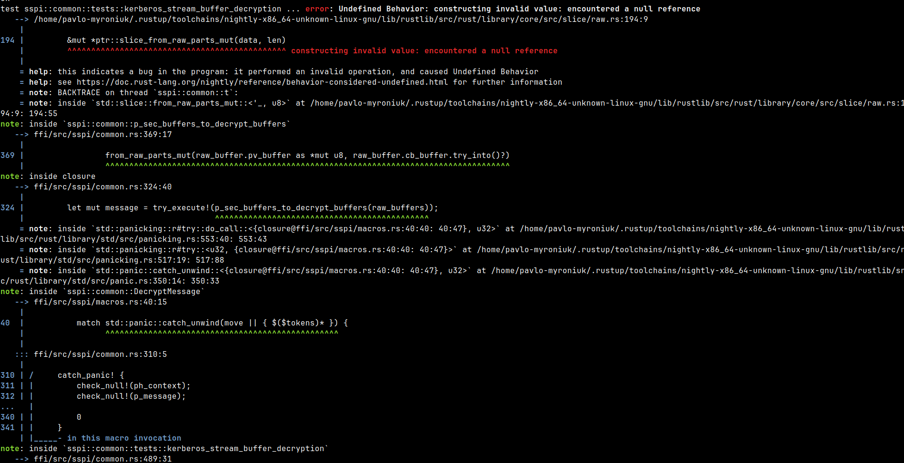

+++
title = "Writing unsafe Rust code? Please, consider Miri"
date = 2024-06-30
draft = false

[taxonomies]
tags = ["rust", "tool"]

[extra]
keywords = "Rust, Miri"
toc = true
thumbnail = "miri-thumbnail.png"
+++

For ones who don't know ([quote src](https://github.com/rust-lang/miri)):

> [Miri](https://github.com/rust-lang/miri) is an **interpreter** for Rust's mid-level intermediate representation.
> Miri is an [Undefined Behavior](https://doc.rust-lang.org/reference/behavior-considered-undefined.html) detection tool for Rust. It can run binaries and test suites of cargo projects and detect unsafe code that fails to uphold its safety requirements.

:thumbsup:

> *The description is pretty clear. So, why did you write an entire blog post about it?*

I have a few reasons to do it.

* Recently I decided to try it on my work project and was excited with the result.
* I thought [Miri](https://github.com/rust-lang/miri) was complicated in usage/configuring like other similar checkers, but it turned out very easy and convenient (like all tools in the Rust ecosystem).
* Show you some of the bugs Miri has found in the project.
* **Convince you to try it**.

# Getting started

First of all, you need to install Miri:

```bash
rustup +nightly component add miri
```

Why *nightly*? The Miri can be run only with the nightly Rust. So, you should be able to compile your project with nightly Rust.
Miri can run project binaries, tests, examples, and so on.

```bash
cargo +nightly miri run
cargo +nightly miri run --example <example name>
cargo +nightly miri test
cargo +nightly miri test <test_name> --features=<feature list>
```

# Who should use Miri

In my opinion, everyone who writes an *unsafe* Rust code should use Miri and test their code with this tool. It can be any kind of *unsafe* code:

* FFI (except fully generated ones).
* Unsafe transmutations.
* `Box::from_raw/into_raw`.
* `slice::from_raw_parts/_mut`.
* Interaction with OS API.
* Magic tricks with references and raw pointers.
* ...and many other cases.

If you are writing any unsafe Rust code, you should consider using Miri.

> *"We have tested our code and it works well in production"*


You can be just lucky. Fortune and the compiler are on your side then. But one day you can change your code a little bit, just reorder some functions and boom :boom:. Now you have an unexplainable magic error/behavior. This and other arguments are well explained in this talk: [Unsafe Rust and Miri by Ralf Jung](https://youtu.be/svR0p6fSUYY). I highly recommend watching it!

# Let's find some UB

The first run:


Uuups, I can't compile the project with nightly Rust. I have warned you about it above. In my case, [updating the `Cargo.lock`](https://github.com/Devolutions/sspi-rs/pull/255) is enough. But it's just a case and we can be forced to spend more time on it.

The second run was more *"successful"*:

 

...and more. But I'm not showing you this to ask you to fix my code. I want you to pay attention to the following: look at the second screenshot and tell me what Miri has printed.

* Comprehensive problem description: _Undefined Behavior: memory access failed: alloc872852 has size 250, so pointer to 22 bytes starting at offset 236 is out-of-bounds_.
* The exact place in the code where the error happened: `ffi/src/sspi/sec_pkg_info.rs:189:13`.
* An approximate stack trace.
* A place in the code where the memory was allocated: `ffi/src/sspi/sec_pkg_info.rs:167:28`.

Isn't this cool? It's very cool! Now I have so much info to fix this UB. I can't ask for more info :smile:.

Miri has found more bugs than I expected. The UB was in such places I can't even think of. In this PR you can see what UB and memory leaks I have fixed thanks to Miri: [Fix UB and memory leaks found by Miri](https://github.com/Devolutions/sspi-rs/pull/256).

# Limitations

* **Miri can execute only Rust code.** It means you don't have access to all functions from `libc` or any other foreign functions (system API, FFI). Miri can open the file or read the environment variable. But you can not establish a TCP connection, for example. It's another reason to write [low-coupled code with high cohesion](https://stackoverflow.com/q/14000762/9123725).
* **Miri can not ensure that your program is sound.** From Miri [README.md](https://github.com/rust-lang/miri?tab=readme-ov-file#miri):
  >  [Soundness](https://rust-lang.github.io/unsafe-code-guidelines/glossary.html#soundness-of-code--of-a-library) is the property of never causing undefined behavior when invoked from arbitrary safe code, even in combination with other sound code. In contrast, Miri can just tell you if *a particular way of interacting with your code* (e.g., a test suite) causes any undefined behavior. It is up to you to ensure sufficient coverage.
* **Miri can be slow on big/heavy tests.** It's because Miri is *an interpreter* for Rust's mid-level intermediate representation. It means that the code is not compiled to ASM and is not executed directly on the CPU.

# Configuration

Miri can be configured by `-Z` flags and environment variables. And yes, we don't have any `.toml` file here. For example:

```bash
MIRIFLAGS="-Zmiri-disable-isolation -Zmiri-ignore-leak" cargo +nightly miri test
```

The full list of flags is listed in the Miri [README.md](https://github.com/rust-lang/miri#miri--z-flags-and-environment-variables).

# Conclusions

If you're writing `unsafe` Rust code, don't forget to test it.

If you're writing `unsafe` Rust code, don't forget to run it with [Miri](https://github.com/rust-lang/miri).

That's all. Bye bye :wave:.

# Doc, references, code

* [Miri](https://github.com/rust-lang/miri).
* [Miri flags](https://github.com/rust-lang/miri?tab=readme-ov-file#miri--z-flags-and-environment-variables).
* [Behavior considered undefined](https://doc.rust-lang.org/reference/behavior-considered-undefined.html).
* [Talk about Undefined Behavior, unsafe Rust, and Miri](https://www.ralfj.de/blog/2023/06/13/undefined-behavior-talk.html).
