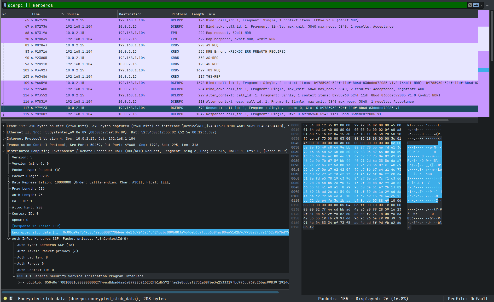
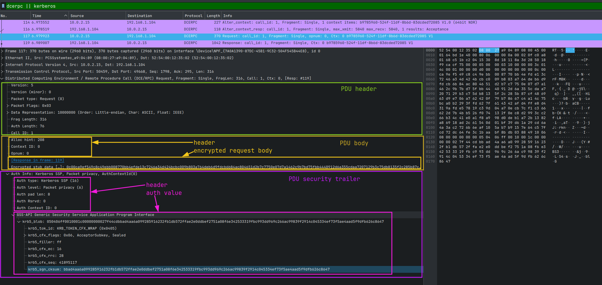
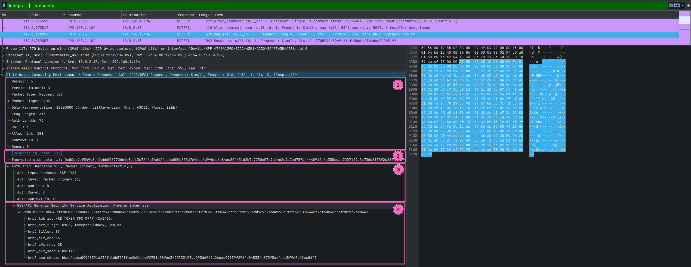

+++
title = "Implementing RPC encryption in SSPI"
date = 2025-03-30
draft = false

[taxonomies]
tags = ["kerberos", "rpc", "sspi", "rust"]

[extra]
keywords = "Kerberos, RPC, SSPI, Rust"
toc = true
# thumbnail = "tauri-error-handling-thumbnail.png"
+++

# Intro

Today's world has many unknown and magical things. Proprietary protocols and libraries are among them :zany_face:. In this blog post, I will explain how RPC encryption works under the hood and how to implement it over the SSPI interface.

## Gals

* Provide a detailed explanation of how RPC PDUs are encrypted.
* Explain how it is related to SSPI.
* Implement RPC PDUs encryption/decryption and test it against real RPC traffic :hand_over_mouth:.

## Non-goals

* I'm not explaining RPC use cases or how to set it up.
* Do not expect RPC internals explanations.

This blog post is only about encrypting and decrypting RPC PDUs.

# Getting started

I assume the reader has enough knowledge and experience with RPC and SSPI to read this article. If not, I highly recommend reading the following articles (they should give enough context to understand what I am going to do):

* [RPC Encryption – An Exercise in Frustration](https://www.bloggingforlogging.com/2023/04/28/rpc-encryption-an-exercise-in-frustration/).
* [SSPI introduction](https://tbt.qkation.com/posts/sspi-introduction/).

Microsoft frequently uses the RPC for local and remote calls. Of course, many remote RPC calls are encrypted, and the caller needs to pass the authentication to be able to communicate with the server.

Let's take, for example, [[MS-GKDI]: Group Key Distribution Protocol](https://learn.microsoft.com/en-us/openspecs/windows_protocols/ms-gkdi/943dd4f6-6b80-4a66-8594-80df6d2aad0a),

> ...which enables clients to obtain cryptographic keys associated with Active Directory security principals.

It specifies only one [`GetKey`](https://learn.microsoft.com/en-us/openspecs/windows_protocols/ms-gkdi/4cac87a3-521e-4918-a272-240f8fabed39) RPC method. I hope it's obvious that the key is encrypted and cannot be sent over the network as a plaintext.



Captured RPC communication shows us all authentication steps and encrypted `GetKey` RPC method call. And we will decrypt it at the end of this article :sunglasses:.

# RPC PDU structure

(Alternatively, you can read the _RPC Payload_ section from the [RPC Encryption – An Exercise in Frustration](https://www.bloggingforlogging.com/2023/04/28/rpc-encryption-an-exercise-in-frustration/) article).

RPC PDU is usually split into three parts ([https://pubs.opengroup.org/onlinepubs/9629399/chap12.htm](https://pubs.opengroup.org/onlinepubs/9629399/chap12.htm)):

| name | purpose |
|-|-|
| header | contains protocol control information |
| body | the body of a request or response PDU contains data representing the input or output parameters for an operation |
| security trailer | contains data specific to an authentication protocol. For example, an authentication protocol may ensure the integrity of a packet via inclusion of an encrypted checksum in the authentication verifier |

But for now, we need to dig a bit deeply. PDU body consists of its own header and data. In turn, PDU security trailer also has its header and auth value. Look at the screenshot below:



I think you got the idea. PDU body data and security trailer auth value are encrypted in our case.

# RPC encryption through SSPI

Why SSPI? There are several reasons why:

1. This is how it originally done in Window.
2. Some aspects of the encryption process make sense only with SSPI in mind.
3. RPC and SSPI are interconnected in many places, so why do not explain the SSPI part.

RPC PDUs are encrypted by calling the [SSPI::EncryptMessage](https://learn.microsoft.com/en-us/windows/win32/api/sspi/nf-sspi-encryptmessage) function (and, correspondingly, decryption is done by calling the [SSPI::DecryptMessage](https://learn.microsoft.com/en-us/windows/win32/api/sspi/nf-sspi-decryptmessage) function). Let's see its interface.

```cpp
// https://learn.microsoft.com/en-us/windows/win32/api/sspi/nf-sspi-encryptmessage
SECURITY_STATUS SEC_ENTRY EncryptMessage(
  [in]      PCtxtHandle    phContext,
  [in]      unsigned long  fQOP,
  [in, out] PSecBufferDesc pMessage,
  [in]      unsigned long  MessageSeqNo
);

// https://learn.microsoft.com/en-us/windows/win32/api/sspi/ns-sspi-secbufferdesc
typedef struct _SecBufferDesc {
  unsigned long ulVersion;
  unsigned long cBuffers;
  PSecBuffer    pBuffers;
} SecBufferDesc, *PSecBufferDesc;

// https://learn.microsoft.com/en-us/windows/win32/api/sspi/ns-sspi-secbuffer
typedef struct _SecBuffer {
  unsigned long cbBuffer;
  unsigned long BufferType;
  char          *pvBuffer;
} SecBuffer, *PSecBuffer;
```

There are a lot of security buffer types and two security buffer flags defined in SSPI ([SecBuffer structure (`sspi.h`): `BufferType`](https://learn.microsoft.com/en-us/windows/win32/api/sspi/ns-sspi-secbuffer)). But for now, we need only a few of them:

| buffer type | meaning/purpose |
|-|-|
| `SECBUFFER_TOKEN` | in general case, it contains the security token portion of the message. In our case, it contains a signature generated by the security package. |
| `SECBUFFER_DATA` | contains input data to be processed by the security package. In our case, it's just a data we want to encrypt or decrypt. |

Also, we have two possible buffer flags:

| buffer flag | meaning |
|-|-|
| `SECBUFFER_READONLY` | the data in this buffer is read only and is never can be overwritten by the security package. Usually, this flag is used to inform the security package about something. |
| `SECBUFFER_READONLY_WITH_CHECKSUM` | The data in this buffer is included in checksum calculation but not in encryption/decryption process. |

As you can see, the message we want to encrypt is an array of buffers. The whole PDU is split into SSPI security buffers and passed to the `SSPI::EncryptMessage` function. This process is described in the _"Message Protection"_ section of the [RPC Encryption – An Exercise in Frustration](https://www.bloggingforlogging.com/2023/04/28/rpc-encryption-an-exercise-in-frustration/) article. In short, it happens as follows:

| | security buffer type + flags | security buffer value |
|-|-|-|
| 1 | `SECBUFFER_DATA` + `SECBUFFER_READONLY_WITH_CHECKSUM` | contains PDU header + PDU body header |
| 2 | `SECBUFFER_DATA` | contains PDU body data to be encrypted (in-place) |
| 3 | `SECBUFFER_DATA` + `SECBUFFER_READONLY_WITH_CHECKSUM` | contains PDU security trailer header |
| 4 | `SECBUFFER_TOKEN` | will contain PDU security trailer auth value |

It can be illustrated on the previous RPC request that we used as the example:



All encryption is always in-place. The security package overwrites the original data with encrypted data. This also means that the caller must allocate the last security buffer (4th which has the `SECBUFFER_TOKEN` type), and the security package will overwrite it. The caller can get the token buffer length by calling the [`QueryContextAttributes`](https://learn.microsoft.com/en-us/windows/win32/secauthn/querycontextattributes--general) function with the `SECPKG_ATTR_SIZES` parameter. The `cbSecurityTrailer` field of the [`SecPkgContext_Sizes`](https://learn.microsoft.com/en-us/windows/win32/api/sspi/ns-sspi-secpkgcontext_sizes) structure contains a desired value.

# SSPI::EncryptMessage

Before implementing it, I want to clarify some general function behaviour. As I wrote above, it encrypts the input message in-place. Some security packages, besides encryption, also calculates checksum over the provided data. Even more, some security packages can only calculate a checksum over the provided data. Here is a citation from the MSDN:

> Some packages do not have messages to be encrypted or decrypted but rather provide an integrity hash that can be checked.

We have 4 buffers as an input message. The general encryption process looks like this:

```rust
// pseudo code

// message[0] is PDU header + PDU body header. SECBUFFER_DATA + SECBUFFER_READONLY_WITH_CHECKSUM.
// message[1] is PDU body data. we need to encrypt it. SECBUFFER_DATA.
// message[2] is PDU security trailer header. SECBUFFER_DATA + SECBUFFER_READONLY_WITH_CHECKSUM.
// message[3] is PDU security trailer auth value. Currently, this buffer is blank (memory is allocated). SECBUFFER_TOKEN.

message[1] = encrypt(message[1]);
message[3] = checksum(message[0] | message[1] | message[2]);
```

# Kerberos::EncryptMessage

Phew :face_exhaling:

Now that we have enough knowledge about the encryption process, we can talk about concrete encryption algorithms. The client can authenticate using one of the available protocols (security packages) like NTLM or Kerberos. The most secure these days is, of course, Kerberos. Our task is to understand how it works and implement it.

# Doc, references, code

* [RPC Encryption – An Exercise in Frustration](https://www.bloggingforlogging.com/2023/04/28/rpc-encryption-an-exercise-in-frustration/).
* [[MS-KILE]: Kerberos Binding of `GSS_WrapEx()`](https://learn.microsoft.com/en-us/openspecs/windows_protocols/ms-kile/e94b3acd-8415-4d0d-9786-749d0c39d550).
* [`EncryptMessage` (Kerberos) function](https://learn.microsoft.com/en-us/windows/win32/secauthn/encryptmessage--kerberos).
* [SecBuffer structure (`sspi.h`)](https://learn.microsoft.com/en-us/windows/win32/api/sspi/ns-sspi-secbuffer).
* [[MS-RPCE]](https://learn.microsoft.com/en-us/openspecs/windows_protocols/ms-rpce/290c38b1-92fe-4229-91e6-4fc376610c15).