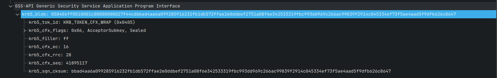
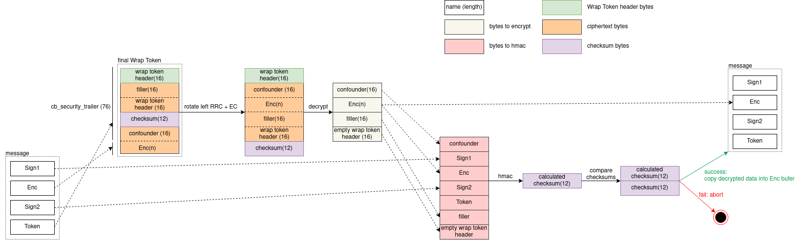
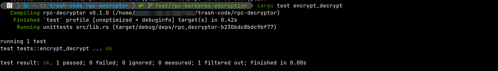
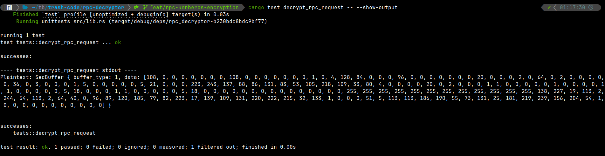

+++
title = "Implementing Kerberos RPC encryption over SSPI"
date = 2025-04-05
draft = false
template = "post.html"
description = "A deep dive into how Kerberos RPC encryption works and how it is related to SSPI. By the end of the article, we will implement custom encryptor/decryptor."

[taxonomies]
tags = ["kerberos", "rpc", "sspi", "rust", "cryptography"]

[extra]
keywords = "Kerberos, RPC, SSPI, Rust"
toc = true
thumbnail = "thumbnail.png"
+++

# Intro

Today's world has many unknown and magical things. Proprietary protocols and libraries are among them :zany_face:. In this blog post, I will explain how RPC encryption works under the hood and how to implement it over the SSPI interface.

## Goals

* Provide a detailed explanation of how RPC PDUs are encrypted.
* Explain how it is related to SSPI.
* Implement RPC PDUs encryption/decryption and test it against **real RPC traffic** :hand_over_mouth:.

## Non-goals

* I'm not explaining RPC use cases or how to set it up.
* Do not expect RPC internals explanations.

This blog post is only about encrypting and decrypting RPC PDUs.

# Getting started

I assume the reader has enough knowledge and experience with RPC and SSPI to read this article. If not, I highly recommend reading the following articles (they should give enough context to understand what I am going to do):

* [RPC Encryption - An Exercise in Frustration](https://www.bloggingforlogging.com/2023/04/28/rpc-encryption-an-exercise-in-frustration/).
* [SSPI introduction](https://tbt.qkation.com/posts/sspi-introduction/).

Microsoft frequently uses RPC for local and remote calls. Of course, many remote RPC calls are encrypted, and the caller needs to pass the authentication to communicate with the server.

Let's take, for example, [[MS-GKDI]: Group Key Distribution Protocol](https://learn.microsoft.com/en-us/openspecs/windows_protocols/ms-gkdi/943dd4f6-6b80-4a66-8594-80df6d2aad0a),

> ...which enables clients to obtain cryptographic keys associated with Active Directory security principals.

It specifies only one [`GetKey`](https://learn.microsoft.com/en-us/openspecs/windows_protocols/ms-gkdi/4cac87a3-521e-4918-a272-240f8fabed39) RPC method. I hope it's obvious that the key is encrypted and cannot be sent over the network as plaintext.


(If you want to open and analyze this packet with me, then here is a Wireshark recording: [rpc.pcapng](./rpc.pcapng).)

Captured RPC communication shows us all authentication steps and encrypted `GetKey` RPC method call. And we will decrypt it at the end of this article :sunglasses:.

# RPC PDU structure

(Alternatively, you can read the _RPC Payload_ section from the [RPC Encryption - An Exercise in Frustration](https://www.bloggingforlogging.com/2023/04/28/rpc-encryption-an-exercise-in-frustration/) article).

RPC PDU is usually split into three parts ([https://pubs.opengroup.org/onlinepubs/9629399/chap12.htm](https://pubs.opengroup.org/onlinepubs/9629399/chap12.htm)):

| name | purpose |
|-|-|
| header | contains protocol control information |
| body | the body of a request or response PDU contains data representing the input or output parameters for an operation |
| security trailer | contains data specific to an authentication protocol. For example, an authentication protocol may ensure the integrity of a packet via inclusion of an encrypted checksum in the authentication verifier |

But for now, we need to dig a bit deeply. PDU body consists of its header and data. In turn, the PDU security trailer also has its header and auth value. Look at the screenshot below:


I think you've got the idea. In our case, the PDU body data and security trailer auth value are encrypted.

# RPC encryption over SSPI

Why SSPI? There are several reasons why:

1. This is how it is originally done in Windows.
2. Some aspects of the encryption process make sense only with SSPI in mind.
3. RPC and SSPI are interconnected in many places, so why not explain the SSPI part?

RPC PDUs are encrypted by calling the [SSPI::EncryptMessage](https://learn.microsoft.com/en-us/windows/win32/api/sspi/nf-sspi-encryptmessage) function (and, correspondingly, decryption is done by calling the [SSPI::DecryptMessage](https://learn.microsoft.com/en-us/windows/win32/api/sspi/nf-sspi-decryptmessage) function). Let's see its interface.

```cpp
// https://learn.microsoft.com/en-us/windows/win32/api/sspi/nf-sspi-encryptmessage
SECURITY_STATUS SEC_ENTRY EncryptMessage(
  [in]      PCtxtHandle    phContext,
  [in]      unsigned long  fQOP,
  [in, out] PSecBufferDesc pMessage,
  [in]      unsigned long  MessageSeqNo
);

// https://learn.microsoft.com/en-us/windows/win32/api/sspi/nf-sspi-decryptmessage
SECURITY_STATUS SEC_ENTRY DecryptMessage(
  [in]      PCtxtHandle    phContext,
  [in, out] PSecBufferDesc pMessage,
  [in]      unsigned long  MessageSeqNo,
  [out]     unsigned long  *pfQOP
);

// https://learn.microsoft.com/en-us/windows/win32/api/sspi/ns-sspi-secbufferdesc
typedef struct _SecBufferDesc {
  unsigned long ulVersion;
  unsigned long cBuffers;
  PSecBuffer    pBuffers;
} SecBufferDesc, *PSecBufferDesc;

// https://learn.microsoft.com/en-us/windows/win32/api/sspi/ns-sspi-secbuffer
typedef struct _SecBuffer {
  unsigned long cbBuffer;
  unsigned long BufferType;
  char          *pvBuffer;
} SecBuffer, *PSecBuffer;
```

There are a lot of security buffer types and two security buffer flags defined in SSPI ([SecBuffer structure (`sspi.h`): `BufferType`](https://learn.microsoft.com/en-us/windows/win32/api/sspi/ns-sspi-secbuffer)). But for now, we need only a few of them:

| buffer type | meaning/purpose |
|-|-|
| `SECBUFFER_TOKEN` | in the general case, it contains the security token portion of the message. In our case, it contains a signature generated by the security package. |
| `SECBUFFER_DATA` | contains input data to be processed by the security package. In our case, it's just data we want to encrypt or decrypt. |

Also, we have two possible buffer flags:

| buffer flag | meaning |
|-|-|
| `SECBUFFER_READONLY` | the data in this buffer is read-only and is never can be overwritten by the security package. Usually, this flag is used to inform the security package about something. |
| `SECBUFFER_READONLY_WITH_CHECKSUM` | The data in this buffer is included in the checksum calculation but not in the encryption/decryption process. |

As you can see, the message we want to encrypt is an array of buffers. The whole PDU is split into SSPI security buffers and passed to the `SSPI::EncryptMessage` function. This process is described in the _"Message Protection"_ section of the [RPC Encryption - An Exercise in Frustration](https://www.bloggingforlogging.com/2023/04/28/rpc-encryption-an-exercise-in-frustration/) article. In short, it happens as follows:

|| security buffer type + flags | security buffer value | made-up name |
|-|-|-|-|
|1| `SECBUFFER_DATA` + `SECBUFFER_READONLY_WITH_CHECKSUM` | contains PDU header + PDU body header | Sign1 |
|2| `SECBUFFER_DATA` | contains PDU body data to be encrypted (in-place) | Enc |
|3| `SECBUFFER_DATA` + `SECBUFFER_READONLY_WITH_CHECKSUM` | contains PDU security trailer header | Sign2 |
|4| `SECBUFFER_TOKEN` | will contain PDU security trailer auth value | Token |

We will refer to these buffers a lot, so I added made-up names to each of them. This can be illustrated in the previous RPC request that we used as the example:


All encryption is always **in-place**. The security package overwrites the original data with encrypted data. This also means that the caller must allocate the last security buffer (4th which has the `SECBUFFER_TOKEN` type), and the security package will overwrite it. The caller can get the token buffer length by calling the [`QueryContextAttributes`](https://learn.microsoft.com/en-us/windows/win32/secauthn/querycontextattributes--general) function with the `SECPKG_ATTR_SIZES` parameter. The `cbSecurityTrailer` field of the [`SecPkgContext_Sizes`](https://learn.microsoft.com/en-us/windows/win32/api/sspi/ns-sspi-secpkgcontext_sizes) structure contains a desired value.

# SSPI::EncryptMessage

Before implementing it, I want to clarify some general function behavior. As I wrote above, it encrypts the input message in-place. Some security packages, besides encryption, also calculate checksum over the provided data. Even more, some security packages can only calculate a checksum over the provided data. Here is a citation from the [MSDN](https://learn.microsoft.com/en-us/windows/win32/api/sspi/nf-sspi-encryptmessage):

> Some packages do not have messages to be encrypted or decrypted but rather provide an integrity hash that can be checked.

In our case, both encryption and integrity hash (hmac) calculations happen. We have 4 buffers as an input message. The general encryption process looks like this:

```rust
// pseudo code

// Sign1: message[0] is PDU header + PDU body header. SECBUFFER_DATA + SECBUFFER_READONLY_WITH_CHECKSUM.
// Enc: message[1] is PDU body data. we need to encrypt it. SECBUFFER_DATA.
// Sign2: message[2] is PDU security trailer header. SECBUFFER_DATA + SECBUFFER_READONLY_WITH_CHECKSUM.
// Token: message[3] is PDU security trailer auth value. Currently, this buffer is blank (memory is allocated). SECBUFFER_TOKEN.

message[1] = encrypt(message[1]);
message[3] = checksum(message[0] | message[1] | message[2]);
```

# Kerberos::EncryptMessage

Now that we have enough knowledge about the encryption process, we can talk about concrete encryption algorithms. The client can authenticate using one of the available protocols (security packages) like NTLM or Kerberos. The most secure these days is, of course, Kerberos. Our task is to understand how it works and implement it.

First, I should mention that the `Kerberos::EncryptMessage` function behaves as the [`GSS_WrapEx`](https://learn.microsoft.com/en-us/openspecs/windows_protocols/ms-kile/e94b3acd-8415-4d0d-9786-749d0c39d550) function. It encrypts the data, constructs a Wrap Token, and writes it in the input message. The wrap token construction and encryption process are defined in [RPC 4121](https://www.rfc-editor.org/rfc/rfc4121.html). Let's recall [the token structure](https://www.rfc-editor.org/rfc/rfc4121.html#section-4.2.6.2):

```
Octet no   Name        Description
--------------------------------------------------------------
 0..1     TOK_ID    Identification field.  Tokens emitted by
                    GSS_Wrap() contain the hex value 05 04
                    expressed in big-endian order in this
                    field.
 2        Flags     Attributes field, as described in section
                    4.2.2.
 3        Filler    Contains the hex value FF.
 4..5     EC        Contains the "extra count" field, in big-
                    endian order as described in section 4.2.3.
 6..7     RRC       Contains the "right rotation count" in big-
                    endian order, as described in section
                    4.2.5.
 8..15    SND_SEQ   Sequence number field in clear text,
                    expressed in big-endian order.
 16..last Data      Encrypted data for Wrap tokens with
                    confidentiality, or plaintext data followed
                    by the checksum for Wrap tokens without
                    confidentiality, as described in section
                    4.2.4.
```

This can look familiar to you because we already saw this structure in the Wireshark:



If we want to decrypt the RPC request, then we need to know the meaning of each field:

|name|meaning|
|-|-|
| `TOK_ID` | `0x0504` |
| `Flags` | They depend on the authentication process. |
| `Filler` | `0xff` |
| `EC` | [RFC 4121: EC Field](https://www.rfc-editor.org/rfc/rfc4121.html#section-4.2.3). It represents how many filler bytes we must insert after the plaintext data before encryption. In our case, it is equal to **16** ([The sender should set extra count (EC) to 1 block - 16 bytes.](https://learn.microsoft.com/en-us/openspecs/windows_protocols/ms-kile/e94b3acd-8415-4d0d-9786-749d0c39d550)) |
| `RRC` | In our case, it is equal to **28**. [The RRC field is 28 if encryption is requested.](https://learn.microsoft.com/en-us/openspecs/windows_protocols/ms-kile/e94b3acd-8415-4d0d-9786-749d0c39d550) |
| `SND_SEQ` | This value is set by the Kerberos implementation. |

It might not make much sense to you so far, but soon enough, you will have one picture.

RFC 4121 also defines [the encryption process](https://www.rfc-editor.org/rfc/rfc4121.html#section-4.2.4):

> The resulting Wrap token is `{"header" | encrypt(plaintext-data | filler | "header")}`, where `encrypt()` is the encryption operation.

It looks simple, and I think you got the idea. But there is a tricky moment. The negotiated Kerberos encryption algorithm is `AES256-CTS-HMAC-SHA1-96`. This algorithm has two specific features:

* It appends a checksum (hmac) over the plaintext to the ciphertext.
* It prepends one block of random bytes (named _confounder_) to the plaintext data before encryption (it is a non-deterministic encryption).

So, the actual encryption scheme is a bit more complex and looks something like this:

```rust
// pseudocode
// I hope you didn't forget the `message` array from the previous pseudo code block.

let ec = 16;
let filler = ec * 0x00;
let confounder = rand::<[u8; 16]>();

let data_to_encrypt = message[1] | filler | wrap_token_header;
let ciphertext = encrypt(confounder | data_to_encrypt);

let data_to_hmac = message[0] | message[1] | message[2] | filler | wrap_token_header;
let checksum = hmac(confounder | data_to_hmac);

let wrap_token = wrap_token_header | ciphertext | checksum;
```

> _Cool. Can we finally write the resulting Wrap Token to input buffers?_

Not yet :hand_over_mouth:. The RFC also defined the right rotation operation after the encryption. [RFC 4121: RRC Field](https://www.rfc-editor.org/rfc/rfc4121.html#section-4.2.5):

> The "RRC" (Right Rotation Count) field in Wrap tokens is added **to allow the data to be encrypted in-place by existing SSPI applications**.
>
> Excluding the first 16 octets of the token header, the resulting Wrap token in the previous section is rotated to the right by "RRC" octets. The net result is that "RRC" octets of trailing octets are moved toward the header.
>
> Consider the following as an example of this rotation operation: Assume that the RRC value is 3 and the token before the rotation is `{"header" | aa | bb | cc | dd | ee | ff | gg | hh}`.  The token after rotation would be `{"header" | ff | gg | hh | aa | bb | cc | dd | ee }`.

It means, that we need to do the right-rotation operation on `ciphertext | checksum`. But pay attention here: [we must rotate it by **RRC + RC** bytes](https://learn.microsoft.com/en-us/openspecs/windows_protocols/ms-kile/e94b3acd-8415-4d0d-9786-749d0c39d550). The final Wrap Token looks like this:

```rust
// pseudocode
let rrc = 28;
let ec = 16;

let wrap_token = wrap_token_header | rotate_right(ciphertext | checksum, rrc + ec);
```

The very last step is to split the resulting Wrap Token into buffers and write them into corresponding input buffers (input message). Let's recall the task. We have 4 input buffers:

- Sign1: `Data` buffer with `SECBUFFER_READONLY_WITH_CHECKSUM`.
- Enc: `Data` buffer.
- Sign2: `Data` buffer with `SECBUFFER_READONLY_WITH_CHECKSUM`.
- Token: `Token` buffer.

And now we need to write the Wrap Token buffer into the second and fourth buffers. To do it correctly, we write first `cbSecurityTrailer` bytes of the Wrap Token into the Token buffer, and the rest of the Wrap Token should be written into the Enc buffer.

```rust
// pseudocode
let cb_security_trailer = 76;

let (token, data) = wrap_token.split_at(cb_security_trailer);

// Write into the Enc buffer
message[1].copy_from_slice(data);
// Write into the Token buffer
message[3].copy_from_slice(token);
```

Some curious readers may ask me:

> _Why can't we fill the Enc buffer first and then just write the rest of the Wrap Token into the Token buffer? Most likely because the RPC server expects the same buffers, as you just explained._
>
> _But the question is why it works this way and not another._

Some things are done on purpose, while others are simply historical heritage (legacy). If you write down all these data manipulations, you can notice that, in the end, the Enc buffer ciphertext matches the original data. The checksum, encrypted confounder, and Wrap Token header will be in the Token buffer. Look at the scheme below:


I tried to show the whole encryption process in the diagram above. As you can see, the encrypted Enc buffer data is written directly into the Enc buffer. But the Wrap Token Header, encrypted confounder, filler, etc., are written exclusively in the Token buffer.

## Assumptions

Now we know all the details of the encryption process. Of course, we can't know all the reasons behind Microsoft's decisions regarding their protocols and implementations. But for now, I can make a few **_assumptions_**:

- **Why do we need to rotate `ciphertext | checksum`?**. To make the encrypted Enc buffer data match the unencrypted one. This way, the encryption will be _in-place_.
- **Why is the EC value equal to 16?**. Just to extend the ciphertext (to make it longer on purpose). **Why do we need to make it longer?** Kerberos AES256-CTS-HMAC-SHA1-96 encryption algorithm uses AES256 in [CTS mode](https://en.wikipedia.org/wiki/Ciphertext_stealing). In short, it changes the last two blocks of ciphertext, so the padding is unnecessary. To ensure that the encrypted Enc buffer data is not affected during CTS (cipher text stealing) (otherwise, it would be impossible for the encrypted Enc buffer data to match the unencrypted one), we need to be sure that the last two blocks of the ciphertext do not contain the Enc buffer data. Thus, we have two additional blocks: the first block is the filler bytes (`0x00 * 16`) and the second block is the Wrap Token header (16 bytes long).
- **Why is the `cbSecurityTrailer` value equal to 76?** wrap token header len + confounder len + filler len + wrap token header (encrypted) len + checksum len = 16 + 16 + 16 + 16 + 12 = 76.

Alternatively, you can read Microsoft's example of the message encryption. [[MS-KILE]: `GSS_WrapEx` with `AES128-CTS-HMAC-SHA1-96`](https://learn.microsoft.com/en-us/openspecs/windows_protocols/ms-kile/ade7594d-5934-42e0-994e-93fa0fd1f359):


The picture above shows the same process but with two buffers to encrypt instead of one. `clearhdr` - Wrap Token header. `padding` = `ec * 0x00`.

Phew :face_exhaling: I hope you are not tired because we are going to implement it :hugs:.

# Code: Encryptor

_**Note 1**. The full code is available here: RPC decryptor [github/TheBestTvarynka/trash-code/rpc-decryptor](https://github.com/TheBestTvarynka/trash-code/tree/feat/rpc-kerberos-encryption/rpc-decryptor)._

_**Note 2**. The code in this article is not production-ready! **The only purpose of the code below is to show the algorithm's correctness.**_

Let's start with simple things. Here is a small [`SecBuffer`](https://learn.microsoft.com/en-us/windows/win32/api/sspi/ns-sspi-secbuffer) implementation. We don't need anything more complex.

```rust
pub const DATA: u32 = 1;
pub const TOKEN: u32 = 2;

pub const READONLY_WITH_CHECKSUM_FLAG: u32 = 0x10000000;

pub struct SecBuffer<'data> {
    pub buffer_type: u32,
    pub data: &'data mut [u8],
}

impl<'data> SecBuffer<'data> {
    pub fn new(buffer_type: u32, data: &'data mut [u8]) -> Self {
        Self { buffer_type, data }
    }
}
```

Now we need a Wrap Token implementation. I don't want to overengineer it. I wrote a simple Wrap Token header encoding/decoding. Again, we don't need anything more complex.

```rust
pub struct WrapTokenHeader {
    pub flags: u8,
    pub ec: u16,
    pub rrc: u16,
    pub send_seq: u64,
}

impl WrapTokenHeader {
    pub fn encoded(&self) -> [u8; 16] {
        let mut header_data = [0, 0, 0, 0, 0, 0, 0, 0, 0, 0, 0, 0, 0, 0, 0, 0];

        header_data[0..2].copy_from_slice(&[0x05, 0x04]);
        header_data[2] = self.flags;
        header_data[3] = 0xff;
        header_data[4..6].copy_from_slice(&self.ec.to_be_bytes());
        header_data[6..8].copy_from_slice(&self.rrc.to_be_bytes());
        header_data[8..].copy_from_slice(&self.send_seq.to_be_bytes());

        header_data
    }

    pub fn from_bytes(mut src: impl Read) -> Self {
        if src.read_u16::<BigEndian>().unwrap() != 0x0504 {
            panic!("Invalid Wrap Token ID");
        }

        let flags = src.read_u8().unwrap();

        let filler = src.read_u8().unwrap();
        if filler != 0xff {
            panic!("Invalid filler");
        }

        let ec = src.read_u16::<BigEndian>().unwrap();
        let rrc = src.read_u16::<BigEndian>().unwrap();
        let send_seq = src.read_u64::<BigEndian>().unwrap();

        Self {
            flags,
            ec,
            rrc,
            send_seq,
        }
    }
}
```

Great! Now the fun part: encryption implementation. First of all, we should define the constants we are going to use.

```rust
// "Extra count"
const EC: u16 = 16;
// "Right Rotation Count"
const RRC: u16 = 28;

// https://www.rfc-editor.org/rfc/rfc4121.html#section-2
const CLIENT_ENCRYPTION_KEY_USAGE: i32 = 24;
const CLIENT_DECRYPTION_KEY_USAGE: i32 = 22;

const SERVER_ENCRYPTION_KEY_USAGE: i32 = CLIENT_DECRYPTION_KEY_USAGE;
const SERVER_DECRYPTION_KEY_USAGE: i32 = CLIENT_ENCRYPTION_KEY_USAGE;

const CB_SECURITY_TRAILER: usize = 16 /* wrap token header len */
    + 16 /* confounder len */
    + EC as usize
    + 16 /* wrap token header (encrypted) len */
    + 12 /* checksum (hmac) len */;
```

You may be surprised by key usage numbers. Don't worry.

> [7.5.1.  Key Usage Numbers](https://www.rfc-editor.org/rfc/rfc4120#section-7.5.1)
>
> The encryption and checksum specifications in [RFC3961](https://www.rfc-editor.org/rfc/rfc3961) require as input a _"key usage number"_, to alter the encryption key used in any specific message to make certain types of cryptographic attack more difficult.

In other words, a key usage number is a _public_ known value used to derive the encryption key from a base key (session key). You should not care about it. We always use key usage numbers specified in the RFC/specification.

Now we can start implementing RPC encryption. Finally! We start with the Wrap Token and filler generation.

```rust
fn encrypt(key: &[u8], key_usage: i32, send_seq: u64, message: &mut [SecBuffer<'_>]) {
    let mut wrap_token_header = WrapTokenHeader {
        flags: 0x06,
        ec: EC,
        rrc: 0,
        send_seq,
    };
    let encoded_wrap_token_header = wrap_token_header.encoded();
    let filler = vec![0; usize::from(EC)];

    todo!()
}
```

Then, we encrypt the data. Let's do it in two steps:

1. Collect the data to encrypt in one buffer: DATA sec buffer + filler + wrap token header.
2. Encrypt it with the correct key usage number. There are not many Kerberos encryption algorithm implementations. The only actively used and well-maintained one is `picky-krb`: [docs.rs/picky-krb/crypto/aes/](https://docs.rs/picky-krb/latest/picky_krb/crypto/aes/index.html).

```rust
fn encrypt(key: &[u8], key_usage: i32, send_seq: u64, message: &mut [SecBuffer<'_>]) {
    /// ...

    // Find the Enc buffer
    let mut data_to_encrypt = message.iter().fold(Vec::new(), |mut acc, sec_buffer| {
        if sec_buffer.buffer_type == DATA {
            acc.extend_from_slice(sec_buffer.data);
        }

        acc
    });
    // + Filler
    data_to_encrypt.extend_from_slice(&filler);
    // + Wrap token header
    data_to_encrypt.extend_from_slice(&encoded_wrap_token_header);

    let cipher = Aes256CtsHmacSha196::new();

    let EncryptWithoutChecksum {
        mut encrypted,
        confounder,
        ki: _,
    } = cipher.encrypt_no_checksum(key, key_usage, &data_to_encrypt).unwrap();

    todo!()
}
```

I hope you didn't forget about the confounder. In the code above, it is autogenerated and returned from the `encrypt_no_checksum` function. We need it to correctly calculate HMAC. What is next? Right, checksum calculation.

```rust
fn encrypt(key: &[u8], key_usage: i32, send_seq: u64, message: &mut [SecBuffer<'_>]) {
    /// ...

    let mut data_to_sign = message.iter().fold(confounder, |mut acc, sec_buffer| {
        if sec_buffer.buffer_type == DATA | READONLY_WITH_CHECKSUM_FLAG {
            acc.extend_from_slice(sec_buffer.data);
        } else if sec_buffer.buffer_type == DATA {
            acc.extend_from_slice(sec_buffer.data);
        }

        acc
    });
    // + Filler
    data_to_sign.extend_from_slice(&filler);
    // + Wrap token header
    data_to_sign.extend_from_slice(&encoded_wrap_token_header);

    let checksum = cipher.encryption_checksum(&key, key_usage, &data_to_sign).unwrap();
    encrypted.extend_from_slice(&checksum);

    todo!()
}
```

As you can see, we calculate checksum separately from the encryption because we may have `READONLY_WITH_CHECKSUM_FLAG` buffers which we don't need to encrypt.

:face_exhaling: What's left? Right rotation, final Wrap Token construction, copying the data to the input `message`.

```rust
fn encrypt(key: &[u8], key_usage: i32, send_seq: u64, message: &mut [SecBuffer<'_>]) {
    /// ...

    encrypted.rotate_right(usize::from(RRC + EC));

    wrap_token_header.rrc = RRC;

    // final Wrap Token
    let mut raw_wrap_token = wrap_token_header.encoded().to_vec();
    raw_wrap_token.extend_from_slice(&encrypted);

    let (token, data) = raw_wrap_token.split_at(CB_SECURITY_TRAILER);

    let token_buffer = message
        .iter_mut()
        .find(|sec_buffer| sec_buffer.buffer_type == TOKEN)
        .expect("TOKEN buffer not found");
    token_buffer.data.copy_from_slice(token);

    let data_buffer = message
        .iter_mut()
        .find(|sec_buffer| sec_buffer.buffer_type == DATA)
        .expect("DATA buffer not found");
    data_buffer.data.copy_from_slice(data);
}
```

That's all! We just implemented RPC Kerberos encryption! :sunglasses: :partying_face:

# Code: Decryptor

_**Note**. The full code is available here: RPC decryptor [github/TheBestTvarynka/trash-code/rpc-decryptor](https://github.com/TheBestTvarynka/trash-code/tree/feat/rpc-kerberos-encryption/rpc-decryptor)._

I didn't explain the decryption process in detail, but it is completely the reverse of encryption. Look at the scheme below (you may need to zoom in or open it in a new tab):



As you can see, the decryption process is a reversed encryption process (obviously, makes sense). Time to start implementing it. We start with the Wrap Token construction and split it into the header and encrypted parts.

```rust
fn decrypt(key: &[u8], key_usage: i32, message: &mut [SecBuffer<'_>]) {
    let mut wrap_token = message
        .iter_mut()
        .find(|sec_buffer| sec_buffer.buffer_type == TOKEN)
        .expect("TOKEN buffer not found")
        .data
        .to_vec();
    message.iter().for_each(|sec_buffer| {
        if sec_buffer.buffer_type == DATA {
            wrap_token.extend_from_slice(sec_buffer.data);
        }
    });

    let (wrap_token_header, encrypted) = wrap_token.split_at_mut(16 /* Wrap Token header length */);
    let wrap_token_header = WrapTokenHeader::from_bytes(wrap_token_header as &[u8]);

    encrypted.rotate_left(usize::from(wrap_token_header.rrc + wrap_token_header.ec));

    todo!()
}
```

Then, we do the left rotation and data decryption:

```rust
fn decrypt(key: &[u8], key_usage: i32, message: &mut [SecBuffer<'_>]) {
    /// ...
    
    encrypted.rotate_left(usize::from(wrap_token_header.rrc + wrap_token_header.ec));

    let cipher = Aes256CtsHmacSha196::new();

    let DecryptWithoutChecksum {
        plaintext,
        confounder,
        checksum,
        ki: _,
    } = cipher.decrypt_no_checksum(&key, key_usage, encrypted).unwrap();

    let plaintext_len = plaintext.len() - usize::from(wrap_token_header.ec + 16 /* Wrap Token header length */);

    // plaintext - decrypted data.
    // data - filler + wrap token.
    let (plaintext, data) = plaintext.split_at(plaintext_len);

    todo!()
}
```

Nice! And, of course, we need to calculate the checksum and compare it with the provided one.

```rust
fn decrypt(key: &[u8], key_usage: i32, message: &mut [SecBuffer<'_>]) {
    /// ...
    
    let mut decrypted = plaintext;
    let mut data_to_sign = message.iter().fold(confounder, |mut acc, sec_buffer| {
        if sec_buffer.buffer_type == DATA | READONLY_WITH_CHECKSUM_FLAG {
            acc.extend_from_slice(sec_buffer.data);
        } else if sec_buffer.buffer_type == DATA {
            acc.extend_from_slice(&decrypted[0..sec_buffer.data.len()]);
            decrypted = &decrypted[sec_buffer.data.len()..];
        }

        acc
    });
    // + Filler + Wrap token header
    data_to_sign.extend_from_slice(data);

    let calculated_checksum = cipher.encryption_checksum(&key, key_usage, &data_to_sign).unwrap();

    if calculated_checksum != checksum {
        panic!("Checksum mismatch: message is altered");
    }

    todo!()
}
```

:face_exhaling: And the last one: copying the plaintext to the input `message`.

```rust
fn decrypt(key: &[u8], key_usage: i32, message: &mut [SecBuffer<'_>]) {
    /// ...
    
    let mut decrypted = plaintext;
    message
        .iter_mut()
        .filter(|sec_buffer| sec_buffer.buffer_type == DATA)
        .for_each(|sec_buffer| {
            sec_buffer.data.copy_from_slice(&decrypted[0..sec_buffer.data.len()]);
            decrypted = &decrypted[sec_buffer.data.len()..];
        });
}
```

:confetti_ball: :partying_face: That's all! Now we have encryptor and decryptor implemented. 

# Code: testing

Let's add a simple test to ensure that it works at least against itself (encrypt-decrypt test). I wrote small wrappers for the encryption/decryption functions to make testing easier:

```rust
pub struct KerberosClient {
    key: Vec<u8>,
    send_seq: u64,
}

impl KerberosClient {
    pub const TOKEN_LEN: usize = CB_SECURITY_TRAILER;

    pub fn new(key: Vec<u8>, send_seq: u64) -> Self {
        Self { key, send_seq }
    }

    pub fn encrypt_message(&self, message: &mut [SecBuffer<'_>]) {
        encrypt(&self.key, CLIENT_ENCRYPTION_KEY_USAGE, self.send_seq, message);
    }

    pub fn decrypt_message(&self, message: &mut [SecBuffer<'_>]) {
        decrypt(&self.key, CLIENT_DECRYPTION_KEY_USAGE, message);
    }
}

pub struct KerberosServer {
    key: Vec<u8>,
    send_seq: u64,
}

impl KerberosServer {
    pub const TOKEN_LEN: usize = CB_SECURITY_TRAILER;

    pub fn new(key: Vec<u8>, send_seq: u64) -> Self {
        Self { key, send_seq }
    }

    pub fn encrypt_message(&self, message: &mut [SecBuffer<'_>]) {
        encrypt(&self.key, SERVER_ENCRYPTION_KEY_USAGE, self.send_seq, message);
    }

    pub fn decrypt_message(&self, message: &mut [SecBuffer<'_>]) {
        decrypt(&self.key, SERVER_DECRYPTION_KEY_USAGE, message);
    }
}
```

Pretty straightforward and understandable. And most importantly, we don't need more. Here is a simple test:

```rust
#[test]
fn encrypt_decrypt() {
    let tbt = b"TheBestTvarynka";
    let session_key = [
        91, 11, 188, 227, 10, 91, 180, 246, 64, 129, 251, 200, 118, 82, 109, 65, 241, 177, 109, 32, 124, 39, 127, 171,
        222, 132, 199, 199, 126, 110, 3, 166,
    ];
    let kerberos_client = KerberosClient::new(session_key.to_vec(), 681238048);
    let kerberos_server = KerberosServer::new(session_key.to_vec(), 681238048);

    let mut data_buf = tbt.to_vec();
    let mut token_buf = vec![0; KerberosClient::TOKEN_LEN];
    let mut message = vec![
        SecBuffer::new(DATA, &mut data_buf),
        SecBuffer::new(TOKEN, &mut token_buf),
    ];

    kerberos_client.encrypt_message(&mut message);
    kerberos_server.decrypt_message(&mut message);

    assert_eq!(message[0].data, tbt);
}
```



Good results so far! But do you remember our main goal? We wanted to decrypt the captured encrypted RPC request. Let's do it! Now nothing can stop us :wink: :satisfied:.

```rust
#[test]
fn decrypt_rpc_request() {
    let session_key = vec![
        19, 28, 59, 181, 9, 202, 41, 22, 25, 122, 144, 217, 9, 87, 170, 209, 72, 223, 145, 41, 12, 252, 9, 229, 45,
        218, 206, 161, 199, 216, 243, 53,
    ];
    let kerberos_server = KerberosServer::new(session_key, 41895117);

    // PDU header + PDU body header
    let mut header = vec![
        5, 0, 0, 3, 16, 0, 0, 0, 60, 1, 76, 0, 1, 0, 0, 0, 208, 0, 0, 0, 0, 0, 0, 0,
    ];
    // PDU body: encrypted part
    let mut enc_data = vec![
        12, 0, 202, 158, 245, 73, 200, 196, 158, 187, 0, 135, 112, 187, 78, 253, 225, 60, 114, 70, 163, 77, 66, 75,
        203, 192, 9, 184, 3, 167, 100, 222, 182, 217, 253, 203, 107, 132, 172, 128, 70, 81, 210, 183, 199, 117, 14, 7,
        215, 161, 70, 44, 155, 123, 215, 95, 187, 68, 64, 145, 45, 106, 53, 92, 218, 167, 32, 113, 41, 179, 199, 93,
        184, 19, 95, 44, 40, 91, 135, 207, 72, 105, 99, 217, 231, 6, 167, 98, 66, 15, 121, 183, 134, 103, 196, 161, 76,
        117, 188, 160, 178, 41, 63, 253, 98, 127, 97, 67, 66, 175, 212, 255, 232, 212, 49, 154, 253, 229, 120, 25, 195,
        157, 4, 167, 14, 203, 124, 241, 195, 102, 98, 45, 123, 75, 181, 38, 240, 116, 19, 47, 14, 200, 210, 153, 60,
        194, 102, 179, 76, 65, 224, 161, 248, 169, 152, 208, 222, 177, 167, 43, 19, 130, 168, 105, 24, 173, 44, 97, 84,
        13, 1, 191, 57, 214, 26, 41, 205, 106, 74, 58, 194, 114, 107, 110, 175, 16, 90, 183, 185, 21, 126, 100, 197,
        127, 205, 114, 220, 100, 254, 60, 27, 170, 191, 139, 219, 3, 136, 73,
    ];
    // PDU security trailer header
    let mut sec_trailer_header = vec![16, 6, 8, 0, 0, 0, 0, 0];
    // PDU security trailer auth value
    let mut sec_trailer_auth_value = vec![
        5, 4, 6, 255, 0, 16, 0, 28, 0, 0, 0, 0, 2, 127, 68, 205, 187, 173, 74, 166, 160, 153, 40, 89, 22, 35, 47, 177,
        219, 87, 47, 250, 226, 224, 221, 190, 242, 117, 26, 8, 246, 227, 66, 83, 51, 25, 251, 201, 147, 221, 150, 156,
        38, 106, 201, 152, 57, 242, 145, 76, 4, 83, 52, 239, 115, 245, 174, 74, 173, 95, 157, 251, 98, 108, 134, 71,
    ];
    let mut message = vec![
        SecBuffer::new(DATA | READONLY_WITH_CHECKSUM_FLAG, &mut header),
        SecBuffer::new(DATA, &mut enc_data),
        SecBuffer::new(DATA | READONLY_WITH_CHECKSUM_FLAG, &mut sec_trailer_header),
        SecBuffer::new(TOKEN, &mut sec_trailer_auth_value),
    ];

    kerberos_server.decrypt_message(&mut message);

    println!("Plaintext: {:?}", message[1]);
}
```

All these buffers were extracted from the RPC Request PDU, which you already saw at the start of this article. And yes, I already expect the question from you:

> _Wait! Wait! Wait! Where the hell did you get the correct (I suppose correct) session key?_ :raised_eyebrow:

:sweat_smile: I know the user's password, so I can decrypt the previous Kerberos messages and extract the session key :hand_over_mouth: :shushing_face:. Maybe I'll write an article about it someday. Ping me if you need to know how to do it :upside_down_face:.

Enough talking. Let's run this test. We've been waiting for this for so long.



Yeeeeeey. We have successfully decrypted the RPC request! It proves that the implementation is correct! The plaintext buffer on the screenshot is decrypted `GetKey` RPC request.

Hope you find this article informative and useful. Cheers! :wink:

# Unaddressed topics

If you want to get any of the following topics explained, feel free to contact me.

* NTLM RPC encryption. But if you are really interested, you can read how it is implemented in `sspi-rs`: [github.com/Devolutions/sspi-rs/193f92a0fd73e43d672e3f9ac5775c894c02b200/src/ntlm/mod.rs#L419-L455](https://github.com/Devolutions/sspi-rs/blob/193f92a0fd73e43d672e3f9ac5775c894c02b200/src/ntlm/mod.rs#L419-L455).
* Kerberos auth process. [Three-Leg DCE-Style Mutual Authentication](https://learn.microsoft.com/en-us/openspecs/windows_protocols/ms-kile/190ab8de-dc42-49cf-bf1b-ea5705b7a087).
* How I decrypted Kerberos traffic and extracted the session key.

# Doc, references, code

* Code: RPC decryptor [github/TheBestTvarynka/trash-code/rpc-decryptor](https://github.com/TheBestTvarynka/trash-code/tree/feat/rpc-kerberos-encryption/rpc-decryptor).
* [RPC Encryption - An Exercise in Frustration](https://www.bloggingforlogging.com/2023/04/28/rpc-encryption-an-exercise-in-frustration/).
* [[MS-KILE]: Kerberos Binding of `GSS_WrapEx()`](https://learn.microsoft.com/en-us/openspecs/windows_protocols/ms-kile/e94b3acd-8415-4d0d-9786-749d0c39d550).
* [RPC 4121: The Kerberos Version 5 GSS-API](https://www.rfc-editor.org/rfc/rfc4121.html).
* [`EncryptMessage` (Kerberos) function](https://learn.microsoft.com/en-us/windows/win32/secauthn/encryptmessage--kerberos).
* [SecBuffer structure (`sspi.h`)](https://learn.microsoft.com/en-us/windows/win32/api/sspi/ns-sspi-secbuffer).
* [[MS-RPCE]](https://learn.microsoft.com/en-us/openspecs/windows_protocols/ms-rpce/290c38b1-92fe-4229-91e6-4fc376610c15).
