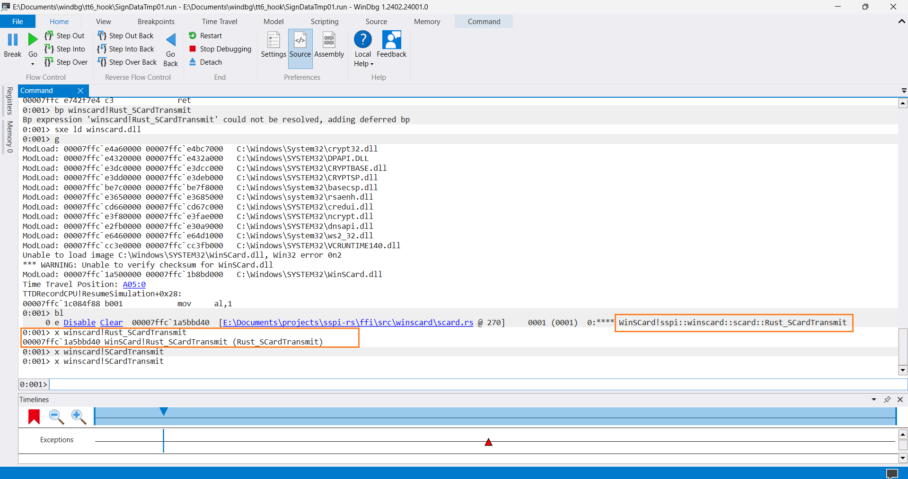

+++
title = "Smart card container name"
date = 2024-04-22
draft = false
template = "post.html"

[taxonomies]
tags = ["debugging", "windows", "scard"]

[extra]
keywords = "Debugging, API, Windows, Smart Card, Reverse Engineering"
toc = true
thumbnail = "win-scard-container-name-thumbnail.png"
+++

# Before I start

## Goals

* Explain how the Windows [minidriver](https://learn.microsoft.com/en-us/windows-hardware/drivers/smartcard/smart-card-minidriver-overview) treats the smart card container name.
* Tell how a bad container name can break scard auth.
* Fun :partying_face:.

## Non-goals

* Explain every piece of smart card architecture in Windows.
* Explain every smart card minidriver function.

# Getting Started

In my [previous article](https://tbt.qkation.com/posts/win-scard-cache), I explained the different smart card cache items (files), their format, and purpose. The current one is some continuation of talking about PIV smart cards in Windows. The setup is the same: Windows smart card minidriver + PIV smartcard. But in this case, we'll use a fully emulated smart card :fire:.

_**Note.**_ The current article is full of technical things related to debugging (WinDbg) and reversing (IDA). Depending on your purpose, choose one of the following paths:

* If you want to reproduce each step with me, then perform all actions from the [Debugging environment](#debugging-environment) section and continue reading the article.
* If you don't want to set up the whole environment but want to reproduce each step on your machine, then download my [TTD recoding and log files](https://drive.google.com/drive/folders/1eaQld0SC94sMgzQUMvIZ1Lm7vUo1PoSr?usp=sharing). But I still recommend reading the [Debugging environment](#debugging-environment) section (at least to know how I came up with it).
* If you only want to read my findings and smart card container name structure, then jump to the [What?](#what) section.
* `else`: read it fully.

Happy reading :blush:. Enjoy :relieved:.

# Debugging environment

My goal is to simulate the data signing using an emulated smart card. To achieve this I need two key things:

* Some program signs the data using the smart card.
* Hook somehow the `winscard.dll` to use an emulated smart card.

A brief explanation of our debugging environment:

1. Test VM + certificate with private key suitable for the data signing.
2. We'll have a small program written in C#. The only thing this program does is sign the hardcoded data using the smart card.
3. We'll have a `bad.dll` that hooks the original `winscard.dll` with our one.
4. And the last but not least thing is a *"launcher"*: another program that creates a signing process, then loads the `bad.dll` into it to hook the `winscard.dll`, and then continues the execution.

> *Pheww, it starts looking like some kind of Frankenstein* :zany_face:

Yes. You are right :upside_down_face:.

## Compile the data signer

The code is very simple. It uses some high level C# API for the data signing. The full code can be found [here](https://github.com/TheBestTvarynka/trash-code/tree/scard-container-name/scard-container-name/SignDataTmp). Just clone the project and build it with [Visual Studio](https://visualstudio.microsoft.com/vs/community/). *Note:* it required **net6.0**.

The overall algorithm is pretty simple: we create a CSP that matches our smart card and then sign the data using the RSA crypto provider. The simplified code looks like this:

```c#
// Create needed CSP.
CspParameters csp = new CspParameters(1,
    "Microsoft Base Smart Card Crypto Provider",
    containerName // smart card container name
);
csp.KeyPassword = pwd;

// Sign the data.
RSACryptoServiceProvider rsaCsp = new RSACryptoServiceProvider(csp);
byte[] signature = rsaCsp.SignData(dataToSign, HashAlgorithmName.SHA1, RSASignaturePadding.Pkcs1);
```

As a result, you should get `SignDataTmp.exe` + `SignDataTmp.dll`.

## Compile your own version of `winscard.dll`

```bash
git clone https://github.com/Devolutions/sspi-rs.git
cd sspi-rs/ffi
git checkout 4cd21349311b8edad03cc0dc8edf56407ccc22b9
cargo build --all-features
```

Of course, during my first debugging, I had a dev version of the `sspi-rs`. But now all developed functionality has been [merged](https://github.com/Devolutions/sspi-rs/pull/210), so we need to pick a specific commit. After that you will have `sspi.dll` in the `target/debug` directory. You can rename it to `winscard.dll` if you want (but it's not required).

## Compile `bad.dll`

This `bad.dll` represents how I do the hooking. There are many hooking techniques. My choice criteria were that it should work and not be hard to implement. So, I chose the [MinHook](https://github.com/TsudaKageyu/minhook) library. It is easy to use and does its job well. Project source code can be found [here](https://github.com/TheBestTvarynka/trash-code/tree/scard-container-name/scard-container-name/bad). Just clone the project and build it with [Visual Studio](https://visualstudio.microsoft.com/vs/community/). *Note:* do not forget to properly link it with `MinHook`.

But here is a surprise. When you try to read the code you'll find out that I hook some weird functions instead of the `winscard.dll`. The reason for that is [delayed loading](https://learn.microsoft.com/en-us/cpp/build/reference/understanding-the-helper-function). We can not simply hook the `winscard.dll` because the `basecsp.dll` loads it via delayed loading :confused:.

But it is still possible to hook. Thanks to [@awakecoding](https://x.com/awakecoding) I know how to do it. He had [researched](https://x.com/awakecoding/status/1725249330435518736) and implemented it in the [MsRdpEx](https://github.com/Devolutions/MsRdpEx): [fix winscard.dll delay-loading interception from basecsp.dll](https://github.com/Devolutions/MsRdpEx/pull/84). I reused some code and make it work for my debugging program :sweat_smile:.

So, as a result, you should get `bad.dll`. Do not forget to set your own paths in the code!

## Compile the launcher

The *"launcher"* is named as *"HookLibrary"* due to my own historical reasons :zany_face:. The full source code can be found [here](https://github.com/TheBestTvarynka/trash-code/tree/scard-container-name/scard-container-name/HookLoadLibrary). *Important*: do not forget to change hardcoded paths to your ones. It works as follows:

1. Runs the data signer executable in a separate process, but does not run it.
2. Injects the `bad.dll` into the process memory forcing it to load this dll. In turn, the `bad.dll` will hook all needed methods.
3. Continues the execution.

So, as a result, you should get `HookLoadLibrary.exe`.

## Run it

Before trying to run this machinery we need to configure the emulated smart card. To do this set up the following environment variables:

| Name | Value | Example |
|------|-------|---------|
| `SSPI_LOG_PATH` | Path to the log file | D:\test_data\sspi.log |
| `SSPI_LOG_LEVEL` | Log level | trace |
| `WINSCARD_PIN` | Smart card PIN code | 214653 |
| `WINSCARD_CERT_PATH` | Path to the *.cer* file containing the smart card certificate | [D:\test_data\user.cer](https://github.com/TheBestTvarynka/trash-code/blob/scard-container-name/scard-container-name/t2%40tbt.com.cer) |
| `WINSCARD_PK_PATH` | Path to the *.key* file containing the smart card certificate | [D:\test_data\user.key](https://github.com/TheBestTvarynka/trash-code/blob/scard-container-name/scard-container-name/t2%40tbt.com.key) |
| `WINSCARD_CONTAINER` | Container name | 1b22c362-46ba-4889-ad5c-01f7abcabcabedw |
| `WINSCARD_READER` | Reader name | `Microsoft Virtual Smart Card 2` |

And finally, run `HookLoadLibrary.exe`.

# Debugging

## The first run

Let's try to sign the data using the emulated smart card.


Expectedly (otherwise, this article would not exist :slightly_smiling_face:), we got an exception. Our goal for the rest of the article is to figure out the cause of the error and fix it.

## Error location

At this point, I don't know what caused the error. So, let's use [WinDbg](https://learn.microsoft.com/en-us/windows-hardware/drivers/debugger) and make a [TTD](https://learn.microsoft.com/en-us/windows-hardware/drivers/debuggercmds/time-travel-debugging-overview) recording. Finding a function that returns an error in this way will be easier. With TTD recording I can walk through the execution without rerunning the app.

_**Note.**_ Because the `HookLoadLibrary.exe` runs the `SignDataTpm.exe` in a separate process, you should attach WinDbg to this process instead of running the `HookLoadLibrary.exe` in the WinDbg.


Good. Now we can start debugging.


At this point, I can assume only something: some function in `msclmd.dll` or `basecsp.dll` fails and breaks the signing. Let's see the last `sspi-rs` FII calls in the logs to have at least some orientation on where to dig. If we catch a moment of the last winscard calls, we'll retrieve a call stack and then analyze those functions. These are the last meaningful records in the log file:


We can see the `SCardTransmit` function call. I'll search for them in the WinDbg. But because I use the custom `winscard.dll`, all WinSCard-related functions have a `Rust_` prefix. Example:



I have omitted some manipulations so that this article is not too boring. In short, on the screenshot below we can see the last `SCardTransmit` call and part of the call stack:


As I expected, we see the `msclmd.dll` and `basecsp.dll` functions. The next algorithm is the following: I take the highest function from the call stack and check the resulting status code in the WinDbg. If it succeeds, I take a lower function from the call stack and check its status code. When I finally find a failing function, I'll use WinDbg and IDA to see the exact failing point. I expect something like `return 0x80100004;` or any other status code.

Hmmm :thinking:. All functions up to the C#-related ones were succeeded. Perhaps the last calls to `SCardTransmit` occurred after a signing error and Windows was trying to finalize the error/gather some information OR the signing process is not even started yet. I need another function to start with. Let's try `SCardReadCacheW`. I had a *"great"* experience with smart card caches in [the past](https://tbt.qkation.com/posts/win-scard-cache), so maybe it'll help me this time. Thanks to TTD I don't need to rerun it and can walk through the recording again and again.

After some time I finally found something that looks like data signing :relieved:.


Let's see the status codes of the highlighted functions:


Cool! Now we know what the `msclmd!I_PIVCardSignData` function returns the [`SCARD_E_INVALID_PARAMETER`](https://learn.microsoft.com/en-us/windows/win32/secauthn/authentication-return-values) status code.

I need to find where in this function body the error has been thrown. Walking through every ASM instruction is boring and time-consuming, so I took an IDA and reversed this function as much as I could. After that, I marked some places (other function calls, `if`s, and so on) that could fail and checked them with WinDbg.


Okaaay, so, the key algorithm and id extraction have failed :thinking:. Reversed pseudo-code:

```c
return_code = I_GetKeyAndAlgFromMapIndex(
                card_data,
                *((_BYTE *)signing_info + 4),// bContainerIndex
                (unsigned __int8 *)&key_buff,
                &key_alg,
                &key_size);
```

I dug into it and found exact place where the fail happens. I skipped this part for you and show you the result:


Here is the reversed part of the ASM code above. We can see that invalid cert file tag causes the `SCARD_E_INVALID_PARAMETER` error:


On the screenshot above the part of the `msclmd!I_GetPIVKeyIDFromPIVCertFileTag` function is shown. The `msclmd!I_IsValidPIVCertFileTag` function has returned `0` (`false`). It means that the cert file tag is not valid.


So, the `cert_file_tag` must meet highlighted conditions to be valid. In our case it's equal to `0xaaaaaa` which is obviously not valid. To fix it we need to figure out how the `cert_file_tag` is constructed and how we can change it to met one of the needed values. I did it for you, so take a look at the following screenshot:


The screenshot above contains a part of the `msclmd!I_GetKeyAndAlgFromMapIndex` function. This piece of code gives us answers to all our questions. First of all, the `cert_file_tag` value is extracted from the `cmap_record` using the [`swscanf_s`](https://learn.microsoft.com/en-us/cpp/c-runtime-library/reference/sscanf-s-sscanf-s-l-swscanf-s-swscanf-s-l?view=msvc-170) function. In simple words, it takes the `cmap_record` buffer pointer, skips the first 30 characters (bytes), scans the following 6 characters (bytes), converts them from hex to decimal, and, finally, assigns it to the `cert_file_tag` variable. This is our `cert_file_tag` which is not valid. In turn, the `cmap_record` is a pointer to the [`CONTAINER_MAP_RECORD`](https://github.com/selfrender/Windows-Server-2003/blob/5c6fe3db626b63a384230a1aa6b92ac416b0765f/ds/security/csps/wfsccsp/inc/basecsp.h#L104-L110) structure where the first field is a container name:

```c
#define MAX_CONTAINER_NAME_LEN                  40

typedef struct _CONTAINER_MAP_RECORD
{
    WCHAR wszGuid [MAX_CONTAINER_NAME_LEN];
    BYTE bFlags;        
    WORD wSigKeySizeBits;
    WORD wKeyExchangeKeySizeBits;
} CONTAINER_MAP_RECORD, *PCONTAINER_MAP_RECORD;
```

According to the Microsoft's specification:

> *The `wszGuid` member consists of a UNICODE character string representation of an identifier that CAPI assigned to the container. This is usually, but not always, a GUID string. Identifier names cannot contain the special character “\”. When read-only cards are provisioned, the provisioning process must follow the same guidelines for identifier names.*

## What?

:face_exhaling: Let's summarize it all.

The `CONTAINER_MAP_RECORD` structure contains a smart card container name. The container map record value is extracted from [the smart card cache](https://tbt.qkation.com/posts/win-scard-cache/#cached-generalfile-mscp-cmapfile). This container name (`wszGuid`) is not a random GUID value. This is a special value that must contain one of the allowed certificate file tags. The smart card driver (`msclmd.dll`) decides how to sign the data based on this `cer_file_tag`. All possible certificate file tags are defined and can be found in [the PIV smart card specification](https://nvlpubs.nist.gov/nistpubs/SpecialPublications/NIST.SP.800-73-4.pdf) and [open-source projects](https://github.com/search?q=0x5FC101+language%3AC&type=code&l=C) that follow this spec.


> *Soooo, if we just change the container name, then data signing should work?* :point_right::point_left:

It seems like yes, it should. We have nothing to lose. Let's try it.

## The fix

Change the `WINSCARD_CONTAINER` environment variable.

| Name | Value | Example |
|------|-------|---------|
| `WINSCARD_CONTAINER` | Container name | 1b22c362-46ba-4889-ad5c-01f7aa5fc10awww |

:crossed_fingers::crossed_fingers::crossed_fingers:


:tada: It works! :tada: Ignore the error at the bottom of the terminal. The only important thing is the resulting signature. It means, that the data signing using the emulated smart card works well :relieved:. Even in the `sspi-rs` logs we can see `SCardTransmit` calls with input padded digest and output signature:


:blush::blush::blush: I don't know why this container name format is not documented anywhere (at least I didn't find any mention about it on the Internet).

# Conclusion

There are a lot of ways of debugging programs. In this article, I told you about one of my cases where I need to be creative and patient. In the end, I could tell that Windows is bad and so on, but I'll say the following instead:

> *Everything is possible. Any bug and problem is solvable. Be creative and have patience.*

Wish you more interesting bugs and fun debugging! :stuck_out_tongue_closed_eyes:

# Doc, references, code

* [Smart Card Minidriver Overview](https://learn.microsoft.com/en-us/windows-hardware/drivers/smartcard/smart-card-minidriver-overview).
* [Emulated smart cards implementation](https://github.com/Devolutions/sspi-rs/pull/210).
* [Source code of all used debugging programs](https://github.com/TheBestTvarynka/trash-code/tree/scard-container-name/scard-container-name).
* [WinDbg](https://learn.microsoft.com/en-us/windows-hardware/drivers/debugger).
* [TTD](https://learn.microsoft.com/en-us/windows-hardware/drivers/debuggercmds/time-travel-debugging-overview).
* [TTD recording and log files](https://drive.google.com/drive/folders/1eaQld0SC94sMgzQUMvIZ1Lm7vUo1PoSr?usp=sharing).