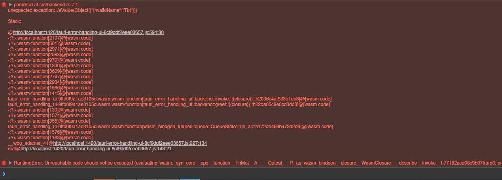
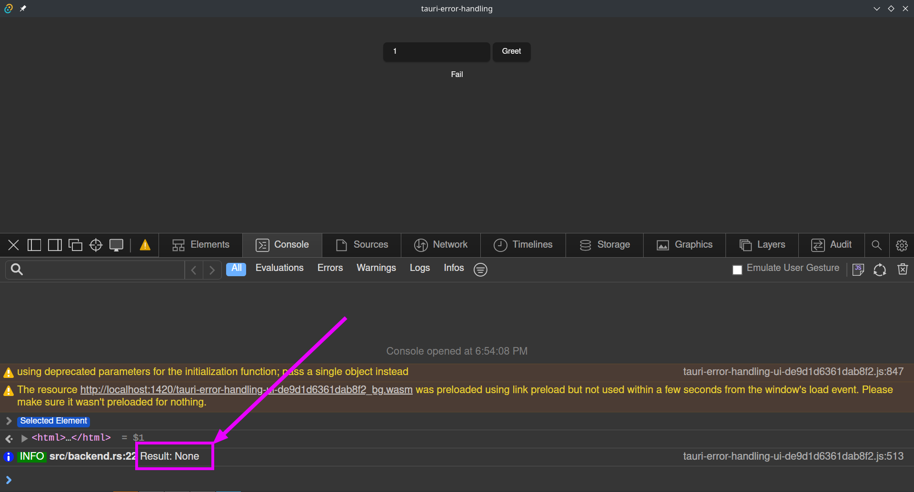
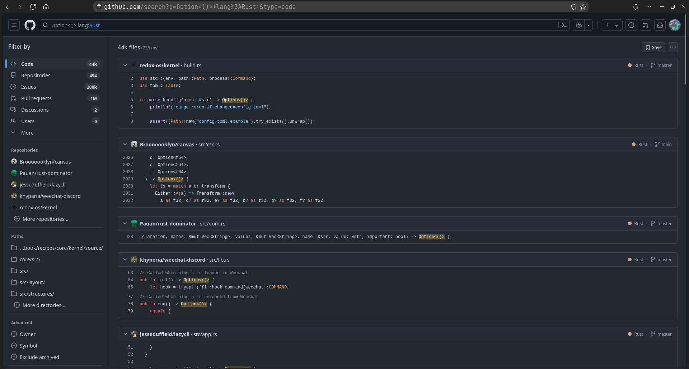

+++
title = "Tauri error handling recipes"
date = 2024-12-26
draft = false
template = "post.html"
description = "I am writing my custom node-taking app in Rust (even on frontend) using Tauri. Here is what I learned about error handling."

[taxonomies]
tags = ["recipes", "rust", "tauri", "leptos"]

[extra]
keywords = "Rust, Tauri, Leptos"
toc = true
thumbnail = "tauri-error-handling-thumbnail.png"
+++

# Intro

I'm developing the desktop app to meet my own needs: [Dataans](https://github.com/TheBestTvarynka/Dataans).

> Take notes in the form of markdown snippets grouped into spaces.

I use [Tauri](https://tauri.app/) as the main framework and [Leptos](https://leptos.dev/) as the frontend. I am satisfied with the developing experience and the result I got.

During the initial implementation (PoC phase), I didn't implement any error handling and called `.unwrap()` every time. However, after the first release, I needed to add proper error handling and make the app more fault-tolerant. The refactoring process wasn't easy and I spent more time than expected. I learned some important lessons and decided to write this article to summarize my knowledge.

_**Disclaimer**_: I have experience using `Tauri` only with `Leptos` and other Rust-based frontend frameworks. Error handling approaches may be different when using JS-based frontend frameworks.

# Set up

I set up a simple project (basically it is a `cargo create-tauri-app` with minimal changes) to demonstrate the approach and the progress: [github/TheBestTvarynka/trash-code/265f39bfde2aa9fb10055bfee5031714498f7b28/tauri-error-handling](https://github.com/TheBestTvarynka/trash-code/tree/265f39bfde2aa9fb10055bfee5031714498f7b28/tauri-error-handling). I left a corresponding commit link for each section in this article. So, you can follow this process and even reproduce it with me.

So, what do we have? We have one simple Tauri command:

```Rust
// Backend: src-tauri/src/lib.rs
#[tauri::command]
fn greet(name: &str) -> String {
    format!("Hello, {}! You've been greeted from Rust!", name)
}

// Frontend: src/backend.rs
pub async fn greet(name: &str) -> String {
    let args = to_value(&GreetArgs { name }).unwrap();
    
    invoke("greet", args).await.as_string().unwrap()
}
```

# Let's handle the error

Usually, most of the commands may fail. We may want to return a `Result` and handle the error on the frontend side. Let's try it. Suppose we need to validate the name. I came up with the following implementation (let's keep it simple):

```Rust
use thiserror::Error;

#[derive(Debug, Error)]
enum Error {
    #[error("invalid name: {0}")]
    InvalidName(String),
}

fn validate_name(_name: &str) -> Result<(), Error> {
    Err(Error::InvalidName("Tbt".into()))
}

#[tauri::command]
fn greet(name: &str) -> Result<String, Error> {
    validate_name(name)?;

    Ok(format!("Hello, {}! You've been greeted from Rust!", name))
}
```

Unfortunately, now we have a compilation error:

```
error[E0599]: the method `blocking_kind` exists for reference `&Result<String, Error>`, but its trait bounds were not satisfied
   --> src-tauri/src/lib.rs:14:1
    |
5   | enum Error {
    | ---------- doesn't satisfy `Error: Into<InvokeError>`
...
14  | #[tauri::command]
    | ^^^^^^^^^^^^^^^^^ method cannot be called on `&Result<String, Error>` due to unsatisfied trait bounds
...
25  |         .invoke_handler(tauri::generate_handler![greet])
    |                         ------------------------------- in this macro invocation
    |
   ::: /home/pavlo-myroniuk/.rustup/toolchains/stable-x86_64-unknown-linux-gnu/lib/rustlib/src/rust/library/core/src/result.rs:527:1
    |
527 | pub enum Result<T, E> {
    | --------------------- doesn't satisfy `Result<std::string::String, Error>: IpcResponse` or `_: ResultKind`
    |
    = note: the following trait bounds were not satisfied:
            `Error: Into<InvokeError>`
            which is required by `Result<std::string::String, Error>: tauri::ipc::private::ResultKind`
            `Result<std::string::String, Error>: IpcResponse`
            which is required by `&Result<std::string::String, Error>: tauri::ipc::private::ResponseKind`
```

:thinking:. Our `Result<String, Error>` type must implement the `IpcResponse` trait. Implementing `serde::Serialize` should be enough (because of the `impl<T: Serialize> IpcResponse for T` trait bound. [docs](https://docs.rs/tauri/latest/tauri/ipc/trait.IpcResponse.html#impl-IpcResponse-for-T)).

```Rust
#[derive(Debug, Error, Deserialize, Serialize)]
enum Error {
    #[error("invalid name: {0}")]
    InvalidName(String),
}
```

Great. Compilation successful. Alternatively, you can read another explanation and example: [The Tauri Documentation WIP/Inter-Process Communication#error-handling](https://jonaskruckenberg.github.io/tauri-docs-wip/development/inter-process-communication.html#error-handling).

_**Lesson 1**_. _All `Error`s must implement the `serde::Serialize` trait_.

What about frontend? How are we going to handle the error? Let's start with the simplest solution:

1. Move the `Error` type to a separate `common` crate which can be used by frontend and backend.
2. Expect `JsValue` to be parsed into `Result<String, Error>`.

```Rust
pub async fn greet(name: &str) -> Result<String, Error> {
    let args = to_value(&GreetArgs { name }).expect("GreetArgs to JsValue should not fail");

    let js_value = invoke("greet", args).await;

    from_value(js_value).expect("JsValue to Result should not fail")
}
```

Oops, we have a problem in runtime:



But why :sob:? According to the documentation ([v2.tauri.app/calling-rust/#error-handling](https://v2.tauri.app/develop/calling-rust/#error-handling)), Tauri command error will be an exception on frontend :confused:. So, we should not expect the `Result<String, Error>`, but handle a JS exception instead.

Fortunately, we can ask `wasm_bindgen` to handle this exception. Tauri docs say nothing about it, but if we open the wasm-bindgen documentation instead, we will find this treasure ([wasm-bindgen/attributes/on-js-imports/catch](https://rustwasm.github.io/wasm-bindgen/reference/attributes/on-js-imports/catch.html)):

> The `catch` attribute allows catching a JavaScript exception. This can be attached to any imported function or method, and the function must return a `Result` where the `Err` payload is a `JsValue`:

:astonished:. Let's use it. Now I'm going to change the binding generated by `cargo create-tauri-app`.

```Rust
#[wasm_bindgen]
extern "C" {
    #[wasm_bindgen(js_namespace = ["window", "__TAURI__", "core"], catch)]
    async fn invoke(cmd: &str, args: JsValue) -> Result<JsValue, JsValue>;
}
```

And now we can handle the exception as an error:

```Rust
pub async fn greet(name: &str) -> Result<String, Error> {
    let args = to_value(&GreetArgs { name }).expect("GreetArgs to JsValue should not fail");

    match invoke("greet", args).await {
        Ok(msg) => Ok(from_value(msg).unwrap()),
        Err(err) => Err(from_value(err).unwrap()),
    }
}
```

And finally, it works :tada:. Here is the resulting code: [github/TheBestTvarynka/trash-code/9f6437fe7799e87439430e483c92c0ed590b12f3/tauri-error-handling](https://github.com/TheBestTvarynka/trash-code/tree/9f6437fe7799e87439430e483c92c0ed590b12f3/tauri-error-handling).

_**Lesson 2**_. _Tauri command error is an exception on frontend. The exception can be caught by using the `catch` attribute of the `#[wasm_bindgen]` macro._

# Bonus: unexpected None

As you can see from the `invoke` function declaration, command input/output values are serialized into/deserialized from JsValue using the `serde_wasm_bindgen` crate. But we are also aware that the JS type-system and Rust type-system are different. Thus, not all Rust objects can be represented in a JS type-system. Theoretically, we can find a Rust object, that:

```Rust
obj == serde_wasm_bindgen::from_value(serde_wasm_bindgen::to_value::(&obj).unwrap()).unwrap()
// false
```

I mean, objects before and after the serialization + deserialization process are not the same. It was theoretical until yesterday when I faced it in practice :zany_face:. Suppose we have the following Tauri command:

```Rust
#[tauri::command]
fn greet(name: &str) -> Option<()> {
    // do the work here

    Some(())
}
```

And the corresponding code on frontend side:

```Rust
pub async fn greet(name: &str) -> Option<()> {
    let args = to_value(&GreetArgs { name }).expect("GreetArgs to JsValue should not fail");

    let js_value = invoke("greet", args).await.expect("should not fail");

    let result: Option<()> = from_value(js_value).expect("deserialization should not fail");
    info!("Result: {:?}", result);

    result
}
```

Let's try it.



Oppps :hushed:. We have `None` instead of `Some(())`. `Some(())` is serialized in `undefined` and `undefined` is deserialized in `None`. You should be very careful with `()` and `enum`s. You can reproduce it by yourself: [github/TheBestTvarynka/trash-code/4a4f62d1d55687cc02538408ceb9eb6fee93187f/tauri-error-handling](https://github.com/TheBestTvarynka/trash-code/tree/4a4f62d1d55687cc02538408ceb9eb6fee93187f/tauri-error-handling).

_**Lesson 3**_. _Objects before and after the serialization + deserialization process may be different. Be careful when using types like `()`, `enum`s, etc._

If you say that no one uses the `Option<()>` type, then I will disagree. Try to search for `Option<()>` on GitHub and you will find many uses of this type: [github/search?q=Option%3C%28%29%3E+lang%3ARust+&type=code](https://github.com/search?q=Option%3C%28%29%3E+lang%3ARust+&type=code).



# Learned lessons

1. All `Error`s must implement the `serde::Serialize` trait.
2. Tauri command error (`Result::Err(E)`) is an exception on frontend. The exception can be caught by using the `catch` attribute of the `#[wasm_bindgen]` macro.
3. The JS type-system and Rust type-system are different. Objects before and after the serialization + deserialization process may be different.

**Fun fact.** This article looks nothing like the one I planned. I didn't know about the `catch` attribute before writing the article. I discovered it accidentally :zany_face:. I even wrote my own `Result` and `Unit` types to implement proper error handling: [github/TheBestTvarynka/Dataans/3f2b97e81cbe8b6c4cd0fffc6d0b44c0a8c4e748/dataans/common/src/error.rs](https://github.com/TheBestTvarynka/Dataans/blob/3f2b97e81cbe8b6c4cd0fffc6d0b44c0a8c4e748/dataans/common/src/error.rs) (but now I plan to delete them).

> \> refactored error handling in my Tauri project
>
> \> it turned out harder than I thought
>
> \> decided to write a blog post about error handling in Tauri
>
> \> while writing the blog post I found out that I could have done it much easier
>
> \> now I am going to refactor the error handling again

I like this side effect of writing articles. Most likely, you will do some research, investigation, and code examples to better explain your idea. Almost every time I write a blog post I discover something new for me.

4. Writing blog posts is a good way to learn something more deeply :star_struck:.

# Doc, references, code

* [The Tauri Documentation WIP/Inter-Process Communication#error-handling](https://jonaskruckenberg.github.io/tauri-docs-wip/development/inter-process-communication.html#error-handling).
* [v2.tauri.app/calling-rust/#error-handling](https://v2.tauri.app/develop/calling-rust/#error-handling).
* [wasm-bindgen/attributes/on-js-imports/catch](https://rustwasm.github.io/wasm-bindgen/reference/attributes/on-js-imports/catch.html).
