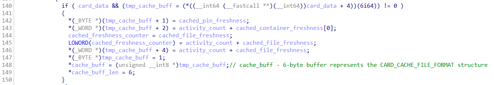
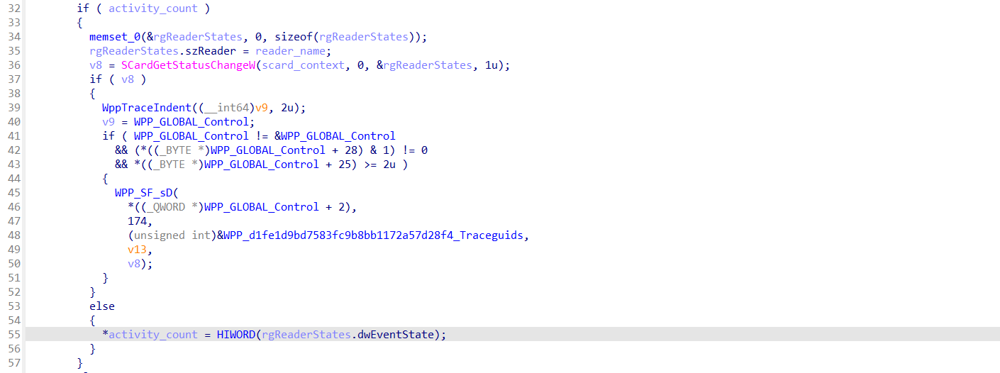

+++
title = "Windows smart card cache"
date = 2024-04-15
draft = false

[taxonomies]
tags = ["debugging", "windows", "rust", "scard"]

[extra]
keywords = "Rust, API Monitor, Debugging, API, Windows, smart card"
toc = true
+++

# Getting Started

A few months ago I had a great opportunity to implement [the smart card emulation](https://github.com/Devolutions/sspi-rs/pull/210). The whole point was to emulate the smart card behavior without an actual smart card. I can talk a lot about such stuff, but in this article, I'm going to share my experience in smart card cache exploration and implementation.

To make all my decisions clear for you, I provide you with some additional context. Imagine the reimplemented `winscard.dll` without actual calls to the security device but with the smart card emulation under the hood. Boom :boom:! We have scard auth without a physical device.

You can have questions like *"How can we replace the original dll"*, *"What is the point of such implementation"*, *"What are the limitations of it"*, and so on. Unfortunately, it's out of the scope of this article. Here I focused only on debugging and smart card cache (I'll explain the reason for it further in the article).

## Goals

* A brief overview of the smart card architecture in Windows.
* Explain smart card cache items for [**PIV**](https://www.idmanagement.gov/university/piv/) smart cards in Windows.
* Fun :partying_face:.

Who should read this article:

* Ones who are interested in how PIV smart cards work on Windows.
* Ones who just need PIV scard cache items format (Hi :wave:, `msclmd.dll`).

## Non-goals

* Explain every piece of smart card architecture in Windows.

# Overview

In Windows, [WinSCard](https://learn.microsoft.com/en-us/windows/win32/api/winscard/) is the lowest accessible API for communicating with smart cards. You operate only using handles (`SCARDCONTEXT`/`SCARDHANDLE`/etc), raw [APDU](https://en.wikipedia.org/wiki/Smart_card_application_protocol_data_unit)s ([SCardTransmit](https://learn.microsoft.com/en-us/windows/win32/api/winscard/nf-winscard-scardtransmit) function), and a bunch of other low-level functions. If you look at the CSP and KSP-based architecture diagram, you'll see WinScard almost at the bottom of the picture:

[](https://learn.microsoft.com/en-us/windows/security/identity-protection/smart-cards/smart-card-architecture#base-csp-and-ksp-based-architecture-in-windows)

Let's analyze this diagram above. Usually, when you deal with any crypto operations in Windows, you use some high-level API - [CryptoAPI](https://learn.microsoft.com/en-us/windows/win32/seccrypto/cryptoapi-system-architecture). But the CryptoAPI is just a high-level API and every [CSP](https://en.wikipedia.org/wiki/Cryptographic_Service_Provider) implements it. In the case of smart cards, the corresponding CSP (`basecsp.dll`, in our case) can not contain the CryptoAPI implementation because all crypto operations should be performed on the security device. This is why BaseCSP uses (depends) on the smart card minidriver. Such a minidriver translates high-level functions into WinSCard API calls. Nothing more.

Usually, every smart card vendor ships its smart card driver (you can see it on the diagram). The Windows itself contains two smart card drivers:

* One driver for Windows proprietary smart cards with closed specifications and documentation.
* And another driver for PIV-compatible smart cards. It has open specifications ([Smart Card Minidriver Specification](https://learn.microsoft.com/en-us/previous-versions/windows/hardware/design/dn631754(v=vs.85)) + [NIST SP 800-73-4](https://nvlpubs.nist.gov/nistpubs/SpecialPublications/NIST.SP.800-73-4.pdf)) but closed documentation.

> *"...two smart card drivers:"*

It was a small lie :sweat_smile:. I mean, yes, it's true, but those two drivers are implemented inside one dll: `msclmd.dll`. *For the rest of this article, we'll talk **only** about `msclmd.dll` and **PIV-compatible** smart cards.*

> *Got it. But why is card cache the main topic of this article?*

I have a few reasons for it:

* No matter how good our WinSCard implementation is, authentication will fail without a working cache.
* Only a few cache items are described in the Window's minidriver specification. Many of them are undocumented and unknown.
* It was the hardest part to debug and implement :stuck_out_tongue_closed_eyes:.

Firstly, I thought I can found cache items format in the specification. But I was wrong. Secondly, I was astonished that I didn't found any information about them in the Internet. In the result, it took me more then month to properly reverse/debug `msclmd.dll` and extract all needed information about scard cache items. And I decided to write an article you are reading now.

> ***Note**. I didn't reverse the whole smart card driver. I explored only needed functions. So, this article has gaps in some places filled with my assumptions. If you are more experienced and know more about such places, please, leave a comment and I'll edit the article to be more complete. Thanks*:relieved:

# Debugging

It's easier to work if we have a concrete destination point. Let's take the Remote Desktop Client (`mstsc.exe`), replace the `wiscard.dll`, and try to connect to the remote machine using the emulated smart card. The established RDP connection is our goal.

To make my life easier, I took the [MsRdpEx](https://github.com/Devolutions/MsRdpEx/) and hooked the `winscard.dll` using the [`MSRDPEX_WINSCARD_DLL`](https://github.com/Devolutions/MsRdpEx/pull/76) environment variable. Pretty simple and usable.

For the further work, only two instruments will be used:

* IDA.
* [WinDbg](https://learn.microsoft.com/en-us/windows-hardware/drivers/debugger/).

[**Time Travel Debugging**](https://learn.microsoft.com/en-us/windows-hardware/drivers/debuggercmds/time-travel-debugging-overview). I encourage you to try it! This technique saved me a lot of time. The possibility of re-playing and moving backward gives us almost unlimited power :muscle:.

# Let's start the journey

I suppose the whole debugging process is boring for you, so I'll show relevant reversed parts of the `msclmd.dll` with small descriptions. If you need only resulting cache items format (structure), then you should skip next sections and jump right to the [Final results](#final-results) section.

## `Cached_CardmodFile\Cached_Pin_Freshness`

Usually, when the driver asks you for the `Cached_CardmodFile\Cached_Pin_Freshness` cache item, it wants to form the [`CARD_CACHE_FILE_FORMAT`](https://github.com/selfrender/Windows-Server-2003/blob/5c6fe3db626b63a384230a1aa6b92ac416b0765f/ds/security/csps/wfsccsp/inc/basecsp.h#L121-L128) structure and the PIN freshness counter is the first field in the structure:

```c
typedef struct _CARD_CACHE_FILE_FORMAT
{
    BYTE bVersion;
    BYTE bPinsFreshness;
    WORD wContainersFreshness;
    WORD wFilesFreshness;
} CARD_CACHE_FILE_FORMAT, *PCARD_CACHE_FILE_FORMAT;
```

The actual cache file is just one-byte number that represents a PIN freshness counter. If you want, it can be two-byte value, but the value will be casted to one-byte. [Implementation example](https://github.com/Devolutions/sspi-rs/blob/master/crates/winscard/src/scard_context.rs#L383-L386):

```rust
const PIN_FRESHNESS: [u8; 2] = [0x00, 0x00];

cache.insert(
    "Cached_CardmodFile\\Cached_Pin_Freshness".into(),
    PIN_FRESHNESS.to_vec(),
);
```

All three freshness counters are extracted from the card cache using the `msclmd!I_GetPIVCachedFreshnessCounter` function. Every freshness counter has an ID:

* `1` - PIN freshness.
* `2` - file freshness.
* `3` - container freshness.

> *What about `bVersion` field?*

Currently, it's always equal to `1` (this value is hardcoded in the DLL. you'll see it on the next screenshots).

But the `CARD_CACHE_FILE_FORMAT` structure creation is not just cache items copying to the structure fields. The driver has an additional algorithm. Okay, let's move on.

## `Cached_CardmodFile\Cached_File_Freshness`

We are already familiar with freshness counters, so I skip this cache item introduction and jump to [the implementation](https://github.com/Devolutions/sspi-rs/blob/master/crates/winscard/src/scard_context.rs#L387-L390):

```rust
const FILE_FRESHNESS: [u8; 2] = [0x0b, 0x00];

cache.insert(
    "Cached_CardmodFile\\Cached_File_Freshness".into(),
    FILE_FRESHNESS.to_vec(),
);
```

Note. The `[0x0b, 0x00]` is almost random value. The freshness counter is just a counter. More importantly, this counter matches the next cache items (files) in this article. I'll explain later what I mean.

## `Cached_CardmodFile\Cached_Container_Freshness`

And finally, the container freshness counter. [Code](https://github.com/Devolutions/sspi-rs/blob/master/crates/winscard/src/scard_context.rs#L391-L394):

```rust
const CONTAINER_FRESHNESS: [u8; 2] = [0x01, 0x00];

cache.insert(
    "Cached_CardmodFile\\Cached_Container_Freshness".into(),
    CONTAINER_FRESHNESS.to_vec(),
);
```

> *So the driver can finally create a `CARD_CACHE_FILE_FORMAT` structure?*

*Well yes but actually no.* Let's see a small reversed part of the `msclmd!I_GetPIVCache` function:



> *What is `activity_count`?*

It's a result value of the `msclmd!I_GetCardActivityCount` function. Here is how it calculated:



The activity counter is calculated based on the `dwEventState` value returned from the [`SCardGetStatusChangeW`](https://learn.microsoft.com/en-us/windows/win32/api/winscard/nf-winscard-scardgetstatuschangew) function. Furthermore, this value also affects the `CARD_CACHE_FILE_FORMAT` structure creation. I pay attention to it on purpose because it's important to know the structure fields' values.

## `Cached_CardProperty_Read Only Mode_0`

## `Cached_CardProperty_Cache Mode_0`

## `Cached_CardProperty_Supports Windows x.509 Enrollment_0`

## `Cached_GeneralFile/mscp/cmapfile`

## `Cached_CardmodFile\Cached_CMAPFile`

## `Cached_ContainerProperty_PIN Identifier_0`

## `Cached_ContainerInfo_00`

## `Cached_GeneralFile/mscp/kxc00`

## `Cached_CardProperty_Capabilities_0`

## `Cached_CardProperty_Key Sizes_2`

## `Cached_CardProperty_Key Sizes_1`

## Container name

# Final results

sc

# Conclusion

c

# Doc, references, code

1. [Smart Card Architecture](https://learn.microsoft.com/en-us/windows/security/identity-protection/smart-cards/smart-card-architecture).
2. [`winscard.h`](https://learn.microsoft.com/en-us/windows/win32/api/winscard/).
3. [Smart Card Minidrivers](https://learn.microsoft.com/en-us/windows-hardware/drivers/smartcard/smart-card-minidrivers).
4. [Smart Card Minidriver Specification](https://learn.microsoft.com/en-us/previous-versions/windows/hardware/design/dn631754(v=vs.85)).
5. Implemented smart card caches: [`scard_context.rs`](https://github.com/Devolutions/sspi-rs/blob/eee2c0b481e63d660cb0cff2c99599fb30b5dd0d/crates/winscard/src/scard_context.rs#L146-L394).
6. [Time Travel Debugging](https://learn.microsoft.com/en-us/windows-hardware/drivers/debuggercmds/time-travel-debugging-overview).