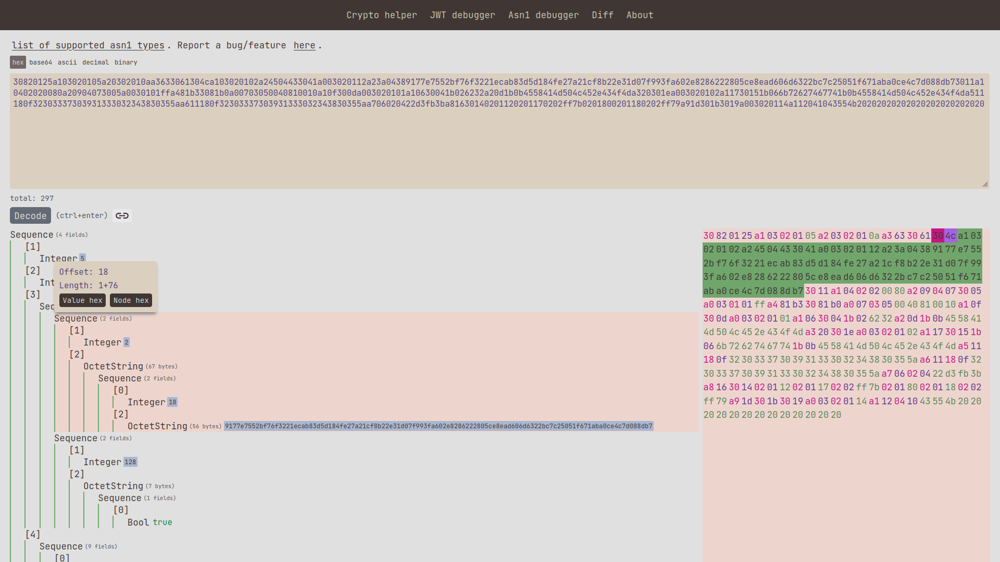
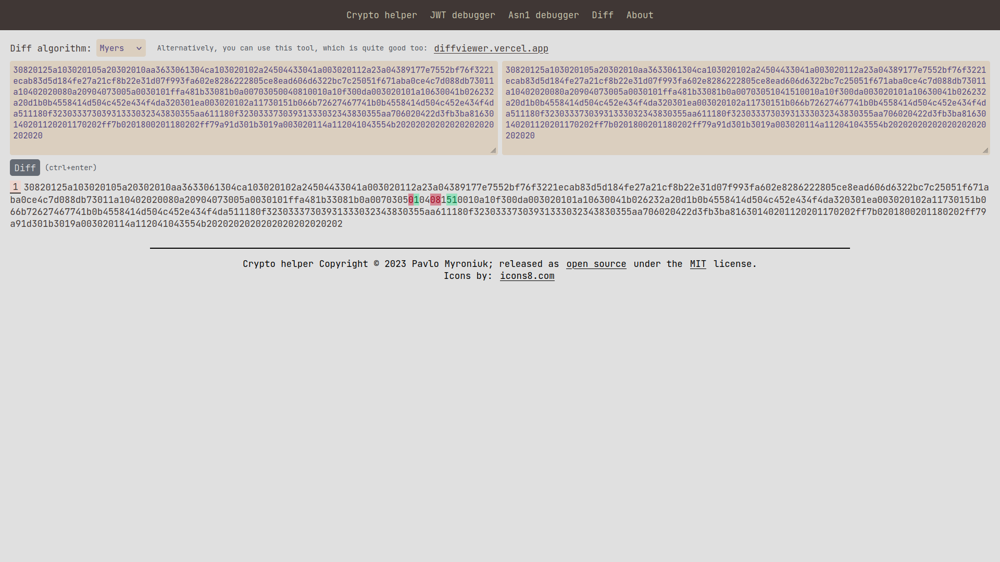

+++
title = "crypto-helper"
description = "Web app that can hash/encrypt/sign the data. JWT debugger."
date = 2024-08-24
draft = false

[taxonomies]
tags = ["yew", "rust", "tools", "project"]

[extra]
toc = true
keywords = "Rust, Yew, Crypto, JWT, Encrypt, Decrypt, Hash, HMAC, MAC, RSA"
+++

Visit this tool at [crypto.qkation.com](https://crypto.qkation.com).

The crypto-helper is an online app that helps to work with the different crypto algorithms. This app can hash/hmac, encrypt/decrypt, and sign/verify the data, debug JWT tokens, parse ASN1 structures, compute diffs, and more. All computations are performed on the client side. _This tool never sends the data the any servers._

## Motivation

### Crypto helper

During my work, I often need to work with bytes sequences that I need to encrypt or decrypt, hash or verify. For example, I might intercept the traffic, extract encrypted Kerberos cipher data, and try to decrypt it using the user's password. Or take payload + signature from the message and try to recalculate it. Such small tasks are very annoying and I decided to optimize this proccess.

Basically, it just takes the input bytes in some format and applies the selected algorithm to it.

{{ img(src="crypto-helper-demo-krb.png" alt="crypto helper krb encryption demo") }}

The list of supported algorithms:

* `Argon2`
* `BCrypt`
* `MD5`
* `SHA1`/`SHA256`/`SHA384`/`SHA512`
* Kerberos ciphers: `AES128-CTS-HMAC-SHA1-96`/`AES256-CTS-HMAC-SHA1-96`
* Kerberos HMAC: `HMAC-SHA1-96-AES128`/`HMAC-SHA1-96-AES256`
* RSA
* Compression: `ZLIB`

### JWT debugger

Another interesting feature is the JWT debugger. I had some time working with Azure AD authorization and its JWT tokens. Why did I decide to implement my own if [jwt.io](https://jwt.io) already exists? The answer is pretty obvious: the existing one is very inconvenient.

* I really don't like its big header. AzureAD tokens are pretty big. Such a massive header is just a waste of space.
* Problems with scrolling. Did you ever try to scroll the header or payload section that contains more than five fields? If not then try.
* Header and payload fields are not resizable.
* Every header/payload/key change immediately overwrites the original JWT token. I often want to see the original one, compare it to a new one, or create a few different tokens based on the initial token.
* Ads. Ads. Ads.

Here is my JWT debugger in action:

{{ img(src="jwt-demo.png" alt="JWT demo") }}

Supported signature algorithms:

* `none`
* `HS256`
* `HS384`
* `HS512`
* `RS256`
* `RS384`
* `RS512`
* `ES256`
* `ES384`
* `ES512`

### ASN1 debugger

Did you hear anything about [ASN1 der](https://luca.ntop.org/Teaching/Appunti/asn1.html)? If not, then this tool is not for you :sweat_smile: If yes and you work with asn1 structures encoding/decoding a lot, then you are at the right place :wink:.

The purpose of this tool is to parse input bytes as the [asn1 der](https://luca.ntop.org/Teaching/Appunti/asn1.html) structure and render the structural representation of it alongside the hex view of its fields and data. A list of supported asn1 types can be found [here](https://github.com/TheBestTvarynka/crypto-helper/tree/main/crates/asn1-parser#supported-asn1-types). Long story short, here is a demo:

I think you got it. Basically, it's a reimplementation of [lapo.it/asn1js](https://lapo.it/asn1js) but with my features and my design. There are some of them:

* Ability to copy asn1 node or node inner value.
* Decode on `ctrl + enter`.
* Different hex view. I compare parsed structure with its hex representation very often, so I need more explicit and highlighted bytes rendering.

To implement it, the custom asn1 parser crate has been written: [asn1-parser](https://github.com/TheBestTvarynka/crypto-helper/tree/main/crates/asn1-parser).

> **Yet another `asn1` parser? ([https://users.rust-lang.org/t/comparison-of-way-too-many-rust-asn-1-der-libraries](https://users.rust-lang.org/t/comparison-of-way-too-many-rust-asn-1-der-libraries))**

It parses the asn1 types and remembers their position in the input data stream. It is a useful feature for pretty rendering.

### Diff checker

The purpose of the [diff-checker](https://crypto.qkation.com/diff) is to just show the diff using selected diff algorithms. It lacks many modern diff-tool features. Most likely it will never have them implemented. The purpose of this tool is only to cover a few specific edge cases.

I use it from time to time for raw data diff computation using different diff algorithms. Most likely you will never need this feature but at least it is needed by me and doesn't contain any ads.

## The journey

* Written in [Rust](https://github.com/rust-lang/rust) :crab: using [yew](https://github.com/yewstack/yew) :sparkles:

It's a fun story because I rewrote this tool two times. Firstly, I planned to make it very simple and started implementing using plain `html`/`css`/`js`. Then I realized that it's hard to improve, and maintain, and can cause a lot of stupid bugs. The second choice was `React`. In the middle of the rewriting, I thought: why do not write it in `Rust`?

After some research, I decided to use the [Yew](https://github.com/yewstack/yew) framework. Basically, it's like `React` but for `Rust`. From my experience, I can tell that *yew* is a great framework to write web applications ([SPA](https://en.wikipedia.org/wiki/Single-page_application)s) in `Rust`. It works well, has great documentation, and is easy to work with. I have faced only one problem: styling. We don't have (so far) such convenient libraries for stlyling as we have for `React`.

I'm happy that I wrote this tool. I use it very often and learned a lot during the implementation. I have had to deal with the web frontend in Rust, web assembly, web workers, application designing and implementation, writing custom asn1 parser, deploying, and much more.

## How to use it

Just follow [the link](https://crypto.qkation.com/) and paste your data. As you can see, the interface is pretty intuitive.

## Moving further

At this point, this tool has the all needed functionality for me. I plan to improve it continuously according to my needs and goals. If you have any feature requests, then create an [issue](https://github.com/TheBestTvarynka/crypto-helper/issues/new) with the description. It'll be a priority for me.

## Doc, references, code

* Visit this tool at [crypto.qkation.com](https://crypto.qkation.com).
* Source code: [TheBestTvarynka/crypto-helper](https://github.com/TheBestTvarynka/crypto-helper).
