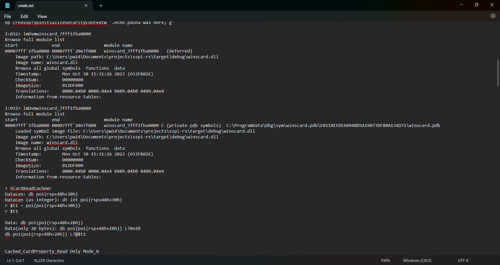
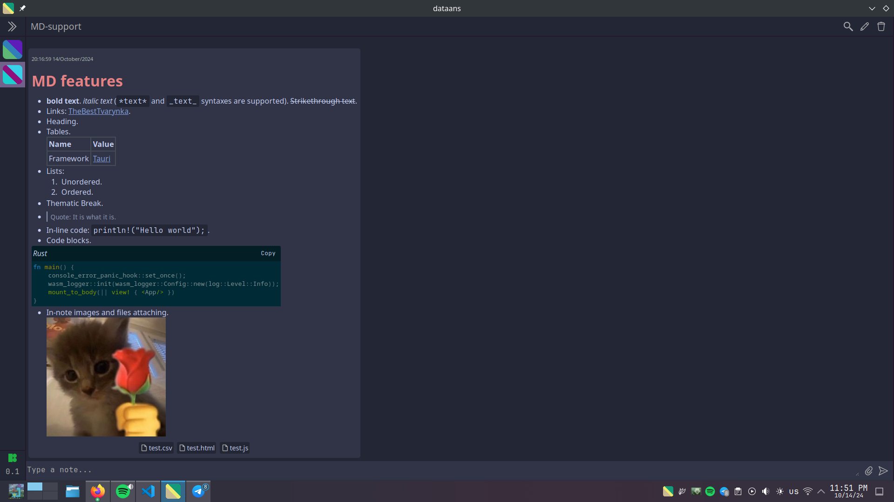

+++
title = "dataans"
description = "Take notes in markdown snippets grouped into spaces."
date = 2024-10-19
draft = false
template = "post.html"

[taxonomies]
tags = ["rust", "tauri", "leptos", "project"]

[extra]
toc = true
keywords = "Rust, Tauri, Leptos, Note-taking, Markdown"
thumbnail = "dataans-thumbnail.png"
+++

Source code: [github/TheBestTvarynka/Dataans](https://github.com/TheBestTvarynka/Dataans/).

The Dataans is a desktop app that allows you to take notes in the form of markdown snippets grouped into spaces. Yes, it's another note-taking app, but it has unique features that I miss in all other note-taking apps.

# Motivation

I write notes almost every time I use my computer. Usually, it's small pieces of data/code/docs/links I found during the research or bug fixing. So, I need some place to store them and the ability to find needed pieces of information easily. I used to use a single text file and open it in `Notepad` or `VS Code`. After the research, I got the file with almost random symbols:

Do I need to explain that it is inconvenient and hard to find anything? I needed a better solution. I tried other note-taking apps, but every one of them had flaws I didn't like a lot.

## What's wrong with existing note-taking apps?

I relate a lot to this blog post ([Why build a messenger app only for sending to yourself?](https://monoline.io/posts/2021/11/11/why-build-a-messenger-app-only-for-sending-to-yourself/)). I quote some key points from it but explain them in my own way and how they relate to me.

1. **Too many options**. I don't need so much test editing functionality. I just want to take notes and have simple markup (styling) functionality. Something like [markdown](https://www.markdownguide.org/) or [asciidoc](https://docs.asciidoctor.org/).
2. **Unwanted features**. This echoes the previous point, but I want to draw your attention specifically to the *UNWANTED* features. For example, I don't need AI to search for info in my notes. I only need a typical search engine. I don't want AI to write notes for me. I can write down my thoughts by myself.
3. **Article-oriented mindset**. People don't think in articles. Many note-taking apps look like you are going to write an article instead of just writing down the idea, thought, or a random piece of data. When I see a blank screen with the cursor, I feel I need to write a document with a defined structure, style, and line of thought. It throws off the thoughts I wanted to write at the beginning.

## Missing features

Despite the listed flaws above, I also have missing features I would like to have in my note-taking app. Some of them may feel weird and illogical to you, but I know what I want :stuck_out_tongue_closed_eyes:.

All note-taking apps I tried lack one or more features listed below. No one contains all of them at once (but if you find such an app, please, tell me about it).

1. **Desktop app**. Yes, you heard it right. In the era of the web, I want a desktop app. Usually, the browser has dozens of opened tabs across multiple windows. It becomes hard to find the tab with notes (even when it's pinned).
2. **Quake (drop-down) mode**. I have used the [Quake](https://github.com/Guake/guake/) terminal since 2019. I like it a lot and the most pleasant feature is a drop-down mode. I set a keybinding to the `F1` key and always have my terminal with me. I would like to have the same ability for my note-taking app because I use it often.
3. **Cross platform**. It should behave the same on _Windows_ and _Linux_. Other platforms may may be supported too, but it's not a requirement for me.
4. **Markdown**. It is simple, easy to learn, and looks good. It contains a perfect set of styling and markup functionality for me.
5. **Grouping** into channels/spaces/folders/or anything like that.

# Solution

These are the two closest apps to what I want:

1. [Telegram](https://telegram.org/). I have plenty of Telegram channels with one subscriber (me) where I save important, useful, and just interesting information. Despite rich Telegram features, I think you can understand why it isn't a solution.
2. [Monoline](https://monoline.io/). It supports MD and has pretty UI, but I would like to organize my notes into groups (like messages are organized in channels in Telegram).

I decided to write my note-taking app after many tries and thoughts. The best part of being a programmer is the ability to do everything I want with the software. It's like a limitless power in the virtual world (unfortunately, *everything has a limit*, but we aren't about that).

## Tech stack

We can debate a lot about the best technologies for such a project, but I already made my decision:

* Main programming language: [`Rust`](https://www.rust-lang.org/).
* App framework: [`Tauri`](https://v2.tauri.app/).
* Frontend framework: [`Leptos`](https://leptos.dev/).

I wrote a comprehensive explanation of the chosen tech stack. You can read it here: [`tech_stack.md`](https://github.com/TheBestTvarynka/Dataans/blob/main/doc/tech_stack.md).

## Features

* Quake (drop-down) mode. The keybinding can be configured.
* Cross-platform.
* All notes are markdown text. The following MD features are supported:
  * Italic, bold, strike-through text.
  * Quotes.
  * Links.
  * Headers.
  * Tables.
  * In-line code and code blocks.
  * Pasting images from clipboard.
* Files can be attached to the note.
* All notes are grouped into spaces. So, space is a collection of notes. It has a name and avatar picture.
* Common keybindings for text editing (like `ctrl+k` for creating links).
* The app can be configured using the config file.
* Color scheme also can be configured.
* Simple note search.
* Many different keybindings to control the application.

...And more. This is a short list of main futures. The full features list and user manual can be found here: [Dataans/wiki/User-manual](https://github.com/TheBestTvarynka/Dataans/wiki/User-manual).

# Moving further

I'm going to continue to improve `Dataans` according to my needs. If someone wants some missing functionality, then create an [issue](https://github.com/TheBestTvarynka/Dataans/issues/new) or a [discussion](https://github.com/TheBestTvarynka/Dataans/discussions), and most likely I'll implement it. Or if you are interested in contributing to this project, then read the [`CONTRIBUTING.md`](https://github.com/TheBestTvarynka/Dataans/blob/main/doc/CONTRIBUTING.md) document.

# References & final note

1. [Dataans: Source code](https://github.com/TheBestTvarynka/Dataans/).
2. [Dataans: Contributing guide](https://github.com/TheBestTvarynka/Dataans/blob/main/doc/CONTRIBUTING.md).
3. [Dataans: Technical decisions explained](https://github.com/TheBestTvarynka/Dataans/blob/main/doc/tech_stack.md).
4. [Dataans: Wiki](https://github.com/TheBestTvarynka/Dataans/wiki).
5. [Why build a messenger app only for sending to yourself?](https://monoline.io/posts/2021/11/11/why-build-a-messenger-app-only-for-sending-to-yourself/).

I want to add only one thing: **write programs for yourself in your favorite languages**. I'm feeling happy every time I use my app for my needs. Even if your app will do only one task, then still create it. _No better software than software that does useful work._
