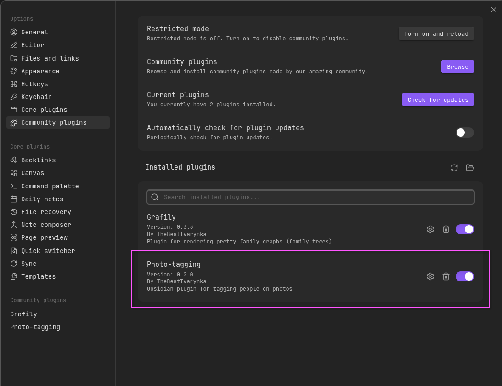
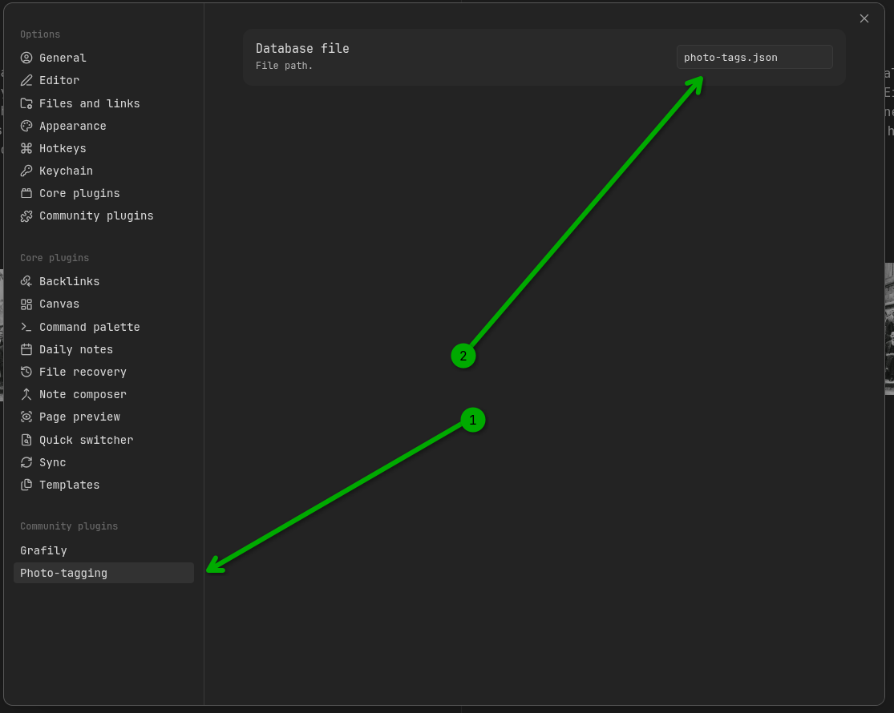
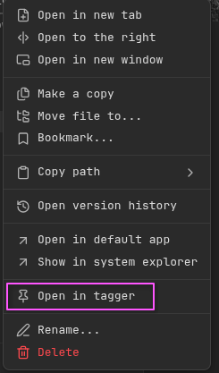
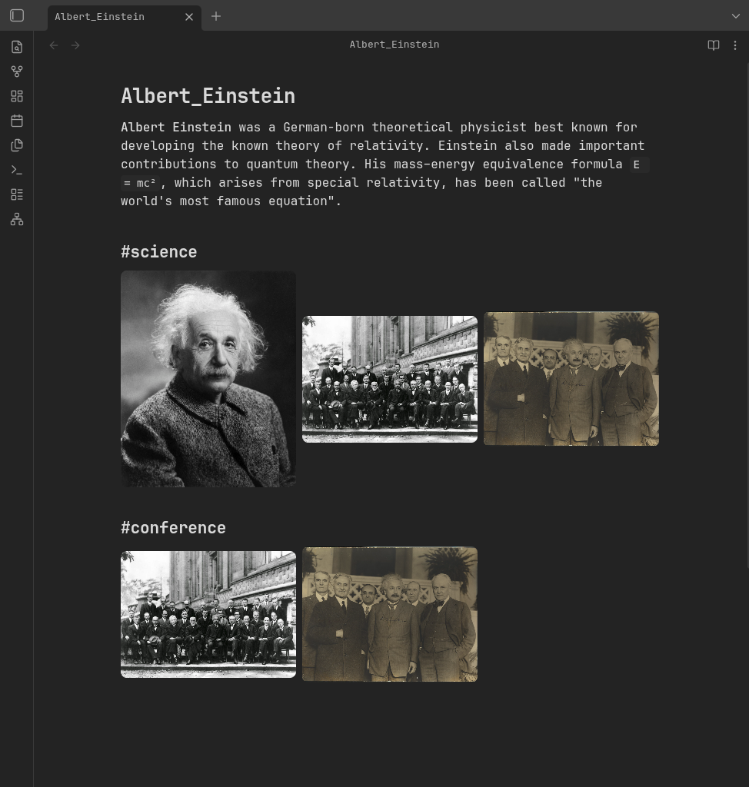
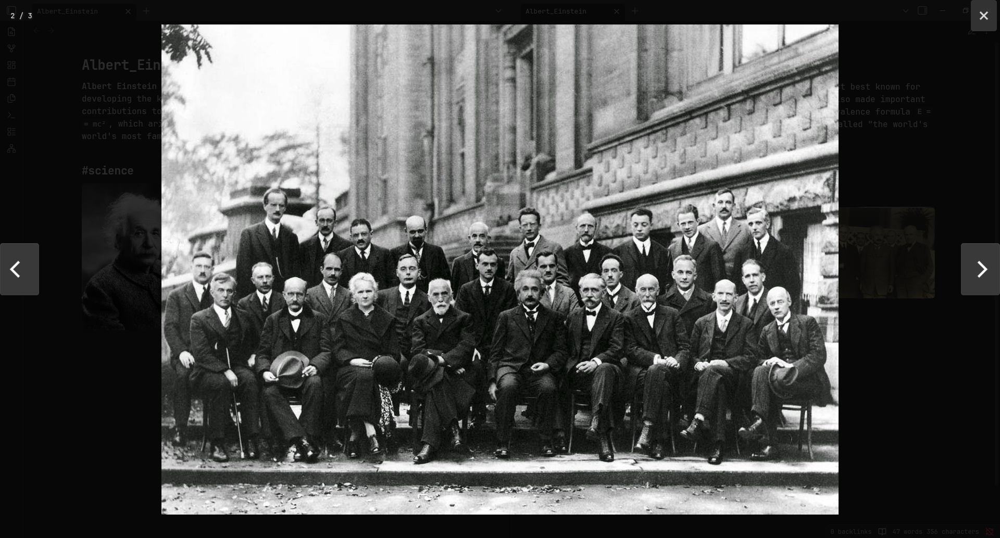
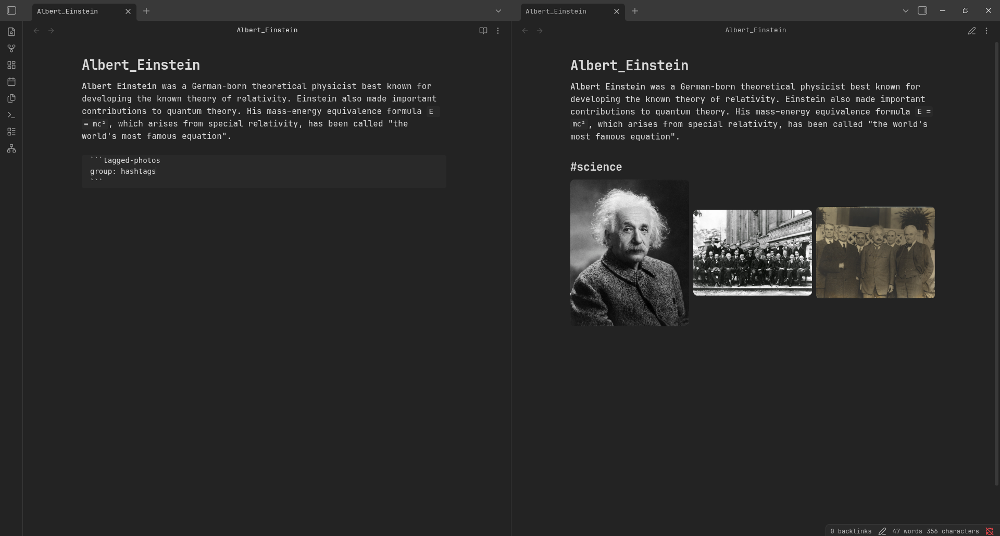

+++
title = "Obsidian photo-tagging"
description = "Simple Obsidian plugin for tagging people on photos."
date = 2026-02-17
draft = false
template = "post.html"

[taxonomies]
tags = ["javascript", "typescript", "project", "react", "frontend"]

[extra]
toc = true
keywords = "TypeScript, Obsidian, Plugin, Tagging, Genealogy"
thumbnail = "photo-tagging-thumbnail.png"
enddate = "present"
status = "development"
+++

TL;DR: [github/TheBestTvarynka/photo-tagging](https://github.com/TheBestTvarynka/photo-tagging).

# The problem

I store my genealogy research data inside the Obsidian vault.
Its structure assumes that I have one page per person.
When I got a lot of old photos from many relatives, I started thinking about how am I going to store them.
Obviously, I cannot group them by person because there are many photos with many persons on them.
After a bit of thinking and visualizing :face_in_clouds: :monocle_face:, I realized that the best solution for me would be to show on person's page all photos this person present.

# The solution

I tried to find a similar thing in existing Obsidian plugins but failed.
Unfortunately, I did not ind anything like this plugin.
So, as you may already guess, I decided to write my own plugin! :star_struck:

The idea is simple: manually tag people on photos and store the connections data in the `.json` file.
Then the user can add a special code-block which will turn into a gallery of this person's images.

# Usage example

First thing first: the user needs to enable the plugin in the Obsidian app:

Then, optionally, the user can configure the target `.json` file location.
The default value is `photo-tags.json` and it can be changed in the plugin settings:

Next, click on any image inside tha vault with the right-mouse button and you will see a new `Open in tagger` option:

Then, in the opened tagger, tha user can tag people and, optionally, add custom hash-tags.
These hash-tags work in the same way as usual hash-tags: their only purpose is to group all photos in different groups.

After that, on the corresponding person's page, add the `tagged-photos` code block. It will become the person's photos gallery.
Optionally, if the user add `group: hashtags` inside the code block, it will group person's photos by hash-tags and render a separate gallery for every hash-tag.
See the example:

| Usual | Grouped by hash-tags |
|-|-|
|  |  |

Click on the image to see it on the full screen:

Basically, that's all.
Easy, simple, and convenient :sparkles:.

# Features

1. Built-in photo tagger.
  
2. A special `tagged-photos` code block processor that turns the current person's photos in a gallery.
  
  When the user clicks on any image, it will be opened in the fullscreen gallery (powered by [`photoswipe`](https://photoswipe.com/)):
  
3. Hash-tags support (see screenshots above).

# What's next

The main core features are already implemented and they serve their purpose well.
I like them.

I still have a few improvements in mind:

- **Optimizations/caching.** Almost all old photos are just scanned from old paper-photos.
  I usually scan at 1200 DPI and the resulting image is huge.
  Sometimes the page loads slowly. I want to fix that.
- **Better tagger.** Current photo tagger is OK but not good.
  I plan to make it more user-friendly.
- **Automatic connections updates.** Catch when the photos is deleted/renamed/moved and update the connections inside the internal `.json` file automatically.
- **Photo explorer?** I am not sure how this feature should look like and even if it's worth implementing it.
  But time to time I am thinking about a generic photo explorer: a special page, where the user will be able query photos by different combinations of selectors (like hash tags + persons, AND and OR operations in the query).
  The future will show me the right path. :relieved:

# Useful links

1. Source code: [github/TheBestTvarynka/photo-tagging](https://github.com/TheBestTvarynka/photo-tagging).
